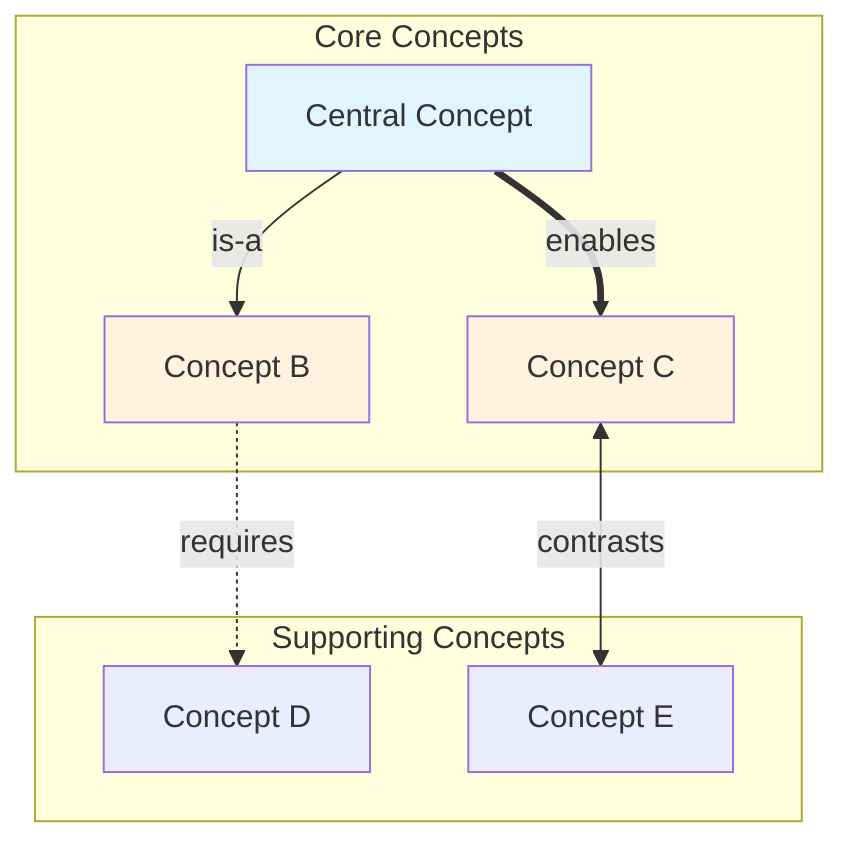

# Concept Map

## Description
A professional skill for generating visual concept maps that illustrate relationships between key ideas extracted from study notes. Creates hierarchical and networked representations suitable for visual learners and comprehensive knowledge organization.

## Trigger
Use this skill when the user requests concept maps, mind maps, knowledge graphs, or visual representations of how concepts relate to each other.

## Instructions

When creating concept maps from study notes, follow this systematic methodology:

### 1. Concept Extraction Phase

Analyze the source study notes to:
- Identify all named concepts, theories, and frameworks
- Extract key terminology with definitions
- Identify hierarchical relationships (parent-child, general-specific)
- Map associative relationships (causes, enables, contrasts-with)
- Determine concept centrality (how many connections each concept has)

### 2. Relationship Classification Framework

Classify relationships between concepts using these types:

| Relationship Type | Symbol | Description | Example |
|-------------------|--------|-------------|---------|
| **is-a** | `-->` | Hierarchical/categorical | "Few-Shot is-a Prompting Technique" |
| **has-part** | `--o` | Compositional | "Prompt has-part Context" |
| **enables** | `==>` | Functional dependency | "CoT enables Complex Reasoning" |
| **contrasts** | `<-->` | Opposition/alternative | "Zero-Shot contrasts Few-Shot" |
| **requires** | `-.->` | Prerequisite | "Chaining requires Output Validation" |
| **improves** | `==+>` | Enhancement | "Examples improves Accuracy" |

### 3. Concept Map Structure

Generate the concept map using this format:

```markdown
# Concept Map: [Topic Title]

**Source:** [Original study notes reference]
**Original Source Path:** [Full path for chain traceability]
**Date Generated:** [YYYY-MM-DD]
**Total Concepts:** [N]
**Total Relationships:** [N]
**Central Concept:** [Most connected concept]

---

## Visual Diagram (Mermaid)

[Mermaid flowchart code]

---

## Concept Hierarchy

[Hierarchical text representation]

---

## Relationship Matrix

[Table showing all relationships]

---

## Concept Index

[Alphabetical index with connection counts]

---

## Learning Pathways

[Suggested traversal orders for learning]
```

### 4. Mermaid Diagram Generation

Generate Mermaid flowchart syntax for visual rendering:

```markdown
## Visual Diagram (Mermaid)



**Diagram Key:**
- Blue nodes: Central/foundational concepts
- Orange nodes: Supporting concepts
- Solid arrows: Direct relationships
- Dashed arrows: Prerequisite relationships
- Double arrows: Bidirectional relationships
```

**Mermaid Guidelines:**
- Use `flowchart TD` (top-down) for hierarchical topics
- Use `flowchart LR` (left-right) for process/sequential topics
- Group related concepts in subgraphs
- Apply consistent styling based on concept type
- Limit to ~15 nodes for readability; create sub-maps for larger topics

### 5. Concept Hierarchy Generation

Create a text-based hierarchical representation:

```markdown
## Concept Hierarchy

[Topic Title]
├── Core Concept 1
│   ├── Sub-concept 1.1
│   │   └── Detail 1.1.1
│   └── Sub-concept 1.2
├── Core Concept 2
│   ├── Sub-concept 2.1
│   └── Sub-concept 2.2
│       ├── Detail 2.2.1
│       └── Detail 2.2.2
└── Core Concept 3
    └── Sub-concept 3.1

**Legend:**
- Level 1: Core concepts (fundamental building blocks)
- Level 2: Sub-concepts (components or variants)
- Level 3: Details (specific implementations or examples)
```

### 6. Relationship Matrix

Create a comprehensive relationship table:

```markdown
## Relationship Matrix

| From | Relationship | To | Strength | Notes |
|------|--------------|-----|----------|-------|
| Concept A | enables | Concept B | Strong | Foundation for B |
| Concept A | has-part | Concept C | Strong | C is component of A |
| Concept B | contrasts | Concept D | Moderate | Alternative approaches |
| Concept C | requires | Concept E | Weak | Optional prerequisite |

### Relationship Statistics
- Total relationships: [N]
- Most connected concept: [Name] ([N] connections)
- Isolated concepts: [List any with 0-1 connections]
- Strongest cluster: [Group of highly interconnected concepts]
```

### 7. Concept Index with Metrics

```markdown
## Concept Index

| Concept | Definition (Brief) | Connections | Centrality | Related Cards |
|---------|-------------------|-------------|------------|---------------|
| Chain-of-Thought | Reasoning step articulation | 5 | High | Cards 2, 4, 5 |
| Few-Shot | Learning from examples | 4 | High | Cards 1, 3, 5 |
| Prompt Structure | Component organization | 4 | High | Cards 1, 3 |
| System Prompt | Behavioral framework | 3 | Medium | Card 5 |
| Zero-Shot | No-example prompting | 2 | Low | Card 3 |

**Centrality Legend:**
- High: 4+ connections (critical for understanding)
- Medium: 2-3 connections (important supporting concept)
- Low: 0-1 connections (peripheral or specialized)
```

### 8. Learning Pathways

Suggest optimal traversal orders:

```markdown
## Learning Pathways

### Pathway 1: Foundational (Bottom-Up)
Start with fundamental concepts, build to complex:
1. [Basic Concept] → 2. [Building Block] → 3. [Intermediate] → 4. [Advanced] → 5. [Synthesis]

**Best for:** Learners new to the topic

### Pathway 2: Goal-Oriented (Top-Down)
Start with end goals, drill into prerequisites:
1. [End Goal Concept] → 2. [Required Skill] → 3. [Foundation] → 4. [Supporting Detail]

**Best for:** Practitioners seeking specific capabilities

### Pathway 3: Comparative
Learn through contrasts and alternatives:
1. [Approach A] ↔ [Approach B] → 2. [When to use each] → 3. [Hybrid approaches]

**Best for:** Learners with partial existing knowledge

### Critical Path
Minimum concepts required for functional understanding:
[Concept 1] → [Concept 2] → [Concept 3]
(Estimated time: [N] focused study sessions)
```

### 9. Quality Standards

Ensure all concept maps meet these criteria:

- **Completeness:** All major concepts from source material represented
- **Accuracy:** Relationships correctly classified and directional
- **Clarity:** Visual diagram is readable without zooming
- **Utility:** Learning pathways provide actionable guidance
- **Traceability:** Concepts link back to source sections
- **Renderability:** Mermaid syntax is valid and renders correctly

### 10. Integration with Skill Chain

When used in chain with other skills:

**Feeding into Flashcards:**
- High-centrality concepts become Easy card candidates
- Relationship pairs become Medium card candidates (compare/contrast)
- Multi-concept clusters become Hard card candidates (synthesis)

**Feeding into Quiz:**
- Relationship accuracy tests → Multiple Choice questions
- Pathway traversal → Short Answer questions
- Full map synthesis → Essay questions

## Tools to Utilize

- Read: For analyzing source study notes
- Write: For saving generated concept maps to files
- Grep: For locating concept definitions and relationships
- Glob: For finding relevant study note files

## Example Invocation

User: "Create a concept map from my machine learning study notes"

Response should include:
- Mermaid diagram with 10-15 key concepts
- Hierarchical breakdown of concept categories
- Relationship matrix with classified connections
- Centrality-ranked concept index
- 2-3 learning pathways for different learner types

## Output Location

Save generated concept maps to:
```
StudyNotes/
└── notes/
    └── [subject]/
        └── concept-maps/
            └── [topic]-concept-map.md
```
