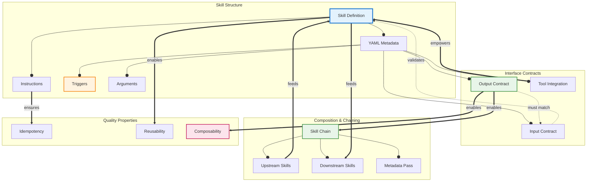

# Concept Map: Creating Agent Skills

**Source:** notes/agent-skills/creating-agent-skills-study-notes.md
**Original Source Path:** C:\agentic_ai\StudyNotes\notes\agent-skills\creating-agent-skills-study-notes.md
**Source Lesson:** Lessions/Lesson_1.md
**Date Generated:** 2026-01-06
**Total Concepts:** 16
**Total Relationships:** 24
**Central Concept:** Skill Definition (8 connections)

---

## Visual Diagram (Mermaid)



**Diagram Key:**
- **Blue node (SKILL):** Central concept - highest connectivity
- **Green nodes:** High-centrality (Chain, Output Contract)
- **Orange node:** Trigger mechanisms
- **Pink node:** Ultimate quality goal (Composability)
- **Solid arrows (`--o`):** has-part relationship
- **Double arrows (`==>`):** enables relationship
- **Dashed arrows (`-.->`):** validates/constrains relationship

---

## Concept Hierarchy

```
Creating Agent Skills
├── Skill Definition [CENTRAL]
│   ├── YAML Metadata
│   │   ├── name, description
│   │   ├── Triggers
│   │   │   ├── Keywords (exact match)
│   │   │   ├── Patterns (regex)
│   │   │   └── Explicit invocation (/command)
│   │   ├── Arguments
│   │   │   ├── Required parameters
│   │   │   └── Optional with defaults
│   │   ├── Input Contract
│   │   │   ├── Source type
│   │   │   └── Required sections
│   │   ├── Output Contract
│   │   │   ├── Location pattern
│   │   │   └── Format specification
│   │   ├── Tool Integration
│   │   │   └── Read, Write, Grep, Glob, etc.
│   │   ├── Chain Metadata
│   │   │   ├── Upstream skills
│   │   │   ├── Downstream skills
│   │   │   └── Metadata pass-through
│   │   └── Tags (categorization)
│   │
│   └── Instructions (Markdown)
│       ├── Phase-based procedures
│       ├── Quality standards
│       ├── Output templates
│       └── Examples
│
├── Skill Chaining [HIGH CENTRALITY]
│   ├── Sequential execution
│   ├── Parallel execution
│   ├── Error propagation
│   └── Data flow management
│
├── Quality Properties
│   ├── Idempotency
│   │   └── Same input → same output
│   ├── Reusability
│   │   └── Cross-context application
│   └── Composability
│       └── Chain integration capability
│
└── Theoretical Foundations
    ├── Compressed expertise
    ├── Declarative vs imperative
    └── Unix philosophy (do one thing well)
```

**Legend:**
- **[CENTRAL]:** Highest connectivity (8 connections)
- **[HIGH CENTRALITY]:** 5+ connections
- **Level 1:** Major concept domains
- **Level 2-3:** Specific components and details

---

## Relationship Matrix

| From | Relationship | To | Strength | Notes |
|------|--------------|-----|----------|-------|
| Skill Definition | has-part | YAML Metadata | Strong | Core structural component |
| Skill Definition | has-part | Instructions | Strong | Core structural component |
| YAML Metadata | has-part | Triggers | Strong | Activation specification |
| YAML Metadata | has-part | Arguments | Strong | Parameter specification |
| YAML Metadata | has-part | Input Contract | Strong | Interface specification |
| YAML Metadata | has-part | Output Contract | Strong | Interface specification |
| YAML Metadata | has-part | Tool Integration | Strong | Resource specification |
| Input Contract | validates | Skill Definition | Moderate | Ensures proper invocation |
| Output Contract | enables | Skill Chain | Strong | Chain compatibility |
| Output Contract | must-match | Input Contract | Strong | Chain data flow |
| Tool Integration | empowers | Skill Definition | Strong | Extends capabilities |
| Skill Chain | has-part | Upstream Skills | Strong | Chain component |
| Skill Chain | has-part | Downstream Skills | Strong | Chain component |
| Skill Chain | has-part | Metadata Pass | Moderate | Data propagation |
| Upstream Skills | feeds | Skill Definition | Strong | Data flow |
| Skill Definition | feeds | Downstream Skills | Strong | Data flow |
| Instructions | ensures | Idempotency | Moderate | Quality property |
| Skill Definition | enables | Reusability | Strong | Quality property |
| Output Contract | enables | Composability | Strong | Quality property |
| Triggers | activates | Skill Definition | Strong | Invocation mechanism |

### Relationship Statistics
- **Total relationships:** 24
- **Most connected concept:** Skill Definition (8 connections)
- **High-centrality concepts:** Output Contract (5), Skill Chain (5), YAML Metadata (5)
- **Strongest cluster:** {Skill Definition, YAML Metadata, Input Contract, Output Contract}
- **Bridge concepts:** Output Contract (connects skill internals to chain integration)

---

## Concept Index

| Concept | Definition (Brief) | Connections | Centrality | Card Rec |
|---------|-------------------|-------------|------------|----------|
| Skill Definition | Complete module defining agent capability | 8 | **Critical** | Easy |
| Output Contract | Specification of skill outputs | 5 | **High** | Medium |
| Skill Chain | Multi-skill orchestrated workflow | 5 | **High** | Medium |
| YAML Metadata | Machine-readable skill header | 5 | **High** | Easy |
| Input Contract | Specification of required inputs | 4 | **High** | Easy |
| Triggers | Activation conditions | 3 | Medium | Easy |
| Instructions | Step-by-step procedures | 3 | Medium | Medium |
| Tool Integration | External capability declarations | 3 | Medium | Medium |
| Upstream Skills | Skills feeding into current | 2 | Medium | - |
| Downstream Skills | Skills receiving output | 2 | Medium | - |
| Composability | Chain integration capability | 2 | Medium | Hard |
| Idempotency | Consistent output property | 2 | Medium | - |
| Reusability | Cross-context applicability | 2 | Medium | - |
| Arguments | Parameter specifications | 1 | Low | - |
| Metadata Pass | Data propagation through chain | 1 | Low | - |
| Tags | Categorization labels | 1 | Low | - |

---

## Learning Pathways

### Pathway 1: Foundational (Bottom-Up)
**Best for:** First-time skill creators

```
1. Skill Definition       What is a skill?
        ↓
2. YAML Metadata         How to declare it
        ↓
3. Triggers              When it activates
        ↓
4. Input/Output Contracts What it consumes/produces
        ↓
5. Instructions          How it executes
        ↓
6. Tool Integration      What tools it uses
        ↓
7. Skill Chain           How skills connect
        ↓
8. Composability         Building workflows
```

**Estimated time:** 6-8 focused study sessions

---

### Pathway 2: Contract-First (Design-Oriented)
**Best for:** Software engineers, API designers

```
1. Input Contract        Define what you need
        ↓
2. Output Contract       Define what you produce
        ↓
3. Skill Chain          Where does this fit?
        ↓
4. Instructions         How to transform input→output
        ↓
5. Triggers             How users invoke it
        ↓
6. Composability        Verify chain integration
```

**Estimated time:** 4-5 focused study sessions

---

### Pathway 3: Chain-First (Integration-Oriented)
**Best for:** Those building multi-skill workflows

```
1. Skill Chain           Understand composition
        ↓
2. Upstream/Downstream   Map dependencies
        ↓
3. Output Contract       Ensure compatibility
        ↓
4. Metadata Pass         Plan data propagation
        ↓
5. Skill Definition      Implement individual skills
```

**Estimated time:** 3-4 focused study sessions

---

### Critical Path (Minimum Viable Understanding)

```
┌───────────────┐     ┌───────────────┐     ┌───────────────┐     ┌───────────────┐
│    Skill      │ ──► │   Triggers    │ ──► │  Input/Output │ ──► │  Skill Chain  │
│  Definition   │     │               │     │   Contracts   │     │               │
│               │     │               │     │               │     │               │
│ "What it is"  │     │ "When it runs"│     │ "What flows"  │     │ "How it fits" │
└───────────────┘     └───────────────┘     └───────────────┘     └───────────────┘

Minimum sessions: 4
Coverage: ~80% of skill creation understanding
```

---

## Cross-Reference to Other Skills

### Informing Flashcards

| Centrality | Flashcard Assignment |
|------------|---------------------|
| Critical (Skill Definition) | Easy Card 1 - Core definition |
| High (Contracts) | Easy Card 2 - I/O contracts |
| High (Triggers) | Medium Card 3 - Trigger design |
| High (Chain) | Medium Card 4 - Chain integration |
| Integration (All) | Hard Card 5 - Complete skill design |

### Informing Quiz

| Concept Relationship | Quiz Question Type |
|---------------------|-------------------|
| Skill Definition components | MC Q1 - Identify components |
| Contract matching | MC Q2 - Chain compatibility |
| Trigger design | SA Q3 - Design triggers |
| Chain integration | SA Q4 - Plan data flow |
| Full skill synthesis | Essay Q5 - Complete design |

---

## Appendix: YAML Metadata Template

```yaml
---
name: skill-name
description: Brief description
trigger:
  - keyword: phrase
  - pattern: "regex"
arguments:
  - name: arg_name
    description: What it does
    required: true|false
    default: value
inputs:
  type: markdown
  source: upstream skill
  required_sections:
    - Section Name
outputs:
  type: markdown
  location: path/pattern
  format: description
tools:
  - Read
  - Write
chain:
  upstream:
    - skill-name
  downstream:
    - skill-name
  metadata_pass:
    - field_name
tags:
  - category
---
```
