# Concept Map: Lesson 1 - Creating Agent Skills

**Source:** Lessons/Lesson_1.md
**Subject Area:** AI Learning - Creating Agent Skills
**Date Generated:** 2026-01-07
**Total Concepts:** 18
**Total Relationships:** 28
**Central Concept:** Agent Skill (9 connections)

---

## Visual Diagram (Mermaid)

```mermaid
flowchart TD
    subgraph Core["Core Architecture"]
        SKILL[Agent Skill]
        INVOKE[Invocation Pattern]
        COMPOSE[Skill Composition]
        CONTEXT[Context Preservation]
    end

    subgraph Patterns["Invocation Patterns"]
        SLASH[Slash Commands]
        NL[Natural Language Triggers]
        API[Programmatic API]
    end

    subgraph Composition["Composition Patterns"]
        SEQ[Sequential Chaining]
        PAR[Parallel Execution]
        COND[Conditional Branching]
        HIER[Hierarchical Nesting]
    end

    subgraph Theory["Theoretical Foundations"]
        MOD[Modular Programming Theory]
        COG[Cognitive Load Theory]
        ACT[Activity Theory]
    end

    subgraph Perspectives["Scholarly Perspectives"]
        MIN[Minimalist Approach]
        HOL[Holistic Approach]
        ADAPT[Adaptive Skill Design]
    end

    subgraph Quality["Quality Dimensions"]
        REUSE[Reusability]
        CONSIST[Consistency]
        MAINTAIN[Maintainability]
        COMPOS[Composability]
    end

    %% Core relationships
    SKILL --o INVOKE
    SKILL --o COMPOSE
    COMPOSE --o CONTEXT

    %% Invocation relationships
    INVOKE --o SLASH
    INVOKE --o NL
    INVOKE --o API
    SLASH -.->|explicit| SKILL
    NL -.->|conversational| SKILL

    %% Composition pattern relationships
    COMPOSE --o SEQ
    COMPOSE --o PAR
    COMPOSE --o COND
    COMPOSE --o HIER
    SEQ ==>|pipeline| CONTEXT
    PAR ==>|concurrent| CONTEXT

    %% Theory relationships
    MOD ==>|informs| SKILL
    COG ==>|informs| INVOKE
    ACT ==>|informs| SKILL

    %% Perspective relationships
    MIN -.->|atomic design| SKILL
    HOL -.->|complete use case| SKILL
    ADAPT -.->|dynamic scope| SKILL
    MIN <-.->|contrasts| HOL

    %% Quality relationships
    SKILL ==>|enables| REUSE
    SKILL ==>|ensures| CONSIST
    SKILL ==>|promotes| MAINTAIN
    COMPOSE ==>|enables| COMPOS

    %% Styling
    style SKILL fill:#e3f2fd,stroke:#1976d2,stroke-width:3px
    style COMPOSE fill:#e8f5e9,stroke:#388e3c,stroke-width:2px
    style INVOKE fill:#e8f5e9,stroke:#388e3c,stroke-width:2px
    style MOD fill:#fff3e0,stroke:#f57c00,stroke-width:2px
    style COG fill:#fff3e0,stroke:#f57c00,stroke-width:2px
    style ACT fill:#fff3e0,stroke:#f57c00,stroke-width:2px
    style COMPOS fill:#fce4ec,stroke:#c2185b,stroke-width:2px
```



**Diagram Key:**
- **Blue node (SKILL):** Central concept - highest connectivity (9 connections)
- **Green nodes:** High-centrality concepts (Composition, Invocation Pattern)
- **Orange nodes:** Theoretical foundations informing design
- **Pink node:** Ultimate quality goal (Composability)
- **Solid arrows (`--o`):** has-part / contains relationship
- **Double arrows (`==>`):** enables / informs relationship
- **Dashed arrows (`-.->`):** influences / constrains relationship
- **Bidirectional dashed (`<-.->`):** contrasts relationship

---

## Concept Hierarchy

```
Creating Agent Skills (Lesson 1)
├── Agent Skill [CENTRAL - 9 connections]
│   ├── Definition: Self-contained, reusable module
│   ├── Components
│   │   ├── Invocation mechanism
│   │   ├── Input validation logic
│   │   ├── Execution procedures
│   │   ├── Output formatting specifications
│   │   └── Error handling protocols
│   └── Key Distinction: Structured vs ad-hoc prompting
│
├── Invocation Patterns [HIGH CENTRALITY - 5 connections]
│   ├── Slash Commands
│   │   ├── Explicit syntax
│   │   ├── High discoverability
│   │   └── Power user focused
│   ├── Natural Language Triggers
│   │   ├── Conversational integration
│   │   ├── Requires disambiguation
│   │   └── Occasional use focused
│   └── Programmatic API Calls
│       └── System-to-system invocation
│
├── Skill Composition [HIGH CENTRALITY - 7 connections]
│   ├── Sequential Chaining
│   │   └── Output → Input pipeline
│   ├── Parallel Execution
│   │   └── Concurrent independent tasks
│   ├── Conditional Branching
│   │   └── Result-based routing
│   ├── Hierarchical Nesting
│   │   └── Meta-skills orchestrating sub-skills
│   └── Context Preservation
│       └── State maintenance across boundaries
│
├── Theoretical Foundations
│   ├── Modular Programming Theory [MEDIUM - 3 connections]
│   │   ├── Cohesive, loosely-coupled units
│   │   ├── Well-defined interfaces
│   │   └── Encapsulation principles
│   ├── Cognitive Load Theory [MEDIUM - 3 connections]
│   │   ├── Working memory limits
│   │   ├── Sensible defaults
│   │   └── Progressive disclosure
│   └── Activity Theory [MEDIUM - 3 connections]
│       ├── Tools as mediating artifacts
│       ├── User intention → outcome
│       └── HCI research foundation
│
├── Scholarly Perspectives
│   ├── Minimalist Approach
│   │   ├── Atomic skills, single responsibility
│   │   ├── Maximum reusability
│   │   └── Complexity through composition
│   ├── Holistic Approach
│   │   ├── Complete use case encapsulation
│   │   ├── Simplified orchestration
│   │   └── Accepts reduced reusability
│   └── Adaptive Skill Design [EMERGING]
│       ├── Dynamic scope adjustment
│       ├── Context-aware behavior
│       └── Synthesis of minimalist/holistic
│
└── Quality Dimensions
    ├── Reusability
    │   └── Cross-context application
    ├── Consistency
    │   └── Standardized outputs
    ├── Maintainability
    │   └── Central update capability
    └── Composability [GOAL]
        └── Chain integration capability
```

**Legend:**
- **[CENTRAL]:** Highest connectivity (9 connections)
- **[HIGH CENTRALITY]:** 5+ connections
- **[MEDIUM]:** 3-4 connections
- **[EMERGING]:** Contemporary development
- **[GOAL]:** Ultimate quality objective

---

## Relationship Matrix

| From | Relationship | To | Strength | Type | Notes |
|------|--------------|-----|----------|------|-------|
| Agent Skill | has-part | Invocation Pattern | Strong | Structural | Core component |
| Agent Skill | has-part | Skill Composition | Strong | Structural | Capability component |
| Invocation Pattern | has-part | Slash Commands | Strong | Structural | Pattern type |
| Invocation Pattern | has-part | Natural Language Triggers | Strong | Structural | Pattern type |
| Invocation Pattern | has-part | Programmatic API | Strong | Structural | Pattern type |
| Skill Composition | has-part | Sequential Chaining | Strong | Structural | Composition type |
| Skill Composition | has-part | Parallel Execution | Strong | Structural | Composition type |
| Skill Composition | has-part | Conditional Branching | Strong | Structural | Composition type |
| Skill Composition | has-part | Hierarchical Nesting | Strong | Structural | Composition type |
| Skill Composition | requires | Context Preservation | Strong | Dependency | Critical for chaining |
| Modular Programming Theory | informs | Agent Skill | Strong | Theoretical | Design foundation |
| Cognitive Load Theory | informs | Invocation Pattern | Strong | Theoretical | UX foundation |
| Activity Theory | informs | Agent Skill | Moderate | Theoretical | HCI perspective |
| Minimalist Approach | influences | Agent Skill | Moderate | Perspective | Design philosophy |
| Holistic Approach | influences | Agent Skill | Moderate | Perspective | Design philosophy |
| Adaptive Skill Design | influences | Agent Skill | Moderate | Perspective | Emerging synthesis |
| Minimalist Approach | contrasts | Holistic Approach | Strong | Comparative | Opposing views |
| Agent Skill | enables | Reusability | Strong | Quality | Outcome |
| Agent Skill | ensures | Consistency | Strong | Quality | Outcome |
| Agent Skill | promotes | Maintainability | Strong | Quality | Outcome |
| Skill Composition | enables | Composability | Strong | Quality | Primary goal |
| Sequential Chaining | requires | Context Preservation | Strong | Dependency | State flow |
| Parallel Execution | requires | Context Preservation | Moderate | Dependency | Concurrent state |
| Slash Commands | activates | Agent Skill | Strong | Functional | Direct invocation |
| Natural Language Triggers | activates | Agent Skill | Moderate | Functional | Parsed invocation |

### Relationship Statistics

| Metric | Value |
|--------|-------|
| **Total relationships** | 28 |
| **Most connected concept** | Agent Skill (9 connections) |
| **High-centrality concepts** | Skill Composition (7), Invocation Pattern (5), Context Preservation (4) |
| **Strongest cluster** | {Agent Skill, Invocation Pattern, Skill Composition} |
| **Bridge concepts** | Context Preservation (connects composition to chaining patterns) |
| **Theoretical cluster** | {Modular Programming, Cognitive Load, Activity Theory} |
| **Perspective cluster** | {Minimalist, Holistic, Adaptive} |

---

## Concept Centrality Index

| Concept | Connections | Centrality | Domain | Flashcard Priority |
|---------|-------------|------------|--------|-------------------|
| Agent Skill | 9 | **Critical** | Core | Easy - Card 1 |
| Skill Composition | 7 | **High** | Core | Easy - Card 2 |
| Invocation Pattern | 5 | **High** | Core | Medium - Card 3 |
| Context Preservation | 4 | **High** | Composition | Medium - Card 4 |
| Sequential Chaining | 3 | Medium | Composition | - |
| Parallel Execution | 3 | Medium | Composition | - |
| Modular Programming Theory | 3 | Medium | Theory | - |
| Cognitive Load Theory | 3 | Medium | Theory | - |
| Activity Theory | 3 | Medium | Theory | - |
| Minimalist Approach | 3 | Medium | Perspective | Medium - Card 4 |
| Holistic Approach | 3 | Medium | Perspective | Medium - Card 4 |
| Slash Commands | 2 | Medium | Patterns | - |
| Natural Language Triggers | 2 | Medium | Patterns | - |
| Composability | 2 | Medium | Quality | Hard - Card 5 |
| Reusability | 1 | Low | Quality | - |
| Consistency | 1 | Low | Quality | - |
| Maintainability | 1 | Low | Quality | - |
| Adaptive Skill Design | 1 | Low | Perspective | - |

---

## Learning Pathways

### Pathway 1: Foundational (Bottom-Up)
**Best for:** Newcomers to agent skills, conceptual learners

```
1. Agent Skill Definition     What is a skill? Why does it matter?
        ↓
2. Invocation Patterns        How do users trigger skills?
        ↓
3. Slash Commands / NL        Specific trigger mechanisms
        ↓
4. Skill Composition          How do skills work together?
        ↓
5. Composition Patterns       Sequential, Parallel, Conditional, Hierarchical
        ↓
6. Context Preservation       How is state maintained?
        ↓
7. Quality Dimensions         What makes a good skill?
        ↓
8. Composability             The ultimate goal
```

**Estimated study sessions:** 6-8
**Coverage:** Comprehensive practical understanding

---

### Pathway 2: Theory-First (Academic)
**Best for:** Researchers, those wanting deep understanding

```
1. Modular Programming Theory    Design decomposition principles
        ↓
2. Cognitive Load Theory         User experience foundations
        ↓
3. Activity Theory              Tools as mediating artifacts
        ↓
4. Agent Skill Definition       Apply theory to practice
        ↓
5. Minimalist vs Holistic       Compare design philosophies
        ↓
6. Adaptive Skill Design        Emerging synthesis
        ↓
7. Quality Dimensions           Evaluate outcomes
```

**Estimated study sessions:** 5-6
**Coverage:** Deep theoretical grounding

---

### Pathway 3: Design-Oriented (Practical)
**Best for:** Practitioners building skills immediately

```
1. Agent Skill Definition       Core structure
        ↓
2. Invocation Pattern Design    User interface decisions
        ↓
3. Skill Composition            Multi-skill workflows
        ↓
4. Minimalist vs Holistic       Choose granularity
        ↓
5. Quality Dimensions           Evaluate your design
```

**Estimated study sessions:** 3-4
**Coverage:** Practical skill creation

---

### Pathway 4: Comparative (Analytical)
**Best for:** Those evaluating approaches

```
1. Minimalist Approach          Atomic, reusable skills
        ↓                            ↓
        └────────────────┬───────────┘
                         ↓
2. Compare Trade-offs     Reusability vs Simplicity
                         ↓
3. Adaptive Skill Design  Emerging synthesis
                         ↓
4. Context Matters        When to use which approach
```

**Estimated study sessions:** 2-3
**Coverage:** Decision-making framework

---

### Critical Path (Minimum Viable Understanding)

```
┌─────────────────┐     ┌─────────────────┐     ┌─────────────────┐     ┌─────────────────┐
│   Agent Skill   │ ──► │   Invocation    │ ──► │     Skill       │ ──► │  Composability  │
│   Definition    │     │    Patterns     │     │   Composition   │     │                 │
│                 │     │                 │     │                 │     │                 │
│  "What it is"   │     │ "How to invoke" │     │ "How to chain"  │     │ "The goal"      │
└─────────────────┘     └─────────────────┘     └─────────────────┘     └─────────────────┘

Minimum sessions: 4
Coverage: ~75% of Lesson 1 core understanding
Prerequisite for: Flashcards, Quiz, Practice Problems
```

---

## Theoretical Foundation Connections

### How Theories Inform Practice

```
┌────────────────────────────────────────────────────────────────────────┐
│                    THEORETICAL FOUNDATIONS                              │
├─────────────────────┬──────────────────────┬───────────────────────────┤
│ Modular Programming │   Cognitive Load     │      Activity Theory      │
│       Theory        │       Theory         │                           │
├─────────────────────┼──────────────────────┼───────────────────────────┤
│ • Encapsulation     │ • Sensible defaults  │ • Tools mediate goals     │
│ • Loose coupling    │ • Progressive        │ • User intention focus    │
│ • Well-defined      │   disclosure         │ • Context awareness       │
│   interfaces        │ • Consistent         │                           │
│                     │   patterns           │                           │
├─────────────────────┴──────────────────────┴───────────────────────────┤
│                              ▼ INFORMS ▼                               │
├────────────────────────────────────────────────────────────────────────┤
│                         Agent Skill Design                              │
│  • Modular architecture (from Modular Programming)                     │
│  • Intuitive interfaces (from Cognitive Load)                          │
│  • Goal-oriented execution (from Activity Theory)                      │
└────────────────────────────────────────────────────────────────────────┘
```

---

## Scholarly Perspective Comparison

| Dimension | Minimalist | Holistic | Adaptive |
|-----------|------------|----------|----------|
| **Core Principle** | Single responsibility | Complete use case | Dynamic scope |
| **Skill Scope** | Atomic, narrow | Broad, self-contained | Context-dependent |
| **Reusability** | Maximum | Limited | Moderate-High |
| **Composition** | Required for complex tasks | Minimal | Flexible |
| **Complexity** | In orchestration | In individual skills | In adaptation logic |
| **Best Context** | Large orgs, shared skills | Small teams, specific use | Advanced implementations |
| **Testing** | Unit-focused | Integration-focused | Behavior-focused |

---

## Cross-Reference to Learning Materials

### Informing Flashcards

| Concept Centrality | Flashcard Mapping |
|-------------------|-------------------|
| Critical (Agent Skill) | Easy Card 1 - Core definition |
| High (Skill Composition) | Easy Card 2 - Composition patterns |
| High (Invocation Pattern) | Medium Card 3 - Pattern design |
| Medium (Perspectives) | Medium Card 4 - Minimalist vs Holistic |
| Integration (Quality) | Hard Card 5 - Evaluation framework |

### Informing Quiz Design

| Concept Relationship | Recommended Question Type |
|---------------------|--------------------------|
| Agent Skill definition | Multiple Choice - Identify components |
| Composition patterns | Multiple Choice - Pattern selection |
| Invocation design | Short Answer - Design triggers |
| Perspective comparison | Short Answer - Analyze trade-offs |
| Full skill design | Essay - Synthesize complete skill |

### Informing Practice Problems

| Concept Cluster | Problem Type |
|----------------|--------------|
| Invocation Patterns | Warm-Up - Design slash command |
| Composition | Skill-Builder - Chain three skills |
| Perspectives | Challenge - Refactor monolithic to modular |
| Quality | Debug/Fix - Identify composition failure |

---

## Appendix: Concept Definitions Summary

| Concept | Brief Definition |
|---------|------------------|
| **Agent Skill** | Self-contained, reusable module encapsulating specific AI agent capability |
| **Invocation Pattern** | Standardized mechanism for triggering skill execution |
| **Slash Commands** | Explicit command syntax (e.g., `/skill-name`) for skill activation |
| **Natural Language Triggers** | Conversational phrases that activate skills |
| **Skill Composition** | Patterns for combining multiple skills into complex workflows |
| **Sequential Chaining** | Output of one skill feeds input of next |
| **Parallel Execution** | Multiple skills execute concurrently |
| **Conditional Branching** | Skill selection based on intermediate results |
| **Hierarchical Nesting** | Meta-skills orchestrating sub-skills |
| **Context Preservation** | Maintaining state across skill boundaries |
| **Modular Programming Theory** | Principles of decomposition into cohesive, loosely-coupled units |
| **Cognitive Load Theory** | Design principles respecting human working memory limits |
| **Activity Theory** | Framework for understanding tools as mediating artifacts |
| **Minimalist Approach** | Philosophy favoring atomic, single-responsibility skills |
| **Holistic Approach** | Philosophy favoring complete use case encapsulation |
| **Adaptive Skill Design** | Emerging synthesis with dynamic scope adjustment |
| **Composability** | Quality enabling skills to integrate into chains |
| **Reusability** | Quality enabling cross-context application |

---

*Generated from Lesson 1: Creating Agent Skills | Concept Map Skill*
