# Concept Map: Lesson 12 - AI Agents, Autonomous Systems, and Spec-Driven Development

**Source:** Lessons/Lesson_12.md
**Subject Area:** AI Learning - AI Agents, Autonomous Systems, and Spec-Driven Development
**Date Generated:** 2026-01-08
**Total Concepts:** 58
**Total Relationships:** 78

---

## Visual Concept Map (Mermaid)

```mermaid
graph TD
    subgraph AgentCore["Agent Fundamentals"]
        AGENT[AI Agent]
        PERCEPTION[Perception]
        REASONING[Reasoning Engine]
        PLANNING[Planning]
        ACTION[Action Layer]
        AGENTLOOP[Agent Loop]
    end

    subgraph ReasoningPatterns["Reasoning Patterns"]
        COT[Chain-of-Thought]
        REACT[ReAct Pattern]
        TOT[Tree of Thoughts]
        REFLEXION[Reflexion]
        SELFCONS[Self-Consistency]
    end

    subgraph ToolUse["Tool Use"]
        TOOLS[Tool Registry]
        FUNCCALL[Function Calling]
        TOOLEXEC[Tool Execution]
        TOOLSEL[Tool Selection]
        SANDBOX[Sandboxing]
    end

    subgraph Memory["Memory Systems"]
        WORKING[Working Memory]
        EPISODIC[Episodic Memory]
        SEMANTIC[Semantic Memory]
        PROCEDURAL[Procedural Memory]
        VECTORDB[Vector Store]
    end

    subgraph SDD["Spec-Driven Development"]
        SPEC[Specification]
        CONSTITUTION[Constitution Phase]
        SPECIFY[Specify Phase]
        PLAN[Plan Phase]
        TASKS[Tasks Phase]
        IMPLEMENT[Implement Phase]
        SPECKIT[Spec-Kit Framework]
    end

    subgraph CodingAgent["Coding Agents"]
        CODEAGENT[Coding Agent]
        CODEBASE[Codebase Understanding]
        SELFDEBUG[Self-Debugging]
        CODEGEN[Code Generation]
        TESTGEN[Test Generation]
    end

    subgraph MultiAgent["Multi-Agent Systems"]
        MULTIAGENT[Multi-Agent]
        HIERARCHY[Hierarchical]
        PEERTOPEER[Peer-to-Peer]
        DEBATE[Debate Pattern]
        MSGBUS[Message Bus]
    end

    subgraph Evaluation["Evaluation"]
        BENCHMARK[Benchmarks]
        SWEBENCH[SWE-bench]
        AGENTBENCH[AgentBench]
        METRICS[Efficiency Metrics]
    end

    subgraph Safety["Safety & Control"]
        SAFETY[Safety Layer]
        HITL[Human-in-the-Loop]
        AUDIT[Audit Log]
        ALIGNMENT[Alignment]
        CORRIGIBILITY[Corrigibility]
    end

    %% Agent Core relationships
    AGENT -->|"contains"| PERCEPTION
    AGENT -->|"contains"| REASONING
    AGENT -->|"contains"| PLANNING
    AGENT -->|"contains"| ACTION
    PERCEPTION -->|"feeds"| REASONING
    REASONING -->|"produces"| PLANNING
    PLANNING -->|"guides"| ACTION
    ACTION -->|"updates"| PERCEPTION
    AGENTLOOP -->|"orchestrates"| AGENT

    %% Reasoning relationships
    COT -->|"enables"| REASONING
    REACT -->|"combines"| COT
    REACT -->|"combines"| ACTION
    TOT -->|"extends"| COT
    REFLEXION -->|"improves"| REACT
    SELFCONS -->|"validates"| COT

    %% Tool Use relationships
    ACTION -->|"invokes"| TOOLS
    FUNCCALL -->|"interface for"| TOOLS
    TOOLSEL -->|"chooses from"| TOOLS
    TOOLEXEC -->|"runs"| TOOLS
    SANDBOX -->|"protects"| TOOLEXEC

    %% Memory relationships
    REASONING -->|"uses"| WORKING
    WORKING -->|"persists to"| EPISODIC
    EPISODIC -->|"stored in"| VECTORDB
    SEMANTIC -->|"stored in"| VECTORDB
    PROCEDURAL -->|"guides"| ACTION

    %% SDD relationships
    SPEC -->|"phase 1"| CONSTITUTION
    CONSTITUTION -->|"phase 2"| SPECIFY
    SPECIFY -->|"phase 3"| PLAN
    PLAN -->|"phase 4"| TASKS
    TASKS -->|"phase 5"| IMPLEMENT
    SPECKIT -->|"defines"| SDD
    SPEC -->|"drives"| CODEAGENT

    %% Coding Agent relationships
    CODEAGENT -->|"requires"| CODEBASE
    CODEAGENT -->|"performs"| CODEGEN
    CODEAGENT -->|"performs"| TESTGEN
    SELFDEBUG -->|"improves"| CODEGEN
    IMPLEMENT -->|"uses"| CODEAGENT

    %% Multi-Agent relationships
    MULTIAGENT -->|"pattern"| HIERARCHY
    MULTIAGENT -->|"pattern"| PEERTOPEER
    MULTIAGENT -->|"pattern"| DEBATE
    MSGBUS -->|"enables"| MULTIAGENT
    DEBATE -->|"improves"| REASONING

    %% Evaluation relationships
    BENCHMARK -->|"includes"| SWEBENCH
    BENCHMARK -->|"includes"| AGENTBENCH
    METRICS -->|"measures"| AGENT
    SWEBENCH -->|"evaluates"| CODEAGENT

    %% Safety relationships
    SAFETY -->|"validates"| ACTION
    HITL -->|"approves"| ACTION
    AUDIT -->|"logs"| ACTION
    ALIGNMENT -->|"ensures"| SAFETY
    CORRIGIBILITY -->|"enables"| HITL
```



---

## Concept Hierarchy

```
AI AGENTS AND SPEC-DRIVEN DEVELOPMENT
├── AGENT FUNDAMENTALS
│   ├── Agent Architecture
│   │   ├── Perception Layer (input processing)
│   │   ├── Reasoning Engine (LLM-based)
│   │   ├── Planning Component
│   │   ├── Action Layer (tool execution)
│   │   └── Memory System
│   ├── Agent Types
│   │   ├── Reactive (stimulus-response)
│   │   ├── Deliberative (world model)
│   │   ├── Hybrid (combined)
│   │   └── Learning (RL-based)
│   └── Agent Loop
│       ├── Observe → Reason → Plan → Act
│       └── Feedback integration
│
├── REASONING PATTERNS
│   ├── Chain-of-Thought (CoT)
│   │   ├── Step-by-step reasoning
│   │   └── Improved accuracy on complex tasks
│   ├── ReAct (Reasoning + Acting)
│   │   ├── Thought → Action → Observation
│   │   ├── Grounded reasoning
│   │   └── Tool-use integration
│   ├── Tree of Thoughts (ToT)
│   │   ├── Multiple reasoning paths
│   │   ├── Evaluation and pruning
│   │   └── Backtracking capability
│   ├── Reflexion
│   │   ├── Self-critique
│   │   └── Iterative improvement
│   └── Self-Consistency
│       ├── Multiple samples
│       └── Majority voting
│
├── TOOL USE AND FUNCTION CALLING
│   ├── Tool Architecture
│   │   ├── Tool Registry
│   │   ├── Schema definitions
│   │   └── Parameter validation
│   ├── Tool Categories
│   │   ├── Information retrieval
│   │   ├── Code execution
│   │   ├── External APIs
│   │   └── File operations
│   ├── Tool Selection
│   │   ├── Description-based
│   │   ├── Few-shot examples
│   │   └── Retrieval-augmented
│   └── Execution Safety
│       ├── Sandboxing
│       ├── Timeout handling
│       └── Error recovery
│
├── MEMORY SYSTEMS
│   ├── Working Memory
│   │   ├── Current context
│   │   └── Active goals
│   ├── Episodic Memory
│   │   ├── Past interactions
│   │   ├── Similarity retrieval
│   │   └── Recency weighting
│   ├── Semantic Memory
│   │   ├── Facts and knowledge
│   │   └── Knowledge graphs
│   ├── Procedural Memory
│   │   └── Skills and procedures
│   └── Implementation
│       ├── Vector databases
│       └── Conversation summarization
│
├── SPECIFICATION-DRIVEN DEVELOPMENT (SDD)
│   ├── Core Philosophy
│   │   ├── Specifications as executable
│   │   ├── Intent-first design
│   │   └── Code as generated output
│   ├── Spec-Kit Framework (5 Phases)
│   │   ├── Phase 1: Constitution (/sp.constitution)
│   │   ├── Phase 2: Specification (/sp.specify)
│   │   ├── Phase 3: Planning (/sp.plan)
│   │   ├── Phase 4: Tasks (/sp.tasks)
│   │   └── Phase 5: Implementation (/sp.implement)
│   ├── Quality Commands
│   │   ├── /sp.clarify (resolve ambiguities)
│   │   ├── /sp.analyze (verify consistency)
│   │   └── /sp.checklist (validation)
│   └── Specification Structure
│       ├── Functional requirements
│       ├── Non-functional requirements
│       ├── API contracts
│       └── Acceptance criteria
│
├── AUTONOMOUS CODING AGENTS
│   ├── Architecture
│   │   ├── Task understanding
│   │   ├── Codebase understanding
│   │   ├── Implementation loop
│   │   └── Verification
│   ├── Capabilities
│   │   ├── Code generation
│   │   ├── Test generation
│   │   ├── Self-debugging
│   │   └── Code understanding
│   ├── Tools
│   │   ├── File read/write/edit
│   │   ├── Search (grep, glob)
│   │   ├── Terminal/bash
│   │   └── LSP diagnostics
│   └── Benchmarks
│       ├── SWE-bench
│       ├── HumanEval
│       └── MBPP
│
├── MULTI-AGENT SYSTEMS
│   ├── Architectures
│   │   ├── Hierarchical (manager-worker)
│   │   ├── Peer-to-peer (collaborative)
│   │   ├── Pipeline (sequential)
│   │   └── Debate (adversarial)
│   ├── Communication
│   │   ├── Message bus
│   │   ├── Message types (request, response, handoff)
│   │   └── Coordination protocols
│   └── Specialization
│       ├── Planner agent
│       ├── Researcher agent
│       ├── Coder agent
│       ├── Reviewer agent
│       └── Tester agent
│
├── EVALUATION AND BENCHMARKING
│   ├── Evaluation Dimensions
│   │   ├── Capability (task success)
│   │   ├── Efficiency (tokens, time)
│   │   ├── Safety (harmful actions)
│   │   ├── Robustness (edge cases)
│   │   └── Alignment (follows instructions)
│   ├── Key Benchmarks
│   │   ├── SWE-bench (software engineering)
│   │   ├── AgentBench (general tasks)
│   │   ├── WebArena (web navigation)
│   │   └── GAIA (assistant tasks)
│   └── Metrics
│       ├── Pass@k
│       ├── Resolution rate
│       └── Token efficiency
│
├── SAFETY, CONTROL, AND ALIGNMENT
│   ├── Safety Challenges
│   │   ├── Unintended actions
│   │   ├── Goal misalignment
│   │   ├── Deceptive behavior
│   │   └── Capability overhang
│   ├── Safety Mechanisms
│   │   ├── Action validation
│   │   ├── Blocklists
│   │   ├── Scope constraints
│   │   └── Resource limits
│   ├── Human-in-the-Loop
│   │   ├── Approval levels
│   │   ├── Autonomous / Notify / Confirm / Blocked
│   │   └── Audit trails
│   └── Alignment Techniques
│       ├── Constitutional AI
│       ├── RLHF
│       └── Interpretability
│
└── FUTURE DIRECTIONS
    ├── Near-Term
    │   ├── Improved long-context
    │   ├── Better tool reliability
    │   └── Sophisticated planning
    ├── Medium-Term
    │   ├── Persistent learning
    │   ├── Multi-modal agents
    │   └── Domain-specialized teams
    └── Longer-Term
        ├── Self-improving agents
        ├── Autonomous discovery
        └── Robust alignment
```

---

## Relationship Matrix

| From Concept | To Concept | Relationship Type | Strength |
|--------------|------------|-------------------|----------|
| AI Agent | Reasoning Engine | contains | Strong |
| AI Agent | Memory System | contains | Strong |
| AI Agent | Action Layer | contains | Strong |
| ReAct | Chain-of-Thought | extends | Strong |
| ReAct | Tool Use | combines | Strong |
| Tree of Thoughts | Chain-of-Thought | extends | Strong |
| Tool Registry | Function Calling | interface | Strong |
| Sandboxing | Tool Execution | protects | Strong |
| Working Memory | Episodic Memory | persists-to | Strong |
| Vector Store | Episodic Memory | stores | Strong |
| Specification | Constitution Phase | initiates | Strong |
| Spec-Kit Framework | SDD | defines | Strong |
| Coding Agent | Codebase Understanding | requires | Strong |
| Self-Debugging | Code Generation | improves | Strong |
| SWE-bench | Coding Agent | evaluates | Strong |
| Multi-Agent | Message Bus | requires | Strong |
| Debate Pattern | Reasoning | improves | Strong |
| Safety Layer | Action Validation | performs | Strong |
| Human-in-the-Loop | Action | approves | Strong |
| Alignment | Safety | ensures | Strong |
| Reflexion | ReAct | improves | Medium |
| Semantic Memory | Knowledge Graph | stored-in | Medium |

---

## Centrality Index

**High Centrality (6+ connections):**

| Concept | Incoming | Outgoing | Total | Role |
|---------|----------|----------|-------|------|
| AI Agent | 3 | 6 | 9 | **Core Entity** |
| Action Layer | 4 | 4 | 8 | **Execution Hub** |
| Reasoning Engine | 4 | 4 | 8 | **Decision Center** |
| Tool Use | 3 | 5 | 8 | **Capability Extender** |
| Memory System | 3 | 4 | 7 | **Context Manager** |
| SDD | 2 | 5 | 7 | **Development Paradigm** |
| Coding Agent | 3 | 4 | 7 | **Implementation Agent** |

**Medium Centrality (3-5 connections):**

| Concept | Incoming | Outgoing | Total | Role |
|---------|----------|----------|-------|------|
| ReAct | 2 | 3 | 5 | Reasoning pattern |
| Chain-of-Thought | 2 | 3 | 5 | Foundational technique |
| Safety Layer | 2 | 3 | 5 | Protection mechanism |
| Specification | 2 | 3 | 5 | SDD artifact |
| Multi-Agent | 2 | 3 | 5 | System architecture |
| Episodic Memory | 2 | 2 | 4 | Persistence layer |
| Self-Debugging | 2 | 2 | 4 | Quality mechanism |

**Low Centrality (1-2 connections):**
- Reflexion, Self-Consistency, Procedural Memory, Constitution Phase, Debate Pattern, GAIA, WebArena, Constitutional AI

---

## Learning Pathways

### Pathway 1: Agent Foundations
**Goal:** Understand core agent architecture and reasoning
**Sequence:** Agent Loop → Perception → Reasoning → Planning → Action → Chain-of-Thought → ReAct → Tool Use
**Prerequisites:** Basic LLM understanding, prompt engineering
**Assessment:** Can explain agent loop and implement ReAct pattern

### Pathway 2: Memory and Context
**Goal:** Master agent memory systems
**Sequence:** Working Memory → Episodic Memory → Semantic Memory → Vector Stores → Conversation Summarization → Memory-Augmented Agent
**Prerequisites:** Pathway 1
**Assessment:** Can implement memory-augmented agent with retrieval

### Pathway 3: Spec-Driven Development
**Goal:** Apply SDD methodology to software creation
**Sequence:** SDD Philosophy → Spec-Kit Framework → Constitution → Specification → Planning → Tasks → Implementation → Verification
**Prerequisites:** Pathways 1-2, software development experience
**Assessment:** Can guide agent through complete SDD workflow

### Pathway 4: Autonomous Coding
**Goal:** Build and evaluate coding agents
**Sequence:** Codebase Understanding → Code Generation → Test Generation → Self-Debugging → SWE-bench Evaluation → Efficiency Optimization
**Prerequisites:** Pathways 1-3
**Assessment:** Can build coding agent and evaluate on benchmarks

### Pathway 5: Safety and Production
**Goal:** Deploy agents safely in production
**Sequence:** Safety Challenges → Action Validation → Human-in-the-Loop → Approval Levels → Audit Logging → Alignment Techniques → Multi-Agent Safety
**Prerequisites:** Pathways 1-4
**Assessment:** Can design safe agent deployment with appropriate controls

---

## Critical Path Analysis

**Minimum Viable Understanding (MVU):**
```
Agent Loop → Reasoning (CoT/ReAct) → Tool Use → Memory → SDD Basics → Safety
```

**Rationale:** These six areas provide essential agent development vocabulary:
1. **Agent Loop:** Core execution model
2. **Reasoning:** How agents think and decide
3. **Tool Use:** How agents interact with world
4. **Memory:** How agents maintain context
5. **SDD Basics:** Practical application paradigm
6. **Safety:** Essential for any deployment

**Expanded Path for Practitioners:**
```
Agent Architecture → Perception → Reasoning → CoT → ReAct → ToT → Tool Registry →
Function Calling → Sandboxing → Working Memory → Episodic Memory → Vector DB →
SDD Philosophy → Spec-Kit (5 phases) → Coding Agent → Self-Debugging →
Multi-Agent → Message Bus → Safety Layer → HITL → Audit → Benchmarks → SWE-bench
```

---

## Cross-Lesson Connections

### To Lesson 2 (Prompt Engineering)
| Agent Concept | Prompt Engineering Connection | Implication |
|---------------|------------------------------|-------------|
| Chain-of-Thought | Advanced prompting | Agent reasoning foundation |
| ReAct | Structured prompts | Action-oriented prompting |
| System prompts | Agent instructions | Defines agent behavior |

### To Lesson 3 (Large Language Models)
| Agent Concept | LLM Connection | Implication |
|---------------|----------------|-------------|
| Reasoning Engine | LLM core | Agents built on LLMs |
| Context window | Working memory | Memory constraints |
| Function calling | Model capability | Native tool support |

### To Lesson 11 (MLOps)
| Agent Concept | MLOps Connection | Implication |
|---------------|------------------|-------------|
| Agent Evaluation | Model monitoring | Track agent performance |
| Safety Layer | Quality gates | Deployment safeguards |
| Audit Logging | Observability | Production monitoring |

---

## Concept Definitions (Quick Reference)

| Concept | One-Line Definition |
|---------|---------------------|
| AI Agent | System that perceives, reasons, plans, and acts autonomously |
| Agent Loop | Observe → Reason → Plan → Act execution cycle |
| Chain-of-Thought | Step-by-step reasoning in LLM responses |
| ReAct | Pattern combining reasoning traces with tool actions |
| Tree of Thoughts | Multi-path reasoning with evaluation and backtracking |
| Tool Use | Agent capability to invoke external functions |
| Function Calling | Structured interface for LLM tool invocation |
| Working Memory | Current context within agent's active processing |
| Episodic Memory | Stored past interactions retrievable by similarity |
| Semantic Memory | Factual knowledge stored for reference |
| SDD | Paradigm where specifications directly generate implementations |
| Spec-Kit | Framework defining 5-phase SDD methodology |
| Constitution | Phase 1: Establish development guidelines |
| Coding Agent | Agent that autonomously writes and debugs code |
| Self-Debugging | Agent capability to identify and fix its own errors |
| Multi-Agent | System of coordinated specialized agents |
| Human-in-the-Loop | Safety pattern requiring human approval for actions |
| SWE-bench | Benchmark evaluating agents on real GitHub issues |

---

## Study Recommendations

### Foundation First
1. Implement basic agent loop from scratch
2. Build ReAct pattern with simple tools
3. Trace reasoning through Chain-of-Thought examples

### Memory Practice
1. Implement episodic memory with vector store
2. Add conversation summarization
3. Test retrieval relevance

### SDD Application
1. Follow Spec-Kit 5-phase workflow on small project
2. Write detailed specifications before implementation
3. Validate generated code against spec

### Safety Integration
1. Implement action validation layer
2. Design approval workflow
3. Build audit logging

---

*Generated from Lesson 12: AI Agents, Autonomous Systems, and Spec-Driven Development | Concept Map Skill*
