# Concept Map: Lesson 10 - Computer Vision

**Source:** Lessons/Lesson_10.md
**Subject Area:** AI Learning - Computer Vision: From Image Processing to Deep Learning Visual Understanding
**Date Generated:** 2026-01-08
**Total Concepts:** 48
**Total Relationships:** 65

---

## Visual Concept Map (Mermaid)

```mermaid
graph TD
    subgraph Fundamentals["Image Fundamentals"]
        IMAGE[Image Representation]
        PREPROC[Preprocessing]
        AUGMENT[Data Augmentation]
        NORMAL[Normalization]
    end

    subgraph ConvOps["Convolution Operations"]
        CONV[Convolution]
        KERNEL[Kernel/Filter]
        STRIDE[Stride]
        PADDING[Padding]
        POOL[Pooling]
        RECEPTIVE[Receptive Field]
    end

    subgraph Architectures["CNN Architectures"]
        LENET[LeNet]
        ALEXNET[AlexNet]
        VGG[VGG]
        RESNET[ResNet]
        EFFNET[EfficientNet]
        MOBILENET[MobileNet]
    end

    subgraph Residual["Residual Learning"]
        SKIP[Skip Connection]
        BOTTLENECK[Bottleneck Block]
        GRADIENT[Gradient Flow]
        IDENTITY[Identity Mapping]
    end

    subgraph Detection["Object Detection"]
        BBOX[Bounding Box]
        IOU[IoU]
        NMS[Non-Max Suppression]
        ANCHOR[Anchor Boxes]
    end

    subgraph TwoStage["Two-Stage Detectors"]
        RCNN[R-CNN]
        FASTRCNN[Fast R-CNN]
        FASTERRCNN[Faster R-CNN]
        RPN[Region Proposal Network]
        ROIPOOL[RoI Pooling]
        FPN[Feature Pyramid Network]
    end

    subgraph OneStage["One-Stage Detectors"]
        YOLO[YOLO]
        SSD[SSD]
        RETINANET[RetinaNet]
    end

    subgraph Segmentation["Segmentation"]
        SEMANTIC[Semantic Segmentation]
        INSTANCE[Instance Segmentation]
        PANOPTIC[Panoptic Segmentation]
        FCN[FCN]
        UNET[U-Net]
        DEEPLAB[DeepLab]
        MASKRCNN[Mask R-CNN]
        ATROUS[Atrous Convolution]
    end

    subgraph Modern["Modern Advances"]
        VIT[Vision Transformer]
        SELFSUP[Self-Supervised Learning]
        CONTRASTIVE[Contrastive Learning]
        MAE[Masked Autoencoder]
    end

    %% Fundamental relationships
    IMAGE -->|"requires"| PREPROC
    PREPROC -->|"includes"| AUGMENT
    PREPROC -->|"includes"| NORMAL

    %% Convolution relationships
    CONV -->|"uses"| KERNEL
    CONV -->|"parameters"| STRIDE
    CONV -->|"parameters"| PADDING
    CONV -->|"downsamples via"| POOL
    CONV -->|"determines"| RECEPTIVE

    %% Architecture evolution
    LENET -->|"evolved to"| ALEXNET
    ALEXNET -->|"inspired"| VGG
    VGG -->|"improved by"| RESNET
    RESNET -->|"scaled to"| EFFNET
    RESNET -->|"compressed to"| MOBILENET

    %% Residual relationships
    RESNET -->|"uses"| SKIP
    SKIP -->|"enables"| GRADIENT
    SKIP -->|"implements"| IDENTITY
    RESNET -->|"uses"| BOTTLENECK

    %% Detection relationships
    BBOX -->|"evaluated by"| IOU
    IOU -->|"used in"| NMS
    ANCHOR -->|"enables"| BBOX

    %% Two-stage detector evolution
    RCNN -->|"improved to"| FASTRCNN
    FASTRCNN -->|"improved to"| FASTERRCNN
    FASTERRCNN -->|"uses"| RPN
    FASTERRCNN -->|"uses"| ROIPOOL
    FASTERRCNN -->|"extended by"| FPN

    %% One-stage detectors
    YOLO -->|"alternative to"| FASTERRCNN
    SSD -->|"similar to"| YOLO
    YOLO -->|"uses"| ANCHOR

    %% Segmentation relationships
    FCN -->|"foundation of"| SEMANTIC
    UNET -->|"extends"| FCN
    UNET -->|"uses"| SKIP
    DEEPLAB -->|"uses"| ATROUS
    MASKRCNN -->|"extends"| FASTERRCNN
    MASKRCNN -->|"performs"| INSTANCE

    %% Modern relationships
    VIT -->|"applies"| CONV
    VIT -->|"alternative to"| RESNET
    SELFSUP -->|"includes"| CONTRASTIVE
    SELFSUP -->|"includes"| MAE
```



---

## Concept Hierarchy

```
COMPUTER VISION
├── IMAGE FUNDAMENTALS
│   ├── Image Representation
│   │   ├── Grayscale (H × W × 1)
│   │   ├── RGB (H × W × 3)
│   │   └── Pixel values [0-255] or [0-1]
│   ├── Preprocessing
│   │   ├── Resizing
│   │   ├── Normalization (mean/std)
│   │   └── Channel ordering (RGB/BGR)
│   └── Data Augmentation
│       ├── Geometric (crop, flip, rotate)
│       ├── Photometric (color jitter, blur)
│       └── Advanced (Mixup, CutMix)
│
├── CONVOLUTION OPERATIONS
│   ├── Convolution
│   │   ├── Kernel/Filter (3×3, 5×5)
│   │   ├── Stride (step size)
│   │   ├── Padding (same, valid)
│   │   └── Dilation (atrous)
│   ├── Pooling
│   │   ├── Max pooling
│   │   ├── Average pooling
│   │   └── Global average pooling
│   └── Spatial Hierarchy
│       ├── Receptive field growth
│       └── Feature abstraction
│
├── CNN ARCHITECTURES
│   ├── Classic Architectures
│   │   ├── LeNet (1998) - pioneered CNN
│   │   ├── AlexNet (2012) - ReLU, Dropout
│   │   └── VGG (2014) - uniform 3×3
│   ├── Residual Networks
│   │   ├── ResNet (2015) - skip connections
│   │   ├── DenseNet - dense connections
│   │   └── ResNeXt - grouped convolutions
│   └── Efficient Architectures
│       ├── MobileNet - depthwise separable
│       ├── EfficientNet - compound scaling
│       └── ConvNeXt - modernized CNN
│
├── RESIDUAL LEARNING
│   ├── Skip Connections
│   │   ├── Identity shortcut (x + F(x))
│   │   ├── Projection shortcut (Wx + F(x))
│   │   └── Gradient highway
│   ├── Block Designs
│   │   ├── Basic block (2 convs)
│   │   └── Bottleneck (1×1, 3×3, 1×1)
│   └── Benefits
│       ├── Gradient flow
│       ├── Residual learning (easier)
│       └── Depth scaling
│
├── OBJECT DETECTION
│   ├── Fundamentals
│   │   ├── Bounding box (x, y, w, h)
│   │   ├── IoU (intersection/union)
│   │   ├── NMS (remove duplicates)
│   │   └── Anchor boxes (priors)
│   ├── Two-Stage Detectors
│   │   ├── R-CNN (selective search + CNN)
│   │   ├── Fast R-CNN (RoI pooling)
│   │   ├── Faster R-CNN (RPN)
│   │   └── FPN (multi-scale)
│   └── One-Stage Detectors
│       ├── YOLO (grid-based)
│       ├── SSD (multi-scale)
│       └── RetinaNet (focal loss)
│
├── SEGMENTATION
│   ├── Task Types
│   │   ├── Semantic (per-pixel class)
│   │   ├── Instance (per-object mask)
│   │   └── Panoptic (stuff + things)
│   ├── Architectures
│   │   ├── FCN (fully convolutional)
│   │   ├── U-Net (encoder-decoder + skip)
│   │   ├── DeepLab (atrous + ASPP)
│   │   └── Mask R-CNN (detection + mask)
│   └── Techniques
│       ├── Encoder-decoder
│       ├── Skip connections
│       ├── Atrous/dilated convolution
│       └── Multi-scale context
│
└── MODERN ADVANCES
    ├── Vision Transformers
    │   ├── ViT (patch embeddings)
    │   ├── DeiT (data-efficient)
    │   └── Swin (hierarchical)
    ├── Self-Supervised Learning
    │   ├── Contrastive (SimCLR, MoCo)
    │   ├── Masked modeling (MAE, BEiT)
    │   └── Self-distillation (DINO)
    └── Efficiency
        ├── Knowledge distillation
        ├── Quantization
        └── Neural Architecture Search
```

---

## Relationship Matrix

| From Concept | To Concept | Relationship Type | Strength |
|--------------|------------|-------------------|----------|
| Convolution | Feature Map | produces | Strong |
| Convolution | Receptive Field | determines | Strong |
| Pooling | Spatial Hierarchy | builds | Strong |
| LeNet | AlexNet | evolved-to | Strong |
| AlexNet | VGG | inspired | Strong |
| VGG | ResNet | improved-by | Strong |
| ResNet | Skip Connection | uses | Strong |
| Skip Connection | Gradient Flow | enables | Strong |
| Faster R-CNN | RPN | uses | Strong |
| Faster R-CNN | FPN | extended-by | Strong |
| YOLO | Faster R-CNN | alternative-to | Strong |
| YOLO | Anchor Boxes | uses | Strong |
| U-Net | Skip Connection | uses | Strong |
| U-Net | FCN | extends | Strong |
| DeepLab | Atrous Conv | uses | Strong |
| Mask R-CNN | Faster R-CNN | extends | Strong |
| ViT | CNN | alternative-to | Medium |
| Self-Supervised | Contrastive | includes | Strong |
| IoU | NMS | used-in | Strong |
| Bounding Box | IoU | evaluated-by | Strong |

---

## Centrality Index

**High Centrality (6+ connections):**

| Concept | Incoming | Outgoing | Total | Role |
|---------|----------|----------|-------|------|
| Convolution | 2 | 6 | 8 | **Core Operation** |
| ResNet | 2 | 6 | 8 | **Architecture Milestone** |
| Skip Connection | 3 | 4 | 7 | **Key Innovation** |
| Faster R-CNN | 2 | 5 | 7 | **Detection Standard** |
| Object Detection | 3 | 4 | 7 | **Major Task** |
| Segmentation | 2 | 5 | 7 | **Major Task** |

**Medium Centrality (3-5 connections):**

| Concept | Incoming | Outgoing | Total | Role |
|---------|----------|----------|-------|------|
| U-Net | 2 | 3 | 5 | Segmentation architecture |
| YOLO | 2 | 3 | 5 | Real-time detection |
| Pooling | 2 | 3 | 5 | Spatial processing |
| IoU | 2 | 2 | 4 | Evaluation metric |
| FPN | 2 | 2 | 4 | Multi-scale feature |
| ViT | 1 | 3 | 4 | Modern architecture |

**Low Centrality (1-2 connections):**
- Preprocessing, Augmentation, LeNet, VGG, Bottleneck, RoI Pooling, SSD, FCN, Atrous, MAE, Contrastive

---

## Learning Pathways

### Pathway 1: CNN Foundations
**Goal:** Understand core CNN operations and architecture
**Sequence:** Image Representation → Convolution → Pooling → Receptive Field → LeNet → AlexNet → VGG
**Prerequisites:** Linear algebra, basic ML
**Assessment:** Can explain what each layer learns in a CNN

### Pathway 2: Deep Network Training
**Goal:** Master residual learning and deep architectures
**Sequence:** Vanishing Gradient → Skip Connection → Residual Learning → Bottleneck → ResNet → EfficientNet
**Prerequisites:** Pathway 1
**Assessment:** Can implement residual block from scratch

### Pathway 3: Object Detection
**Goal:** Comprehensive understanding of detection frameworks
**Sequence:** Bounding Box → IoU → NMS → Anchor Boxes → R-CNN → Fast R-CNN → Faster R-CNN → RPN → FPN → YOLO → SSD
**Prerequisites:** Pathways 1-2
**Assessment:** Can select appropriate detector for given constraints

### Pathway 4: Segmentation Mastery
**Goal:** Deep understanding of pixel-level prediction
**Sequence:** Semantic Segmentation → FCN → Encoder-Decoder → U-Net → Atrous Conv → DeepLab → Instance Seg → Mask R-CNN
**Prerequisites:** Pathways 1-3
**Assessment:** Can design segmentation architecture for new task

### Pathway 5: Modern Vision
**Goal:** Survey state-of-the-art advances
**Sequence:** ViT → Patch Embeddings → Self-Supervised → Contrastive → MAE → DINO → Efficient Models
**Prerequisites:** Pathways 1-4
**Assessment:** Can compare CNN vs Transformer for vision tasks

---

## Critical Path Analysis

**Minimum Viable Understanding (MVU):**
```
Convolution → Pooling → CNN Architecture → Skip Connection → Detection → Segmentation
```

**Rationale:** These six concepts provide essential CV vocabulary:
1. **Convolution:** Core operation for local features
2. **Pooling:** Spatial hierarchy and invariance
3. **CNN Architecture:** How components combine
4. **Skip Connection:** Enabling deep networks
5. **Detection:** Localization task understanding
6. **Segmentation:** Pixel-level prediction

**Expanded Path for Practitioners:**
```
Image Preprocessing → Convolution → Kernel → Stride → Padding → Pooling →
Receptive Field → VGG → Skip Connection → ResNet → Bottleneck → IoU → NMS →
Anchor → Faster R-CNN → RPN → FPN → YOLO → FCN → U-Net → DeepLab → Mask R-CNN → ViT
```

---

## Cross-Lesson Connections

### To Lesson 8 (Neural Network Architectures)
| CV Concept | Architecture Connection | Implication |
|------------|------------------------|-------------|
| Convolution | Building block | Local feature extraction |
| Skip Connection | Residual pattern | Enables deep CNNs |
| Pooling | Downsampling | Spatial hierarchy |

### To Lesson 5 (Deep Learning)
| CV Concept | Deep Learning Connection | Implication |
|------------|-------------------------|-------------|
| Data Augmentation | Regularization | Prevents overfitting |
| Batch Normalization | Training stability | Faster convergence |
| Transfer Learning | Pre-training | ImageNet features transfer |

### To Lesson 7 (Generative AI)
| CV Concept | Generative Connection | Implication |
|------------|----------------------|-------------|
| U-Net | Diffusion backbone | Noise prediction |
| Encoder-Decoder | VAE structure | Latent space |
| CNN features | Perceptual loss | Quality metrics |

---

## Concept Definitions (Quick Reference)

| Concept | One-Line Definition |
|---------|---------------------|
| Convolution | Filter sliding operation extracting local features |
| Pooling | Downsampling operation for spatial invariance |
| Receptive Field | Input region affecting each output position |
| Skip Connection | Direct path adding input to layer output |
| Residual Learning | Learning F(x) = H(x) - x instead of H(x) |
| Bounding Box | Rectangle defining object location |
| IoU | Intersection over Union; overlap metric |
| NMS | Non-Maximum Suppression; removes duplicates |
| Anchor Box | Predefined box shapes for detection |
| RPN | Region Proposal Network in Faster R-CNN |
| FPN | Feature Pyramid Network for multi-scale |
| YOLO | You Only Look Once; real-time detector |
| FCN | Fully Convolutional Network for segmentation |
| U-Net | Encoder-decoder with symmetric skip connections |
| Atrous Conv | Dilated convolution for larger receptive field |
| Mask R-CNN | Faster R-CNN extended for instance segmentation |
| ViT | Vision Transformer; patches as tokens |

---

## Study Recommendations

### Foundation First
1. Implement convolution operation manually
2. Visualize learned filters at different layers
3. Trace receptive field growth through network

### Architecture Deep Dives
1. Build ResNet block from scratch
2. Compare VGG vs ResNet training curves
3. Implement skip connections and verify gradient flow

### Detection Practice
1. Implement IoU calculation
2. Code NMS algorithm
3. Visualize anchor boxes on images

### Segmentation Practice
1. Implement FCN upsampling
2. Add skip connections to create U-Net
3. Compare segmentation outputs at different scales

---

*Generated from Lesson 10: Computer Vision | Concept Map Skill*
