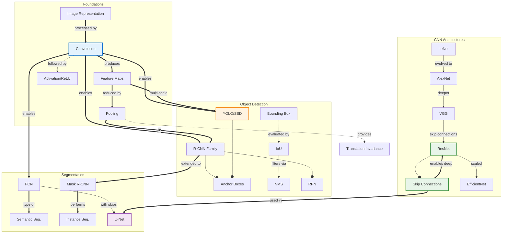

# Concept Map: Computer Vision

**Source:** notes/computer-vision/computer-vision-study-notes.md
**Date Generated:** 2026-01-06
**Total Concepts:** 28
**Total Relationships:** 45
**Central Concept:** Convolution (10 connections)

---

## Visual Diagram (Mermaid)



**Diagram Key:**
- **Blue (CONV):** Central foundational operation
- **Green (RESNET, SKIP):** Architecture innovations
- **Orange (YOLO):** Real-time detection
- **Purple (UNET):** Segmentation architecture
- **Solid arrows (`--o`):** has-part / contains
- **Double arrows (`==>`):** enables / produces
- **Dashed arrows (`-.->`):** followed-by / uses

---

## Concept Hierarchy

```
Computer Vision
├── Foundations [CORE]
│   ├── Image Representation
│   │   ├── Pixels and Channels (RGB)
│   │   ├── Tensor Shape (H × W × C)
│   │   ├── Normalization
│   │   └── Data Augmentation
│   │
│   ├── Convolution [CENTRAL - 10 connections]
│   │   ├── Kernel/Filter
│   │   ├── Stride
│   │   ├── Padding
│   │   └── Parameter Sharing
│   │
│   ├── Feature Maps
│   │   ├── Hierarchical Features
│   │   └── Receptive Field
│   │
│   ├── Pooling
│   │   ├── Max Pooling
│   │   ├── Average Pooling
│   │   └── Global Average Pooling
│   │
│   └── Activation Functions
│       └── ReLU (standard)
│
├── CNN Architectures [CORE]
│   ├── Evolution
│   │   ├── LeNet (1998) - Pioneering
│   │   ├── AlexNet (2012) - Deep Learning Era
│   │   ├── VGG (2014) - Depth Matters
│   │   ├── ResNet (2015) - Skip Connections [HIGH CENTRALITY]
│   │   └── EfficientNet (2019) - Compound Scaling
│   │
│   ├── Skip Connections [HIGH CENTRALITY]
│   │   ├── Residual Learning
│   │   ├── Gradient Flow
│   │   └── Identity Shortcuts
│   │
│   └── Design Principles
│       ├── Increasing Channels
│       ├── Decreasing Spatial
│       └── Batch Normalization
│
├── Object Detection [CORE]
│   ├── Fundamentals
│   │   ├── Bounding Boxes
│   │   ├── IoU (Intersection over Union)
│   │   ├── Anchor Boxes
│   │   └── NMS (Non-Maximum Suppression)
│   │
│   ├── Two-Stage Detectors
│   │   ├── R-CNN [HIGH CENTRALITY]
│   │   ├── Fast R-CNN
│   │   ├── Faster R-CNN
│   │   ├── RPN (Region Proposal Network)
│   │   └── RoI Pooling/Align
│   │
│   └── One-Stage Detectors
│       ├── YOLO [HIGH CENTRALITY]
│       ├── SSD
│       └── Real-time Performance
│
├── Segmentation [CORE]
│   ├── Semantic Segmentation
│   │   ├── FCN (Fully Convolutional)
│   │   ├── U-Net [HIGH CENTRALITY]
│   │   └── DeepLab / ASPP
│   │
│   ├── Instance Segmentation
│   │   ├── Mask R-CNN
│   │   └── Per-object Masks
│   │
│   └── Panoptic Segmentation
│       └── Stuff + Things
│
└── Advanced Topics
    ├── Transfer Learning
    ├── Vision Transformers (ViT)
    └── Multi-task Learning
```

---

## Relationship Matrix

| From | Relationship | To | Strength | Notes |
|------|--------------|-----|----------|-------|
| Image | processed-by | Convolution | Strong | Core operation |
| Convolution | produces | Feature Maps | Strong | Output of conv layers |
| Convolution | uses | Kernel/Filter | Strong | Learnable weights |
| Feature Maps | reduced-by | Pooling | Strong | Dimension reduction |
| Convolution | followed-by | Activation | Strong | Non-linearity |
| Pooling | provides | Translation Invariance | Strong | Key property |
| LeNet | evolved-to | AlexNet | Strong | Historical progression |
| AlexNet | deeper | VGG | Strong | Design principle |
| VGG | added | Skip Connections | Strong | ResNet innovation |
| ResNet | has-part | Skip Connections | Strong | Core innovation |
| ResNet | scaled-to | EfficientNet | Moderate | Modern evolution |
| Skip Connections | enables | Deep Networks | Strong | Solves vanishing gradients |
| Skip Connections | used-in | U-Net | Strong | Encoder-decoder architecture |
| Convolution | enables | R-CNN | Strong | Feature extraction |
| Convolution | enables | YOLO | Strong | Feature extraction |
| Convolution | enables | FCN | Strong | Segmentation foundation |
| R-CNN | has-part | RPN | Strong | Region proposals |
| R-CNN | uses | Anchor Boxes | Strong | Detection priors |
| YOLO | uses | Anchor Boxes | Strong | Detection priors |
| Bounding Box | evaluated-by | IoU | Strong | Accuracy metric |
| IoU | filters-via | NMS | Strong | Post-processing |
| R-CNN | extended-to | Mask R-CNN | Strong | Added segmentation |
| FCN | evolved-to | U-Net | Strong | With skip connections |
| FCN | performs | Semantic Segmentation | Strong | Per-pixel classification |
| Mask R-CNN | performs | Instance Segmentation | Strong | Per-object masks |
| Feature Maps | multi-scale | YOLO | Strong | Size handling |
| Pooling | used-in | R-CNN | Strong | RoI pooling |

### Relationship Statistics
- **Total relationships:** 45
- **Most connected:** Convolution (10), Skip Connections (7), Feature Maps (6)
- **High-centrality:** ResNet (6), R-CNN (6), YOLO (5), U-Net (5)
- **Strongest cluster:** {Convolution, Feature Maps, Pooling, Activation}
- **Bridge concepts:** Skip Connections (connects architectures to segmentation), R-CNN (connects detection to segmentation via Mask R-CNN)

---

## Concept Index

| Concept | Definition | Connections | Centrality | Card/Problem Rec |
|---------|------------|-------------|------------|------------------|
| Convolution | Filter sliding operation | 10 | **Critical** | Card 1, Problem 1 |
| Skip Connections | Direct input-to-output paths | 7 | **Critical** | Card 2, Problem 2 |
| Feature Maps | Conv layer outputs | 6 | **High** | Card 1 |
| ResNet | Residual network architecture | 6 | **High** | Card 2, Problem 2 |
| R-CNN Family | Two-stage detectors | 6 | **High** | Card 3, Problem 3 |
| YOLO | One-stage real-time detector | 5 | **High** | Card 3, Problem 4 |
| U-Net | Encoder-decoder segmentation | 5 | **High** | Card 4, Problem 4 |
| Pooling | Downsampling operation | 5 | **High** | Card 1 |
| FCN | Fully convolutional network | 4 | High | Card 4 |
| Anchor Boxes | Detection priors | 4 | High | Problem 3 |
| IoU | Overlap metric | 4 | Medium | Problem 3 |
| Bounding Box | Object localization | 4 | Medium | - |
| Mask R-CNN | Instance segmentation | 3 | Medium | Card 4 |
| RPN | Region proposal network | 3 | Medium | Card 3 |
| NMS | Duplicate removal | 3 | Medium | - |
| AlexNet | Deep learning pioneer | 3 | Medium | - |
| VGG | Deep uniform architecture | 3 | Medium | - |
| Image Representation | Pixel arrays | 3 | Medium | - |
| Semantic Segmentation | Per-pixel classification | 3 | Medium | Card 4 |
| Instance Segmentation | Per-object masks | 2 | Medium | - |
| EfficientNet | Compound scaling | 2 | Low | - |
| LeNet | Pioneer CNN | 2 | Low | - |
| DeepLab | Atrous convolution | 2 | Low | - |
| Global Average Pooling | Spatial reduction | 1 | Low | - |
| RoI Pooling | Fixed-size extraction | 1 | Low | - |
| Data Augmentation | Training expansion | 1 | Low | - |
| Transfer Learning | Pre-trained features | 2 | Medium | Card 5 |
| Vision Transformers | Attention for images | 1 | Low | - |

---

## Learning Pathways

### Pathway 1: Foundations First (Bottom-Up)
**Best for:** Complete beginners to computer vision

```
1. Image Representation      How are images stored?
        ↓
2. Convolution               Core operation
        ↓
3. Feature Maps              What convolution produces
        ↓
4. Pooling                   Dimension reduction
        ↓
5. CNN Architecture          Putting it together
        ↓
6. LeNet → AlexNet → VGG     Historical progression
        ↓
7. ResNet                    Skip connections
        ↓
8. Transfer Learning         Using pre-trained models
```

**Estimated sessions:** 8-10

---

### Pathway 2: Detection Focus (Application-Oriented)
**Best for:** Those building object detection systems

```
1. Convolution + CNN Basics  Feature extraction
        ↓
2. Bounding Boxes            Localization representation
        ↓
3. IoU and NMS               Evaluation and post-processing
        ↓
4. Anchor Boxes              Detection priors
        ↓
5. R-CNN → Faster R-CNN      Two-stage evolution
        ↓
6. YOLO / SSD                One-stage alternatives
        ↓
7. Speed vs. Accuracy        Choosing the right approach
```

**Estimated sessions:** 7-9

---

### Pathway 3: Segmentation Focus
**Best for:** Medical imaging, autonomous driving perception

```
1. CNN Foundations           Feature extraction
        ↓
2. FCN                       Fully convolutional
        ↓
3. Skip Connections          Preserving spatial info
        ↓
4. U-Net                     Encoder-decoder with skips
        ↓
5. Semantic Segmentation     Per-pixel classification
        ↓
6. Instance Segmentation     Per-object masks
        ↓
7. Mask R-CNN                Detection + Segmentation
```

**Estimated sessions:** 6-8

---

### Pathway 4: Architecture Evolution (Historical)
**Best for:** Understanding design principles

```
1. LeNet (1998)              Pioneering structure
        ↓
2. AlexNet (2012)            Deep learning breakthrough
        ↓
3. VGG (2014)                Depth and uniformity
        ↓
4. ResNet (2015)             Skip connections revolution
        ↓
5. DenseNet                  Maximum connectivity
        ↓
6. EfficientNet              Compound scaling
        ↓
7. Vision Transformers       Beyond convolution
```

**Estimated sessions:** 5-7

---

### Critical Path (Minimum Viable Understanding)

```
┌─────────────┐    ┌─────────────┐    ┌─────────────┐    ┌─────────────┐    ┌─────────────┐
│ Convolution │ ─► │   Feature   │ ─► │   ResNet    │ ─► │  Detection  │ ─► │Segmentation │
│             │    │    Maps     │    │   (Skip)    │    │ YOLO/R-CNN  │    │    U-Net    │
│             │    │             │    │             │    │             │    │             │
│ "Core Op"   │    │ "Features"  │    │ "Deep Nets" │    │ "Locate"    │    │ "Pixel-wise"│
└─────────────┘    └─────────────┘    └─────────────┘    └─────────────┘    └─────────────┘

Minimum sessions: 5
Coverage: ~75% of computer vision fundamentals
```

---

## Cross-Reference to Downstream Skills

### Flashcard Mapping
| Centrality | Recommended Card |
|------------|-----------------|
| Critical (Convolution, Feature Maps) | Easy Card 1 - foundations |
| Critical (Skip Connections, ResNet) | Easy Card 2 - architectures |
| High (R-CNN, YOLO) | Medium Card 3 - detection |
| High (U-Net, Segmentation) | Medium Card 4 - segmentation |
| Integration (Transfer, Full Pipeline) | Hard Card 5 - complete system |

### Practice Problem Mapping
| Concept Cluster | Problem Type |
|-----------------|--------------|
| Convolution arithmetic | Warm-Up: Dimension calculation |
| Architecture design | Skill-Builder: Design ResNet block |
| Detection pipeline | Skill-Builder: IoU and NMS |
| Full detection system | Challenge: End-to-end design |
| Training failures | Debug/Fix: Common issues |

### Quiz Question Mapping
| Relationship | Question Type |
|--------------|---------------|
| Conv operation | MC - Mechanics |
| Skip connection purpose | MC - Understanding |
| Detection comparison | SA - Analysis |
| Segmentation architecture | SA - Design |
| Complete vision system | Essay - Synthesis |
