# Concept Map: Lesson 5 - Deep Learning

**Source:** Lessons/Lesson_5.md
**Subject Area:** AI Learning - Deep Learning: Neural Networks, Optimization, and Training Techniques
**Date Generated:** 2026-01-08
**Total Concepts:** 32
**Total Relationships:** 48

---

## Visual Concept Map (Mermaid)

```mermaid
graph TD
    subgraph Architecture["Network Architecture"]
        NN[Neural Network]
        LAYER[Layer]
        NEURON[Neuron]
        DEPTH[Depth]
        WIDTH[Width]
        HIER[Hierarchical Features]
    end

    subgraph Activation["Activation Functions"]
        ACT[Activation Function]
        RELU[ReLU]
        GELU[GELU]
        SWISH[Swish]
        SOFTMAX[Softmax]
    end

    subgraph Loss["Loss & Objectives"]
        LOSS[Loss Function]
        CE[Cross-Entropy]
        MSE[Mean Squared Error]
        LAND[Loss Landscape]
    end

    subgraph Gradient["Gradient Flow"]
        BACKPROP[Backpropagation]
        CHAIN[Chain Rule]
        VANISH[Vanishing Gradient]
        EXPLODE[Exploding Gradient]
        CLIP[Gradient Clipping]
    end

    subgraph Optimizer["Optimization"]
        OPT[Optimizer]
        SGD[SGD]
        MOMENTUM[Momentum]
        ADAM[Adam]
        ADAMW[AdamW]
        LR[Learning Rate]
    end

    subgraph Schedule["LR Scheduling"]
        SCHED[LR Schedule]
        WARMUP[Warmup]
        COSINE[Cosine Decay]
        STEP[Step Decay]
    end

    subgraph Regularization["Regularization"]
        REG[Regularization]
        DROPOUT[Dropout]
        WD[Weight Decay]
        EARLY[Early Stopping]
        AUG[Data Augmentation]
    end

    subgraph Normalization["Normalization"]
        NORM[Normalization]
        BN[BatchNorm]
        LN[LayerNorm]
        PRELN[Pre-LN]
    end

    subgraph Residual["Skip Connections"]
        RES[Residual Connection]
        SKIP[Skip Connection]
        HIGHWAY[Gradient Highway]
    end

    subgraph Scale["Training at Scale"]
        SCALE[Large-Scale Training]
        DP[Data Parallelism]
        MP[Model Parallelism]
        MIXED[Mixed Precision]
        CKPT[Gradient Checkpointing]
    end

    %% Architecture relationships
    NN -->|"composed of"| LAYER
    LAYER -->|"contains"| NEURON
    NN -->|"has"| DEPTH
    NN -->|"has"| WIDTH
    DEPTH -->|"enables"| HIER

    %% Activation relationships
    LAYER -->|"uses"| ACT
    ACT -->|"variant"| RELU
    ACT -->|"variant"| GELU
    ACT -->|"variant"| SWISH
    ACT -->|"variant"| SOFTMAX
    RELU -->|"solves"| VANISH

    %% Loss relationships
    NN -->|"optimizes"| LOSS
    LOSS -->|"variant"| CE
    LOSS -->|"variant"| MSE
    LOSS -->|"defines"| LAND

    %% Gradient relationships
    BACKPROP -->|"uses"| CHAIN
    BACKPROP -->|"can cause"| VANISH
    BACKPROP -->|"can cause"| EXPLODE
    CLIP -->|"prevents"| EXPLODE

    %% Optimizer relationships
    OPT -->|"updates"| NN
    OPT -->|"variant"| SGD
    SGD -->|"enhanced by"| MOMENTUM
    OPT -->|"variant"| ADAM
    ADAM -->|"improved as"| ADAMW
    OPT -->|"uses"| LR

    %% Schedule relationships
    LR -->|"controlled by"| SCHED
    SCHED -->|"includes"| WARMUP
    SCHED -->|"includes"| COSINE
    SCHED -->|"includes"| STEP

    %% Regularization relationships
    REG -->|"prevents"| LAND
    REG -->|"technique"| DROPOUT
    REG -->|"technique"| WD
    REG -->|"technique"| EARLY
    REG -->|"technique"| AUG

    %% Normalization relationships
    NORM -->|"stabilizes"| NN
    NORM -->|"variant"| BN
    NORM -->|"variant"| LN
    LN -->|"placement"| PRELN
    PRELN -->|"improves"| VANISH

    %% Residual relationships
    RES -->|"is"| SKIP
    RES -->|"creates"| HIGHWAY
    HIGHWAY -->|"solves"| VANISH
    RES -->|"enables"| DEPTH

    %% Scale relationships
    SCALE -->|"technique"| DP
    SCALE -->|"technique"| MP
    SCALE -->|"technique"| MIXED
    SCALE -->|"technique"| CKPT
    ADAMW -->|"preferred for"| SCALE
```



---

## Concept Hierarchy

```
DEEP LEARNING
├── NETWORK ARCHITECTURE
│   ├── Neural Network
│   │   ├── Layers (Linear + Activation)
│   │   ├── Neurons (Weighted Sum + Bias)
│   │   └── Parameters (Weights, Biases)
│   ├── Depth
│   │   └── Hierarchical Feature Learning
│   └── Width
│       └── Capacity per Layer
│
├── ACTIVATION FUNCTIONS
│   ├── ReLU
│   │   ├── max(0, x)
│   │   ├── Dying ReLU Problem
│   │   └── Leaky ReLU Variant
│   ├── GELU
│   │   └── Transformer Standard
│   ├── Swish/SiLU
│   │   └── Self-Gated
│   └── Softmax
│       └── Output Layer (Classification)
│
├── LOSS FUNCTIONS
│   ├── Cross-Entropy
│   │   ├── Classification Standard
│   │   └── KL Divergence Interpretation
│   ├── Mean Squared Error
│   │   └── Regression Standard
│   └── Loss Landscape
│       ├── Non-Convex
│       ├── Local Minima
│       └── Saddle Points
│
├── GRADIENT FLOW
│   ├── Backpropagation
│   │   └── Chain Rule Application
│   ├── Vanishing Gradient
│   │   ├── Cause: Products < 1
│   │   └── Solutions: ReLU, Residuals, Init
│   ├── Exploding Gradient
│   │   └── Solution: Gradient Clipping
│   └── Gradient Highway
│       └── Residual Connections
│
├── OPTIMIZATION
│   ├── SGD
│   │   └── θ = θ - η∇L
│   ├── Momentum
│   │   └── Velocity Accumulation
│   ├── Adam
│   │   ├── Adaptive LR
│   │   └── Moment Estimates
│   ├── AdamW
│   │   └── Decoupled Weight Decay
│   └── Learning Rate
│       └── Most Critical Hyperparameter
│
├── LR SCHEDULING
│   ├── Warmup
│   │   └── Stabilize Early Training
│   ├── Cosine Decay
│   │   └── Smooth Reduction
│   ├── Step Decay
│   │   └── Fixed Reduction Points
│   └── One-Cycle
│       └── Increase then Decrease
│
├── REGULARIZATION
│   ├── Weight Decay (L2)
│   │   └── Penalize Large Weights
│   ├── Dropout
│   │   └── Random Neuron Zeroing
│   ├── Data Augmentation
│   │   └── Expand Training Distribution
│   ├── Early Stopping
│   │   └── Halt Before Overfitting
│   └── Label Smoothing
│       └── Soften Hard Targets
│
├── NORMALIZATION
│   ├── Batch Normalization
│   │   ├── Normalize Over Batch
│   │   ├── Running Stats at Inference
│   │   └── Best for CNNs
│   ├── Layer Normalization
│   │   ├── Normalize Over Features
│   │   ├── Batch-Independent
│   │   └── Best for Transformers
│   └── Pre-LN vs Post-LN
│       └── Pre-LN More Stable
│
├── RESIDUAL CONNECTIONS
│   ├── Skip Connection
│   │   └── y = F(x) + x
│   ├── Residual Learning
│   │   └── Learn F(x) = H(x) - x
│   └── Gradient Highway
│       └── ∂y/∂x = ∂F/∂x + 1
│
└── TRAINING AT SCALE
    ├── Data Parallelism
    │   └── Replicate Model, Split Data
    ├── Model Parallelism
    │   └── Split Model Across GPUs
    ├── Mixed Precision
    │   ├── FP16/BF16 Compute
    │   └── FP32 Master Weights
    └── Gradient Checkpointing
        └── Trade Compute for Memory
```

---

## Relationship Matrix

| From Concept | To Concept | Relationship Type | Strength |
|--------------|------------|-------------------|----------|
| Neural Network | Layer | composed-of | Strong |
| Layer | Neuron | contains | Strong |
| Layer | Activation Function | uses | Strong |
| Depth | Hierarchical Features | enables | Strong |
| ReLU | Vanishing Gradient | solves | Strong |
| Backpropagation | Chain Rule | uses | Strong |
| Backpropagation | Vanishing Gradient | can-cause | Strong |
| Backpropagation | Exploding Gradient | can-cause | Strong |
| Gradient Clipping | Exploding Gradient | prevents | Strong |
| Optimizer | Neural Network | updates | Strong |
| SGD | Momentum | enhanced-by | Strong |
| Adam | AdamW | improved-as | Strong |
| Learning Rate | LR Schedule | controlled-by | Strong |
| Regularization | Overfitting | prevents | Strong |
| Normalization | Training | stabilizes | Strong |
| LayerNorm | Pre-LN | placement-variant | Strong |
| Pre-LN | Vanishing Gradient | improves | Strong |
| Residual Connection | Skip Connection | is-a | Strong |
| Residual Connection | Gradient Highway | creates | Strong |
| Gradient Highway | Vanishing Gradient | solves | Strong |
| Residual Connection | Depth | enables | Strong |
| AdamW | Large-Scale Training | preferred-for | Strong |
| Weight Decay | Large Weights | penalizes | Strong |
| Dropout | Co-adaptation | prevents | Strong |
| Warmup | Early Training | stabilizes | Strong |
| BatchNorm | CNNs | best-for | Strong |
| LayerNorm | Transformers | best-for | Strong |
| Cross-Entropy | Classification | standard-for | Strong |
| MSE | Regression | standard-for | Strong |
| Loss Function | Loss Landscape | defines | Strong |
| Data Parallelism | Multi-GPU | enables | Strong |
| Mixed Precision | Memory | reduces | Strong |
| Gradient Checkpointing | Memory | reduces | Medium |

---

## Centrality Index

**High Centrality (6+ connections):**
| Concept | Incoming | Outgoing | Total | Role |
|---------|----------|----------|-------|------|
| Neural Network | 2 | 5 | 7 | **Central Entity** - What we train |
| Vanishing Gradient | 4 | 0 | 4 | **Key Problem** - What we solve |
| Learning Rate | 2 | 3 | 5 | **Critical Hyperparam** |
| Layer | 2 | 3 | 5 | **Building Block** |
| Optimizer | 1 | 5 | 6 | **Update Mechanism** |

**Medium Centrality (3-5 connections):**
| Concept | Incoming | Outgoing | Total | Role |
|---------|----------|----------|-------|------|
| Backpropagation | 0 | 4 | 4 | Training algorithm |
| Residual Connection | 1 | 3 | 4 | Architecture innovation |
| Regularization | 0 | 4 | 4 | Generalization |
| Normalization | 0 | 3 | 3 | Stability |
| Activation Function | 1 | 3 | 4 | Non-linearity |

**Low Centrality (1-2 connections):**
- ReLU, GELU, Swish, Softmax, Cross-Entropy, MSE, SGD, Momentum, Adam, AdamW, Warmup, Cosine, Dropout, Weight Decay, BatchNorm, LayerNorm, Skip Connection

---

## Learning Pathways

### Pathway 1: Network Foundations
**Goal:** Understand how neural networks compute
**Sequence:** Neuron → Layer → Activation Functions → Neural Network → Depth → Hierarchical Features
**Prerequisites:** Basic linear algebra, calculus
**Assessment:** Can trace forward pass through multi-layer network

### Pathway 2: Training Mechanics
**Goal:** Understand how networks learn
**Sequence:** Loss Function → Backpropagation → Chain Rule → Gradient Flow → Vanishing/Exploding Gradients → Solutions (ReLU, Residuals)
**Prerequisites:** Pathway 1
**Assessment:** Can identify and diagnose gradient flow problems

### Pathway 3: Optimization Mastery
**Goal:** Configure optimizers and schedules effectively
**Sequence:** SGD → Momentum → Adam → AdamW → Learning Rate → Warmup → Cosine Decay → Large-Scale Training
**Prerequisites:** Pathway 2
**Assessment:** Can design LR schedule for specific training scenario

### Pathway 4: Regularization & Stability
**Goal:** Prevent overfitting and stabilize training
**Sequence:** Overfitting → Regularization (Dropout, Weight Decay) → Normalization (BatchNorm, LayerNorm) → Pre-LN → Training Stability
**Prerequisites:** Pathways 1-3
**Assessment:** Can diagnose overfitting and apply appropriate regularization

---

## Critical Path Analysis

**Minimum Viable Understanding (MVU):**
```
Layer → Activation → Backpropagation → Optimizer → Learning Rate
```

**Rationale:** These five concepts provide the essential training loop understanding:
1. **Layer:** Building block of networks
2. **Activation:** Why networks can learn non-linear functions
3. **Backpropagation:** How gradients are computed
4. **Optimizer:** How parameters are updated
5. **Learning Rate:** The critical hyperparameter

**Expanded Path for Practitioners:**
```
Layer → Activation (ReLU/GELU) → Loss Function → Backpropagation →
Vanishing Gradient → Residual Connection → Optimizer (AdamW) →
Learning Rate → Warmup + Cosine → Normalization (LayerNorm) →
Pre-LN → Dropout/Weight Decay → Mixed Precision → Data Parallelism
```

---

## Cross-Lesson Connections

### To Lesson 4 (Transformers)
| Deep Learning Concept | Transformer Connection | Implication |
|-----------------------|------------------------|-------------|
| Residual Connections | Attention + FFN blocks | Enables deep Transformers |
| LayerNorm/Pre-LN | Every sublayer | Stability for attention |
| GELU/SwiGLU | FFN activation | Modern Transformer standard |
| AdamW | Default optimizer | Proper weight decay |
| Warmup | Essential for training | Stabilizes attention |

### To Lesson 3 (LLMs)
| Deep Learning Concept | LLM Connection | Implication |
|-----------------------|----------------|-------------|
| Large-Scale Training | Billion-parameter models | DP, MP, mixed precision |
| Gradient Checkpointing | Long sequences | Memory management |
| Loss Landscape | Pre-training | Non-convex but trainable |
| Learning Rate Schedule | Training runs | Warmup + decay |

### To Lessons 1-2 (Skills, Prompting)
| Deep Learning Concept | Application Layer | Implication |
|-----------------------|-------------------|-------------|
| Network Architecture | Model capabilities | What skills can leverage |
| Training | Model behavior | How prompting patterns emerge |
| Regularization | Generalization | Why models transfer |

---

## Concept Definitions (Quick Reference)

| Concept | One-Line Definition |
|---------|---------------------|
| Neural Network | Parameterized function of layers learning from data |
| Activation Function | Non-linearity enabling complex function learning |
| ReLU | max(0, x); enables deep networks |
| GELU | Smooth activation for Transformers |
| Loss Function | Objective quantifying prediction error |
| Cross-Entropy | Classification loss measuring distribution divergence |
| Backpropagation | Computing gradients via chain rule |
| Vanishing Gradient | Gradients shrinking exponentially in deep networks |
| SGD | Basic gradient descent optimizer |
| Adam | Adaptive learning rate optimizer |
| AdamW | Adam with decoupled weight decay |
| Learning Rate | Step size for parameter updates |
| Warmup | Gradual LR increase at training start |
| Cosine Decay | Smooth LR reduction following cosine |
| Dropout | Random neuron zeroing for regularization |
| Weight Decay | L2 penalty on weights |
| BatchNorm | Normalize over batch dimension |
| LayerNorm | Normalize over feature dimension |
| Pre-LN | LayerNorm before sublayer (modern default) |
| Residual Connection | Skip connection: y = F(x) + x |
| Gradient Highway | Direct gradient path through residuals |
| Data Parallelism | Same model on multiple GPUs, split data |
| Mixed Precision | FP16 compute, FP32 weights |
| Gradient Checkpointing | Recompute activations to save memory |

---

## Study Recommendations

### Foundation First
1. Master forward and backward pass computation by hand
2. Understand why activation functions are necessary
3. Trace gradient flow through a simple network

### Optimization Focus
1. Understand the difference between SGD, Adam, AdamW
2. Practice designing LR schedules for different scenarios
3. Know when warmup is necessary and why

### Architecture Principles
1. Understand why residual connections enable depth
2. Know when to use BatchNorm vs LayerNorm
3. Understand Pre-LN vs Post-LN tradeoffs

### Scale Awareness
1. Understand data vs model parallelism
2. Know mixed precision benefits and requirements
3. Understand memory/compute tradeoffs

---

*Generated from Lesson 5: Deep Learning | Concept Map Skill*
