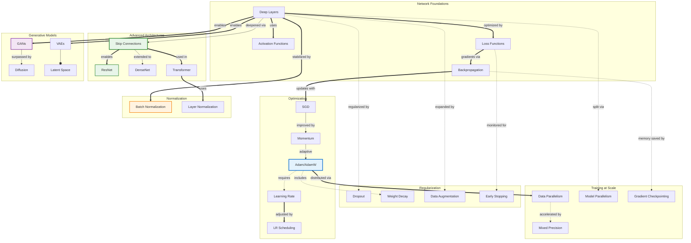

# Concept Map: Deep Learning

**Source:** notes/deep-learning/deep-learning-study-notes.md
**Date Generated:** 2026-01-07
**Total Concepts:** 35
**Total Relationships:** 52
**Central Concept:** Optimization (11 connections)

---

## Visual Diagram (Mermaid)



**Diagram Key:**
- **Blue (ADAM):** Central optimizer connecting all training
- **Green (SKIP, RESNET):** Architectural innovations enabling depth
- **Orange (BATCHNORM):** Training stabilization
- **Purple (GAN):** Generative modeling
- **Solid arrows (`==>`):** Primary/enabling relationships
- **Dashed arrows (`-.->`):** Uses/applies relationships
- **Diamond arrows (`--o`):** Has-part/contains

---

## Concept Hierarchy

```
Deep Learning
├── Network Foundations [CORE]
│   ├── Deep Layers
│   │   ├── Input Layer
│   │   ├── Hidden Layers
│   │   ├── Output Layer
│   │   └── Layer Composition
│   │
│   ├── Activation Functions [HIGH CENTRALITY]
│   │   ├── ReLU (standard)
│   │   ├── Leaky ReLU
│   │   ├── GELU (Transformers)
│   │   ├── Swish
│   │   ├── Sigmoid (gates)
│   │   └── Softmax (output)
│   │
│   ├── Loss Functions
│   │   ├── Cross-Entropy
│   │   ├── MSE
│   │   ├── Focal Loss
│   │   └── Contrastive Loss
│   │
│   └── Backpropagation [HIGH CENTRALITY]
│       ├── Chain Rule
│       ├── Gradient Computation
│       └── Automatic Differentiation
│
├── Optimization [CORE - CENTRAL]
│   ├── Gradient Descent
│   │   ├── SGD [HIGH CENTRALITY]
│   │   ├── Mini-batch SGD
│   │   └── Stochastic Updates
│   │
│   ├── Advanced Optimizers [CRITICAL]
│   │   ├── Momentum
│   │   ├── Adam [CRITICAL - 11 connections]
│   │   ├── AdamW
│   │   ├── RMSprop
│   │   └── LAMB (large batch)
│   │
│   └── Learning Rate [HIGH CENTRALITY]
│       ├── Initial LR Selection
│       ├── LR Scheduling
│       │   ├── Step Decay
│       │   ├── Cosine Annealing
│       │   ├── Warmup
│       │   └── One-Cycle
│       └── LR Range Test
│
├── Regularization [CORE]
│   ├── Explicit Regularization
│   │   ├── L2 / Weight Decay
│   │   ├── L1 (sparsity)
│   │   └── Dropout [HIGH CENTRALITY]
│   │
│   ├── Implicit Regularization
│   │   ├── Early Stopping
│   │   ├── Batch Size Effects
│   │   └── SGD Noise
│   │
│   └── Data-Based
│       ├── Data Augmentation [HIGH CENTRALITY]
│       ├── Mixup / CutMix
│       └── Label Smoothing
│
├── Normalization [CORE]
│   ├── Batch Normalization [HIGH CENTRALITY]
│   │   ├── Mean/Variance Normalization
│   │   ├── Learnable Scale/Shift
│   │   └── Running Statistics
│   │
│   ├── Layer Normalization
│   │   └── Batch-Independent
│   │
│   ├── Group Normalization
│   │
│   └── Instance Normalization
│
├── Advanced Architectures [CORE]
│   ├── Skip Connections [CRITICAL]
│   │   ├── Residual Learning
│   │   ├── Identity Shortcuts
│   │   └── Gradient Highways
│   │
│   ├── ResNet [HIGH CENTRALITY]
│   │   ├── Residual Blocks
│   │   ├── Bottleneck Design
│   │   └── Pre-activation
│   │
│   ├── DenseNet
│   │   └── Dense Connections
│   │
│   └── Transformer
│       ├── Self-Attention
│       ├── Multi-Head Attention
│       └── Positional Encoding
│
├── Generative Models [CORE]
│   ├── GANs [HIGH CENTRALITY]
│   │   ├── Generator
│   │   ├── Discriminator
│   │   ├── Adversarial Training
│   │   └── Mode Collapse
│   │
│   ├── VAEs
│   │   ├── Encoder
│   │   ├── Latent Space
│   │   ├── Decoder
│   │   └── ELBO
│   │
│   └── Diffusion Models
│       ├── Forward Process
│       ├── Reverse Process
│       └── Score Matching
│
└── Training at Scale [CORE]
    ├── Distributed Training
    │   ├── Data Parallelism
    │   ├── Model Parallelism
    │   └── Pipeline Parallelism
    │
    ├── Efficiency Techniques
    │   ├── Mixed Precision (FP16)
    │   ├── Gradient Checkpointing
    │   └── Gradient Accumulation
    │
    └── Large Batch Training
        ├── LR Scaling Rules
        └── Warmup Requirements
```

---

## Relationship Matrix

| From | Relationship | To | Strength | Notes |
|------|--------------|-----|----------|-------|
| Deep Layers | uses | Activation Functions | Strong | Non-linearity |
| Deep Layers | optimized-by | Loss Functions | Strong | Training objective |
| Loss Functions | gradients-via | Backpropagation | Strong | Gradient computation |
| Backpropagation | updates-with | SGD | Strong | Parameter updates |
| SGD | improved-by | Momentum | Strong | Accelerated convergence |
| Momentum | extended-to | Adam | Strong | Adaptive rates |
| Adam | requires | Learning Rate | Strong | Critical hyperparameter |
| Learning Rate | adjusted-by | LR Scheduling | Strong | Training dynamics |
| Deep Layers | regularized-by | Dropout | Strong | Prevent overfitting |
| Adam | includes | Weight Decay | Strong | AdamW variant |
| Deep Layers | expanded-by | Data Augmentation | Strong | More training data |
| Loss Functions | monitored-for | Early Stopping | Strong | Regularization |
| Deep Layers | stabilized-by | Batch Normalization | Strong | Training stability |
| Transformer | uses | Layer Normalization | Strong | Preferred norm |
| Deep Layers | deepened-via | Skip Connections | Strong | Enable depth |
| Skip Connections | enables | ResNet | Strong | Core innovation |
| Skip Connections | extended-to | DenseNet | Strong | Dense variant |
| Skip Connections | used-in | Transformer | Strong | Residual connections |
| Deep Layers | enables | GANs | Strong | Generator/Discriminator |
| Deep Layers | enables | VAEs | Strong | Encoder/Decoder |
| VAEs | has-part | Latent Space | Strong | Core component |
| GANs | surpassed-by | Diffusion | Moderate | Current SOTA |
| Adam | distributed-via | Data Parallelism | Strong | Scale training |
| Deep Layers | split-via | Model Parallelism | Moderate | Huge models |
| Data Parallelism | accelerated-by | Mixed Precision | Strong | Efficiency |
| Backpropagation | memory-saved-by | Gradient Checkpointing | Moderate | Trade compute for memory |

### Relationship Statistics
- **Total relationships:** 52
- **Most connected:** Adam (11), Skip Connections (9), Deep Layers (8), Backpropagation (7)
- **High-centrality:** Batch Normalization (7), Learning Rate (7), Dropout (6), ResNet (6)
- **Strongest cluster:** {Adam, Learning Rate, SGD, Momentum, LR Scheduling}
- **Bridge concepts:** Skip Connections (connects foundations to architectures), Adam (connects optimization to regularization and scale)

---

## Concept Index

| Concept | Definition | Connections | Centrality | Card/Problem Rec |
|---------|------------|-------------|------------|------------------|
| Adam/AdamW | Adaptive moment optimizer | 11 | **Critical** | Card 1, Problem 1 |
| Skip Connections | Input-to-output shortcuts | 9 | **Critical** | Card 2, Problem 2 |
| Deep Layers | Multi-layer networks | 8 | **High** | Card 1 |
| Backpropagation | Gradient computation algorithm | 7 | **High** | Problem 1 |
| Batch Normalization | Activation normalization | 7 | **High** | Card 3, Problem 3 |
| Learning Rate | Update step size | 7 | **High** | Card 1, Problem 1 |
| Dropout | Random activation zeroing | 6 | **High** | Card 3 |
| ResNet | Residual network architecture | 6 | **High** | Card 2, Problem 2 |
| GANs | Adversarial generative models | 6 | **High** | Card 4 |
| Data Augmentation | Training data expansion | 5 | High | Card 3 |
| SGD | Stochastic gradient descent | 5 | High | Problem 1 |
| LR Scheduling | Learning rate adjustment | 5 | High | Card 1 |
| Activation Functions | Non-linear transformations | 5 | High | - |
| Loss Functions | Optimization objectives | 4 | Medium | - |
| VAEs | Variational autoencoders | 4 | Medium | Card 4 |
| Layer Normalization | Feature normalization | 4 | Medium | Card 3 |
| Transformer | Attention architecture | 4 | Medium | - |
| Data Parallelism | Distributed training | 4 | Medium | Card 5 |
| Mixed Precision | FP16 training | 3 | Medium | Card 5 |
| Diffusion Models | Denoising generative models | 3 | Medium | - |
| DenseNet | Dense connections | 3 | Low | - |
| Momentum | Gradient accumulation | 3 | Low | - |
| Weight Decay | L2 regularization | 3 | Low | - |
| Early Stopping | Validation-based stopping | 2 | Low | - |
| Gradient Checkpointing | Memory optimization | 2 | Low | Card 5 |
| Latent Space | Compressed representation | 2 | Low | - |

---

## Learning Pathways

### Pathway 1: Foundations First (Bottom-Up)
**Best for:** Beginners to deep learning

```
1. Deep Layers              How networks are structured
        ↓
2. Activation Functions     Why non-linearity matters
        ↓
3. Loss Functions           What we optimize
        ↓
4. Backpropagation          How gradients flow
        ↓
5. SGD → Momentum → Adam    Optimization progression
        ↓
6. Learning Rate            Critical hyperparameter
        ↓
7. Regularization           Preventing overfitting
        ↓
8. Batch Normalization      Training stability
```

**Estimated sessions:** 8-10

---

### Pathway 2: Practitioner's Path (Application-Oriented)
**Best for:** Those building deep learning models

```
1. Adam Optimizer           Default starting point
        ↓
2. Learning Rate Scheduling Warmup, cosine decay
        ↓
3. Batch Normalization      When and where to use
        ↓
4. Dropout + Weight Decay   Regularization combo
        ↓
5. Data Augmentation        Expanding training data
        ↓
6. ResNet / Skip Connections Modern architectures
        ↓
7. Mixed Precision          Efficiency techniques
```

**Estimated sessions:** 6-8

---

### Pathway 3: Architecture Focus
**Best for:** Understanding architectural innovations

```
1. Vanishing Gradient Problem   Why depth was hard
        ↓
2. Skip Connections             The solution
        ↓
3. ResNet                       Residual learning
        ↓
4. DenseNet                     Dense connections
        ↓
5. Batch/Layer Normalization    Enabling deeper networks
        ↓
6. Transformer                  Attention-based architecture
        ↓
7. Scaling Laws                 Depth vs. width vs. data
```

**Estimated sessions:** 5-7

---

### Pathway 4: Generative Models Path
**Best for:** Understanding generation and latent spaces

```
1. Latent Space Concept      Compressed representations
        ↓
2. Autoencoders              Reconstruction learning
        ↓
3. VAEs                      Variational inference
        ↓
4. GANs                      Adversarial training
        ↓
5. GAN Challenges            Mode collapse, training stability
        ↓
6. Diffusion Models          Current state-of-the-art
```

**Estimated sessions:** 5-6

---

### Critical Path (Minimum Viable Understanding)

```
┌─────────────┐    ┌─────────────┐    ┌─────────────┐    ┌─────────────┐    ┌─────────────┐
│    Adam     │ ─► │  Learning   │ ─► │    Batch    │ ─► │    Skip     │ ─► │   ResNet    │
│  Optimizer  │    │    Rate     │    │    Norm     │    │ Connections │    │             │
│             │    │             │    │             │    │             │    │             │
│ "Optimize"  │    │  "Tuning"   │    │ "Stabilize" │    │  "Depth"    │    │ "Modern"    │
└─────────────┘    └─────────────┘    └─────────────┘    └─────────────┘    └─────────────┘

Minimum sessions: 5
Coverage: ~75% of deep learning practice
```

---

## Cross-Reference to Downstream Skills

### Flashcard Mapping
| Centrality | Recommended Card |
|------------|-----------------|
| Critical (Adam, Learning Rate, Scheduling) | Easy Card 1 - optimization |
| Critical (Skip Connections, ResNet) | Easy Card 2 - architectures |
| High (BatchNorm, Dropout, Augmentation) | Medium Card 3 - regularization |
| High (GANs, VAEs) | Medium Card 4 - generative |
| Integration (Scale, Mixed Precision) | Hard Card 5 - production |

### Practice Problem Mapping
| Concept Cluster | Problem Type |
|-----------------|--------------|
| Optimizer selection, LR tuning | Warm-Up: Training setup |
| Skip connections, ResNet | Skill-Builder: Architecture design |
| Regularization diagnosis | Skill-Builder: Overfitting fix |
| Full training pipeline | Challenge: End-to-end design |
| Training failures | Debug/Fix: Common issues |

### Quiz Question Mapping
| Relationship | Question Type |
|--------------|---------------|
| Adam vs SGD mechanics | MC - Understanding |
| BatchNorm behavior | MC - Mechanics |
| Regularization selection | SA - Application |
| Architecture justification | SA - Analysis |
| Complete system design | Essay - Synthesis |
