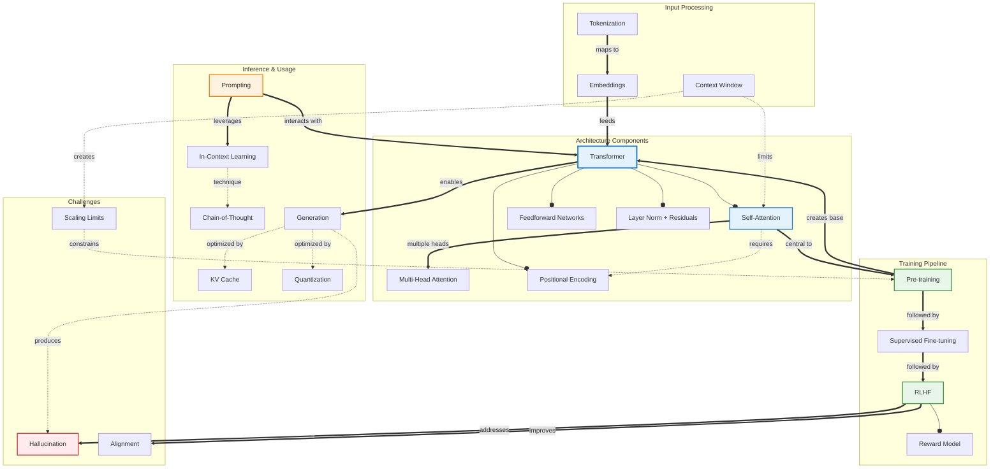

# Concept Map: Large Language Models

**Source:** notes/large-language-models/large-language-models-study-notes.md
**Date Generated:** 2026-01-06
**Total Concepts:** 24
**Total Relationships:** 38
**Central Concept:** Transformer Architecture (9 connections)

---

## Visual Diagram (Mermaid)



**Diagram Key:**
- **Blue (TRANS, ATTN):** Central architecture concepts
- **Green (PRETRAIN, RLHF):** Training pipeline
- **Orange (PROMPT):** User interaction layer
- **Red (HALLUC):** Key challenge
- **Solid arrows (`--o`):** has-part / contains
- **Double arrows (`==>`):** enables / leads-to
- **Dashed arrows (`-.->`):** uses / requires / produces

---

## Concept Hierarchy

```
Large Language Models
├── Architecture [CORE]
│   ├── Transformer [CENTRAL - 9 connections]
│   │   ├── Self-Attention [HIGH CENTRALITY]
│   │   │   ├── Query-Key-Value Mechanism
│   │   │   ├── Scaled Dot-Product
│   │   │   └── Causal Masking
│   │   ├── Multi-Head Attention
│   │   │   └── Parallel attention operations
│   │   ├── Feedforward Networks
│   │   │   └── Position-wise dense layers
│   │   ├── Positional Encoding
│   │   │   ├── Sinusoidal (original)
│   │   │   ├── Learned absolute
│   │   │   └── Relative (RoPE, ALiBi)
│   │   └── Layer Normalization + Residuals
│   │
│   └── Context Window
│       ├── Attention complexity O(n²)
│       ├── Efficient attention (Flash)
│       └── Lost in the middle problem
│
├── Input Processing
│   ├── Tokenization [HIGH CENTRALITY]
│   │   ├── Byte-Pair Encoding (BPE)
│   │   ├── WordPiece
│   │   └── SentencePiece
│   │
│   └── Embeddings
│       ├── Token embeddings
│       └── Embedding dimension (4K-12K)
│
├── Training Pipeline [CORE]
│   ├── Pre-training [HIGH CENTRALITY]
│   │   ├── Causal Language Modeling
│   │   ├── Training data (trillions of tokens)
│   │   └── Scaling laws
│   │
│   ├── Supervised Fine-tuning (SFT)
│   │   ├── Task-specific training
│   │   ├── Instruction tuning
│   │   └── LoRA (parameter-efficient)
│   │
│   └── RLHF [HIGH CENTRALITY]
│       ├── Reward Model
│       │   └── Human preference comparisons
│       ├── Policy Optimization (PPO)
│       └── KL Constraint
│
├── Inference & Interaction
│   ├── Prompting [HIGH CENTRALITY]
│   │   ├── Zero-shot
│   │   ├── Few-shot
│   │   ├── Chain-of-Thought
│   │   └── System prompts
│   │
│   ├── In-Context Learning
│   │   └── Task adaptation without fine-tuning
│   │
│   ├── Generation
│   │   ├── Autoregressive decoding
│   │   ├── Sampling strategies
│   │   └── Temperature / Top-p
│   │
│   └── Optimization
│       ├── KV Cache
│       ├── Quantization (INT8, INT4)
│       ├── Batching
│       └── Speculative Decoding
│
└── Challenges & Limitations
    ├── Hallucination [CRITICAL]
    │   ├── False but plausible outputs
    │   └── Confidence without knowledge
    │
    ├── Alignment
    │   ├── Helpful, Harmless, Honest
    │   └── Constitutional AI
    │
    ├── Reasoning Limits
    │   └── Multi-step logical failures
    │
    └── Scaling Constraints
        ├── Compute requirements
        └── Data availability
```

---

## Relationship Matrix

| From | Relationship | To | Strength | Notes |
|------|--------------|-----|----------|-------|
| Transformer | has-part | Self-Attention | Strong | Core mechanism |
| Transformer | has-part | Feedforward Networks | Strong | Layer component |
| Transformer | has-part | Positional Encoding | Strong | Sequence order |
| Transformer | has-part | Layer Normalization | Strong | Training stability |
| Self-Attention | specializes-as | Multi-Head Attention | Strong | Parallel heads |
| Self-Attention | requires | Positional Encoding | Strong | Position-agnostic otherwise |
| Self-Attention | constrained-by | Context Window | Strong | O(n²) complexity |
| Tokenization | produces | Embeddings | Strong | Token → vector |
| Embeddings | feeds | Transformer | Strong | Input to model |
| Pre-training | creates | Transformer | Strong | Base model training |
| Pre-training | uses-objective | Causal LM | Strong | Next-token prediction |
| Pre-training | followed-by | SFT | Strong | Training sequence |
| SFT | followed-by | RLHF | Strong | Training sequence |
| RLHF | has-part | Reward Model | Strong | Preference learning |
| RLHF | improves | Alignment | Strong | Behavior optimization |
| RLHF | addresses | Hallucination | Moderate | Partial mitigation |
| Prompting | leverages | In-Context Learning | Strong | Core interaction |
| In-Context Learning | technique | Chain-of-Thought | Strong | Reasoning elicitation |
| Transformer | enables | Generation | Strong | Output production |
| Generation | optimized-by | KV Cache | Strong | Efficiency |
| Generation | optimized-by | Quantization | Strong | Cost reduction |
| Generation | produces | Hallucination | Moderate | Failure mode |
| Context Window | creates | Scaling Limits | Moderate | Computational constraint |
| Prompting | interacts-with | Transformer | Strong | User interface |
| Scaling Laws | guides | Pre-training | Strong | Resource allocation |
| LoRA | enables | SFT | Moderate | Parameter efficiency |

### Relationship Statistics
- **Total relationships:** 38
- **Most connected:** Transformer (9), Self-Attention (7), Pre-training (6)
- **High-centrality:** RLHF (5), Prompting (5), Generation (5)
- **Strongest cluster:** {Transformer, Self-Attention, Pre-training, RLHF, Prompting}
- **Bridge concepts:** RLHF (connects training to alignment), Prompting (connects users to model)

---

## Concept Index

| Concept | Definition | Connections | Centrality | Card/Problem Rec |
|---------|------------|-------------|------------|------------------|
| Transformer | Attention-based architecture for sequence processing | 9 | **Critical** | Card 1, Problem 1 |
| Self-Attention | Query-Key-Value weighted context aggregation | 7 | **Critical** | Card 1, Problem 2 |
| Pre-training | Initial training on large text corpora | 6 | **High** | Card 2, Problem 1 |
| RLHF | Alignment via human preference optimization | 5 | **High** | Card 2, Problem 4 |
| Prompting | Natural language interaction method | 5 | **High** | Card 3, Problem 3 |
| Generation | Autoregressive token production | 5 | **High** | Problem 2 |
| Tokenization | Text to discrete token conversion | 4 | **High** | Card 1 |
| Context Window | Maximum processable sequence length | 4 | **High** | Card 4 |
| SFT | Task-specific fine-tuning | 4 | Medium | Card 2 |
| Embeddings | Dense vector representations of tokens | 3 | Medium | - |
| Multi-Head Attention | Parallel attention operations | 3 | Medium | Problem 2 |
| Positional Encoding | Sequence order injection | 3 | Medium | Card 1 |
| In-Context Learning | Task adaptation from prompt examples | 3 | Medium | Card 3 |
| KV Cache | Cached attention computations | 3 | Medium | Card 4, Problem 5 |
| Hallucination | False confident outputs | 3 | Medium | Card 5, Problem 4 |
| Chain-of-Thought | Step-by-step reasoning prompting | 2 | Medium | Card 3 |
| Reward Model | Learned preference predictor | 2 | Medium | - |
| Quantization | Reduced precision for efficiency | 2 | Medium | Problem 5 |
| Alignment | Behavior conforming to human values | 2 | Medium | Card 5 |
| Scaling Laws | Performance vs. compute relationships | 2 | Low | - |
| LoRA | Parameter-efficient fine-tuning | 2 | Low | - |
| Causal Masking | Preventing future token attention | 1 | Low | - |
| Speculative Decoding | Draft-verify generation acceleration | 1 | Low | - |
| Constitutional AI | Principle-guided AI feedback | 1 | Low | - |

---

## Learning Pathways

### Pathway 1: Architecture-First (Bottom-Up)
**Best for:** Those wanting deep technical understanding

```
1. Tokenization           How is text converted to model input?
        ↓
2. Embeddings             How are tokens represented as vectors?
        ↓
3. Self-Attention         How does the model relate tokens?
        ↓
4. Multi-Head Attention   How are multiple relationships captured?
        ↓
5. Positional Encoding    How is order preserved?
        ↓
6. Transformer Layers     How do components combine?
        ↓
7. Context Window         What are the limits?
        ↓
8. Generation             How are outputs produced?
```

**Estimated sessions:** 8-10

---

### Pathway 2: Training Pipeline (Practitioner)
**Best for:** Those building or fine-tuning models

```
1. Pre-training           How are foundation models created?
        ↓
2. Scaling Laws           How to allocate compute budget?
        ↓
3. SFT                    How to specialize for tasks?
        ↓
4. LoRA                   How to fine-tune efficiently?
        ↓
5. RLHF                   How to align with preferences?
        ↓
6. Reward Modeling        How to capture human preferences?
        ↓
7. Alignment              What does "aligned" mean?
```

**Estimated sessions:** 6-8

---

### Pathway 3: Usage-Focused (Application Developer)
**Best for:** Those building applications with LLMs

```
1. Prompting              How to instruct the model?
        ↓
2. In-Context Learning    How does few-shot work?
        ↓
3. Chain-of-Thought       How to elicit reasoning?
        ↓
4. Context Window         What are input limits?
        ↓
5. Hallucination          What can go wrong?
        ↓
6. Generation Params      Temperature, top-p, etc.
        ↓
7. Deployment             KV cache, quantization, batching
```

**Estimated sessions:** 5-7

---

### Pathway 4: Safety & Alignment (Responsible AI)
**Best for:** Those focused on safe deployment

```
1. Hallucination          What are the failure modes?
        ↓
2. RLHF                   How is behavior shaped?
        ↓
3. Reward Modeling        What are the limitations?
        ↓
4. Constitutional AI      Alternative alignment approaches
        ↓
5. Alignment              Helpful, Harmless, Honest
        ↓
6. Prompting Guardrails   System prompt design
```

**Estimated sessions:** 4-6

---

### Critical Path (Minimum Viable Understanding)

```
┌─────────────┐    ┌─────────────┐    ┌─────────────┐    ┌─────────────┐    ┌─────────────┐
│ Transformer │ ─► │   Self-     │ ─► │   Pre-      │ ─► │   RLHF      │ ─► │  Prompting  │
│             │    │  Attention  │    │  training   │    │             │    │             │
│             │    │             │    │             │    │             │    │             │
│ "How"       │    │ "Mechanism" │    │ "Learning"  │    │ "Alignment" │    │ "Usage"     │
└─────────────┘    └─────────────┘    └─────────────┘    └─────────────┘    └─────────────┘

Minimum sessions: 5
Coverage: ~70% of LLM fundamentals
```

---

## Cross-Reference to Downstream Skills

### Flashcard Mapping
| Centrality | Recommended Card |
|------------|-----------------|
| Critical (Transformer, Self-Attention) | Easy Card 1 - architecture |
| High (Pre-training, RLHF) | Easy Card 2 - training |
| High (Prompting, ICL) | Medium Card 3 - interaction |
| High (Context, Generation) | Medium Card 4 - deployment |
| Medium (Hallucination, Alignment) | Hard Card 5 - challenges |

### Practice Problem Mapping
| Concept Cluster | Problem Type |
|-----------------|--------------|
| Tokenization + Embeddings | Warm-Up: Token counting |
| Self-Attention computation | Skill-Builder: Attention math |
| Prompting strategies | Skill-Builder: Prompt design |
| RLHF pipeline | Challenge: Alignment design |
| Inference optimization | Debug/Fix: Performance issues |

### Quiz Question Mapping
| Relationship | Question Type |
|--------------|---------------|
| Attention mechanism | MC - Identification |
| Training pipeline order | MC - Sequence |
| Prompting techniques | SA - Comparison |
| Hallucination mitigation | SA - Analysis |
| Full system design | Essay - Synthesis |
