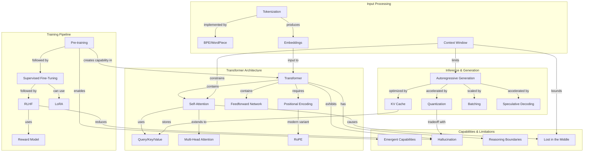

# Concept Map: Lesson 3 - Large Language Models

**Source:** Lessons/Lesson_3.md
**Subject Area:** AI Learning - Large Language Models: Architecture, Training, and Capabilities
**Date Generated:** 2026-01-08
**Total Concepts:** 24
**Total Relationships:** 36

---

## Visual Concept Map (Mermaid)



---

## Concept Hierarchy

```
LARGE LANGUAGE MODELS
├── ARCHITECTURE
│   ├── Transformer
│   │   ├── Self-Attention
│   │   │   ├── Query/Key/Value Projections
│   │   │   ├── Scaled Dot-Product
│   │   │   └── Multi-Head Attention
│   │   ├── Feedforward Networks
│   │   │   └── Position-wise Transformations
│   │   └── Positional Encoding
│   │       └── RoPE (Rotary Position Embedding)
│   └── Decoder-Only Architecture
│       └── Causal Masking
│
├── TRAINING PIPELINE
│   ├── Pre-training
│   │   ├── Self-supervised Learning
│   │   ├── Next-token Prediction
│   │   └── Trillion-token Corpora
│   ├── Supervised Fine-Tuning (SFT)
│   │   ├── Instruction-Response Pairs
│   │   └── LoRA (Parameter-Efficient)
│   └── RLHF
│       ├── Reward Modeling
│       ├── Policy Optimization (PPO)
│       └── KL Divergence Penalty
│
├── INPUT PROCESSING
│   ├── Tokenization
│   │   ├── BPE / WordPiece / SentencePiece
│   │   └── Subword Units
│   ├── Embeddings
│   │   └── Token → Vector Mapping
│   └── Context Window
│       └── O(n²) Attention Complexity
│
├── INFERENCE & GENERATION
│   ├── Autoregressive Generation
│   │   └── Token-by-token Decoding
│   ├── Optimizations
│   │   ├── KV Cache
│   │   ├── Quantization (FP16/INT8/INT4)
│   │   ├── Batching
│   │   └── Speculative Decoding
│   └── Metrics
│       ├── Time-to-First-Token (TTFT)
│       └── Tokens-per-Second
│
└── CAPABILITIES & LIMITATIONS
    ├── Capabilities
    │   ├── Emergent Abilities
    │   ├── Zero-shot Learning
    │   ├── Few-shot Learning
    │   └── Chain-of-Thought Reasoning
    └── Limitations
        ├── Hallucination
        ├── Reasoning Boundaries
        ├── Lost in the Middle
        └── Prompt Sensitivity
```

---

## Relationship Matrix

| From Concept | To Concept | Relationship Type | Strength |
|--------------|------------|-------------------|----------|
| Transformer | Self-Attention | contains | Strong |
| Transformer | Feedforward Network | contains | Strong |
| Self-Attention | Query/Key/Value | uses | Strong |
| Self-Attention | Multi-Head Attention | extends-to | Strong |
| Transformer | Positional Encoding | requires | Strong |
| Positional Encoding | RoPE | modern-variant | Medium |
| Pre-training | SFT | followed-by | Strong |
| SFT | RLHF | followed-by | Strong |
| RLHF | Reward Model | uses | Strong |
| SFT | LoRA | can-use | Medium |
| Pre-training | Transformer | creates-capability-in | Strong |
| Tokenization | BPE | implemented-by | Strong |
| Tokenization | Embeddings | produces | Strong |
| Context Window | Self-Attention | constrains | Strong |
| Embeddings | Transformer | input-to | Strong |
| Autoregressive Generation | KV Cache | optimized-by | Strong |
| Autoregressive Generation | Quantization | accelerated-by | Strong |
| Autoregressive Generation | Batching | scaled-by | Medium |
| Autoregressive Generation | Speculative Decoding | accelerated-by | Medium |
| KV Cache | Query/Key/Value | stores | Strong |
| Pre-training | Emergent Capabilities | enables | Strong |
| Self-Attention | Lost in the Middle | causes | Medium |
| Context Window | Lost in the Middle | bounds | Medium |
| Transformer | Hallucination | exhibits | Strong |
| Transformer | Reasoning Boundaries | has | Strong |
| Context Window | Autoregressive Generation | limits | Strong |
| Quantization | Hallucination | tradeoff-with | Weak |
| RLHF | Hallucination | reduces | Medium |
| Self-Attention | O(n²) Complexity | has | Strong |
| O(n²) Complexity | Context Window | constrains | Strong |
| Pre-training | Factual Knowledge | develops | Strong |
| SFT | Instruction Following | develops | Strong |
| RLHF | Alignment | develops | Strong |
| Causal Masking | Autoregressive Generation | enables | Strong |
| Scaling Laws | Emergent Capabilities | predicts | Medium |
| Chinchilla | Pre-training | guides | Medium |

---

## Centrality Index

**High Centrality (6+ connections):**
| Concept | Incoming | Outgoing | Total | Role |
|---------|----------|----------|-------|------|
| Self-Attention | 3 | 5 | 8 | **Central Hub** - Core mechanism |
| Transformer | 2 | 5 | 7 | **Foundation** - Architecture base |
| Pre-training | 2 | 4 | 6 | **Entry Point** - First training stage |
| Context Window | 2 | 4 | 6 | **Constraint Hub** - Key limitation |
| Autoregressive Generation | 4 | 1 | 5 | **Convergence Point** - All optimizations target this |

**Medium Centrality (3-5 connections):**
| Concept | Incoming | Outgoing | Total | Role |
|---------|----------|----------|-------|------|
| Query/Key/Value | 2 | 2 | 4 | Core attention component |
| RLHF | 2 | 2 | 4 | Final training stage |
| Hallucination | 3 | 0 | 3 | Critical limitation |
| KV Cache | 1 | 2 | 3 | Key optimization |
| Tokenization | 1 | 2 | 3 | Input processing |

**Low Centrality (1-2 connections):**
- Feedforward Network, RoPE, LoRA, Quantization, Batching, Speculative Decoding, Embeddings, BPE, Reward Model, Lost in the Middle, Reasoning Boundaries, Emergent Capabilities

---

## Learning Pathways

### Pathway 1: Architectural Foundation
**Goal:** Understand how LLMs process language
**Sequence:** Transformer → Self-Attention → Query/Key/Value → Multi-Head Attention → Positional Encoding → Feedforward Network
**Duration Estimate:** Core architectural understanding
**Prerequisites:** Basic neural network knowledge
**Assessment:** Can explain attention computation and why Transformers replaced RNNs

### Pathway 2: Training Deep Dive
**Goal:** Understand how LLMs acquire capabilities
**Sequence:** Pre-training → SFT → RLHF → LoRA → Reward Model → Emergent Capabilities
**Duration Estimate:** Complete training pipeline understanding
**Prerequisites:** Pathway 1 (architecture basics)
**Assessment:** Can explain what each training stage contributes and why order matters

### Pathway 3: Production Deployment
**Goal:** Deploy LLMs efficiently in production
**Sequence:** Tokenization → Context Window → Autoregressive Generation → KV Cache → Quantization → Batching → Speculative Decoding
**Duration Estimate:** Production inference mastery
**Prerequisites:** Pathways 1-2 (understand what you're deploying)
**Assessment:** Can design inference pipeline meeting latency/throughput requirements

### Pathway 4: Reliability Engineering
**Goal:** Build trustworthy LLM systems
**Sequence:** Hallucination → Reasoning Boundaries → Lost in the Middle → Context Window → RLHF → Validation Strategies
**Duration Estimate:** Limitation-aware system design
**Prerequisites:** Pathways 1-3 (full LLM understanding)
**Assessment:** Can design multi-layer mitigation for hallucination-sensitive applications

---

## Critical Path Analysis

**Minimum Viable Understanding (MVU):**
```
Transformer → Self-Attention → Pre-training → Hallucination
```

**Rationale:** These four concepts provide the essential mental model:
1. **Transformer**: The architecture family
2. **Self-Attention**: The core mechanism (why they work)
3. **Pre-training**: How they learn (where knowledge comes from)
4. **Hallucination**: Why they fail (critical for safe use)

**Expanded Path for Practitioners:**
```
Transformer → Self-Attention → Q/K/V → Context Window → Pre-training → SFT → RLHF → Autoregressive Generation → KV Cache → Hallucination
```

---

## Cross-Lesson Connections

### To Lesson 1 (Agent Skills)
| LLM Concept | Agent Skills Connection | Implication |
|-------------|------------------------|-------------|
| Context Window | Skill chain design | Skills must manage context across steps |
| Hallucination | Validation layers | Skills need output verification |
| Inference Latency | Skill composition | Multi-step chains compound latency |
| Emergent Capabilities | Skill reliability | Novel tasks may trigger unexpected behavior |

### To Lesson 2 (Prompt Engineering)
| LLM Concept | Prompt Engineering Connection | Implication |
|-------------|------------------------------|-------------|
| Self-Attention | Prompt structure | Position affects attention weights |
| Context Window | Prompt length limits | Must fit within window constraints |
| Pre-training | Zero-shot capability | In-distribution tasks need fewer examples |
| SFT | Instruction format | Following SFT conventions improves results |
| Lost in the Middle | Information placement | Put critical info at start/end |

---

## Concept Definitions (Quick Reference)

| Concept | One-Line Definition |
|---------|---------------------|
| Transformer | Attention-based architecture processing sequences in parallel |
| Self-Attention | Mechanism weighting all positions to compute contextual representations |
| Query/Key/Value | Learned projections determining attention compatibility and output |
| Multi-Head Attention | Parallel attention operations capturing different relationship types |
| Positional Encoding | Mechanism injecting sequence order into position-agnostic attention |
| RoPE | Rotary position embedding enabling relative position modeling |
| Pre-training | Self-supervised training on massive text for broad capability |
| SFT | Supervised training on instruction-response pairs for helpfulness |
| RLHF | Optimization using human preference feedback for alignment |
| LoRA | Parameter-efficient fine-tuning via low-rank matrix updates |
| Tokenization | Converting text to discrete subword units for model input |
| Context Window | Maximum tokens processable in single forward pass |
| Autoregressive Generation | Sequential token-by-token output generation |
| KV Cache | Stored attention states avoiding recomputation during generation |
| Quantization | Reduced numerical precision for faster inference |
| Batching | Processing multiple requests concurrently for throughput |
| Hallucination | Confident generation of plausible but false content |
| Emergent Capabilities | Abilities appearing at scale without explicit training |
| Lost in the Middle | Degraded utilization of mid-context information |
| Reasoning Boundaries | Limits on novel multi-step logical problem-solving |

---

## Study Recommendations

### Foundation First
1. Master Pathway 1 (Architecture) before other pathways
2. Ensure you can explain Q/K/V projections without notes
3. Understand why O(n²) complexity matters for context windows

### Training Pipeline
1. Connect each stage to specific model behaviors you've observed
2. Understand why skipping stages doesn't work
3. Know when LoRA vs. full fine-tuning is appropriate

### Production Focus
1. Practice latency/throughput calculations
2. Understand KV cache memory requirements
3. Know quantization quality tradeoffs

### Reliability Emphasis
1. Memorize hallucination mitigation strategies
2. Understand "lost in the middle" experimentally
3. Design validation layers for your use cases

---

*Generated from Lesson 3: Large Language Models | Concept Map Skill*
