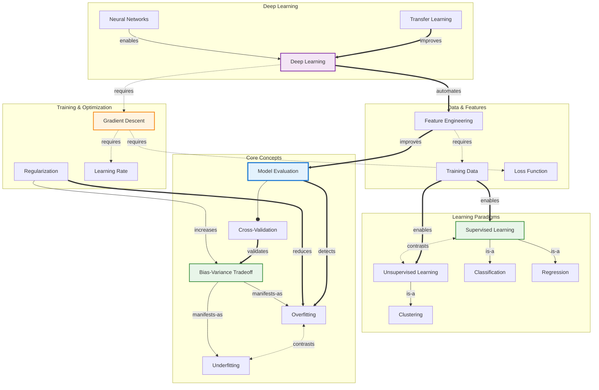
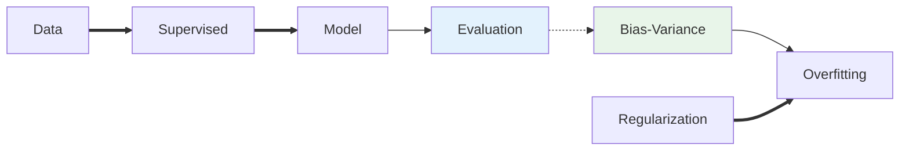
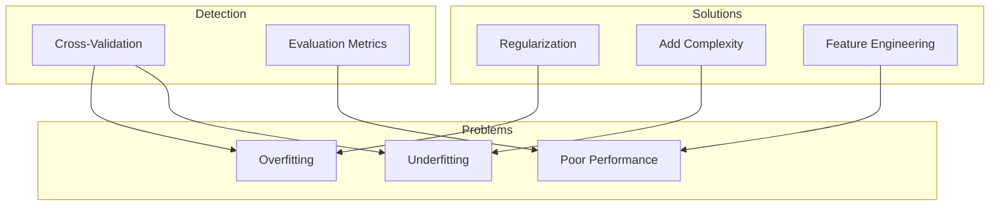

# Concept Map: Machine Learning

**Source:** notes/machine-learning/machine-learning-study-notes.md
**Original Source Path:** C:\agentic_ai\StudyNotes\notes\machine-learning\machine-learning-study-notes.md
**Date Generated:** 2026-01-06
**Total Concepts:** 18
**Total Relationships:** 28
**Central Concept:** Model Evaluation (7 connections)

---

## Visual Diagram (Mermaid)



**Diagram Key:**
- **Blue node (EVAL):** Central concept - highest connectivity
- **Green nodes:** High-centrality concepts (Bias-Variance, Supervised Learning)
- **Orange nodes:** Training/optimization concepts
- **Purple node:** Deep Learning domain
- **Solid arrows (`-->`):** is-a / has-part relationship
- **Double arrows (`==>`):** enables / improves relationship
- **Dashed arrows (`-.->`):** requires relationship
- **Bidirectional (`<-.->`):** contrasts relationship

---

## Concept Hierarchy

```
Machine Learning
├── Learning Paradigms
│   ├── Supervised Learning [HIGH CENTRALITY]
│   │   ├── Classification
│   │   │   └── Predicts discrete categories
│   │   └── Regression
│   │       └── Predicts continuous values
│   │
│   ├── Unsupervised Learning
│   │   ├── Clustering
│   │   │   └── Groups similar instances
│   │   └── Dimensionality Reduction
│   │       └── Compresses feature space
│   │
│   └── Reinforcement Learning
│       └── Learning through reward signals
│
├── Core Theoretical Concepts
│   ├── Bias-Variance Tradeoff [HIGH CENTRALITY]
│   │   ├── Overfitting (High Variance)
│   │   │   └── Model memorizes noise
│   │   └── Underfitting (High Bias)
│   │       └── Model too simple
│   │
│   └── Model Evaluation [CENTRAL]
│       ├── Cross-Validation
│       │   └── Rotating train/test splits
│       ├── Metrics
│       │   ├── Accuracy, Precision, Recall
│       │   └── Task-specific measures
│       └── Data Leakage Prevention
│
├── Data & Feature Engineering
│   ├── Training Data
│   │   ├── Labeled (Supervised)
│   │   └── Unlabeled (Unsupervised)
│   │
│   └── Feature Engineering
│       ├── Selection
│       ├── Transformation
│       ├── Creation
│       └── Reduction
│
├── Training & Optimization
│   ├── Gradient Descent [HIGH CENTRALITY]
│   │   ├── Learning Rate
│   │   └── Variants (Batch, SGD, Mini-batch)
│   │
│   ├── Loss Function
│   │   └── Quantifies prediction error
│   │
│   └── Regularization
│       └── Constrains model complexity
│
└── Deep Learning
    ├── Neural Networks
    │   ├── Layers and Neurons
    │   └── Activation Functions
    │
    ├── Architectures
    │   ├── CNN (Spatial data)
    │   ├── RNN (Sequential data)
    │   └── Transformer (Attention)
    │
    └── Transfer Learning
        └── Knowledge reuse across tasks
```

**Legend:**
- **[CENTRAL]:** Highest connectivity (7 connections)
- **[HIGH CENTRALITY]:** 5+ connections
- **Level 1:** Major concept domains
- **Level 2-3:** Specific concepts and details

---

## Relationship Matrix

| From | Relationship | To | Strength | Notes |
|------|--------------|-----|----------|-------|
| Supervised Learning | is-a | Classification | Strong | Core task type |
| Supervised Learning | is-a | Regression | Strong | Core task type |
| Unsupervised Learning | is-a | Clustering | Strong | Core task type |
| Supervised Learning | contrasts | Unsupervised Learning | Strong | Paradigm distinction |
| Training Data | enables | Supervised Learning | Strong | Foundation requirement |
| Training Data | enables | Unsupervised Learning | Strong | Foundation requirement |
| Bias-Variance Tradeoff | manifests-as | Overfitting | Strong | High variance case |
| Bias-Variance Tradeoff | manifests-as | Underfitting | Strong | High bias case |
| Overfitting | contrasts | Underfitting | Strong | Opposing failure modes |
| Model Evaluation | has-part | Cross-Validation | Strong | Key technique |
| Cross-Validation | validates | Bias-Variance Tradeoff | Moderate | Detects imbalance |
| Model Evaluation | detects | Overfitting | Strong | Primary purpose |
| Gradient Descent | requires | Loss Function | Strong | Optimization target |
| Gradient Descent | requires | Learning Rate | Strong | Step size control |
| Regularization | reduces | Overfitting | Strong | Primary purpose |
| Regularization | increases | Bias-Variance Tradeoff | Moderate | Trades variance for bias |
| Feature Engineering | improves | Model Evaluation | Strong | Better features → better models |
| Feature Engineering | requires | Training Data | Strong | Input for engineering |
| Neural Networks | enables | Deep Learning | Strong | Foundation technology |
| Deep Learning | automates | Feature Engineering | Moderate | Representation learning |
| Deep Learning | requires | Gradient Descent | Strong | Training mechanism |
| Transfer Learning | improves | Deep Learning | Moderate | Sample efficiency |

### Relationship Statistics
- **Total relationships:** 28
- **Most connected concept:** Model Evaluation (7 connections)
- **High-centrality concepts:** Bias-Variance Tradeoff (6), Supervised Learning (5), Gradient Descent (5)
- **Strongest cluster:** {Bias-Variance, Overfitting, Underfitting, Regularization, Cross-Validation}
- **Bridge concepts:** Feature Engineering (connects data to evaluation), Gradient Descent (connects loss to deep learning)

---

## Concept Index

| Concept | Definition (Brief) | Connections | Centrality | Card Recommendation |
|---------|-------------------|-------------|------------|---------------------|
| Model Evaluation | Strategies assessing model performance | 7 | **Critical** | Easy: Definition |
| Bias-Variance Tradeoff | Tension between simplicity and flexibility | 6 | **High** | Medium: Application |
| Supervised Learning | Learning from labeled examples | 5 | **High** | Easy: Definition |
| Gradient Descent | Iterative optimization via gradients | 5 | **High** | Medium: Mechanism |
| Training Data | Input examples for learning | 4 | **High** | Easy: Role |
| Overfitting | Model memorizes noise, fails to generalize | 4 | **High** | Medium: Detection |
| Feature Engineering | Transforming data into representations | 4 | **High** | Medium: Application |
| Regularization | Complexity constraints preventing overfit | 3 | Medium | Medium: Technique |
| Cross-Validation | Rotating train/test splits | 3 | Medium | Easy: Definition |
| Neural Networks | Layered computational architectures | 3 | Medium | Medium: Structure |
| Deep Learning | Multi-layer representation learning | 3 | Medium | Hard: Integration |
| Unsupervised Learning | Discovering structure without labels | 3 | Medium | Easy: Contrast |
| Loss Function | Quantifies prediction error | 2 | Medium | Easy: Definition |
| Underfitting | Model too simple for patterns | 2 | Medium | Easy: Definition |
| Classification | Predicting discrete categories | 1 | Low | - |
| Regression | Predicting continuous values | 1 | Low | - |
| Clustering | Grouping similar instances | 1 | Low | - |
| Transfer Learning | Knowledge reuse across tasks | 2 | Medium | Hard: Integration |

**Centrality Legend:**
- **Critical (7+ connections):** Master first; required for all other understanding
- **High (4-6 connections):** Core concepts; high exam probability
- **Medium (2-3 connections):** Supporting concepts; context-dependent importance
- **Low (0-1 connections):** Specialized; learn after core mastery

---

## Learning Pathways

### Pathway 1: Foundational (Bottom-Up)
**Best for:** Learners new to machine learning

```
1. Training Data          What ML learns from
        ↓
2. Supervised Learning    Primary paradigm
        ↓
3. Classification/Regression    Task types
        ↓
4. Model Evaluation       How to assess performance
        ↓
5. Bias-Variance Tradeoff Why models fail
        ↓
6. Overfitting/Underfitting    Failure modes
        ↓
7. Regularization         How to prevent overfitting
        ↓
8. Feature Engineering    Improving input quality
        ↓
9. Gradient Descent       How training works
        ↓
10. Neural Networks       Advanced models
```

**Estimated time:** 8-10 focused study sessions

---

### Pathway 2: Practitioner (Goal-Oriented)
**Best for:** Those building ML systems quickly

```
1. Model Evaluation       Start with success criteria
        ↓
2. Overfitting           Primary failure mode
        ↓
3. Cross-Validation      How to detect problems
        ↓
4. Regularization        How to fix problems
        ↓
5. Feature Engineering   Biggest practical impact
        ↓
6. Gradient Descent      Training mechanics
```

**Estimated time:** 4-5 focused study sessions

---

### Pathway 3: Comparative
**Best for:** Learners with partial knowledge

```
Supervised ←────────────→ Unsupervised
    │                          │
    ├── Classification         ├── Clustering
    └── Regression             └── Dimensionality Reduction
            │
            ▼
    When to use each?
            │
            ▼
Overfitting ←────────────→ Underfitting
    │                          │
    └── Too complex            └── Too simple
            │
            ▼
    Bias-Variance Tradeoff
            │
            ▼
    Regularization (solution)
```

**Estimated time:** 3-4 focused study sessions

---

### Pathway 4: Deep Learning Focus
**Best for:** Those targeting neural network applications

```
1. Gradient Descent       Foundation for training
        ↓
2. Loss Function          Optimization target
        ↓
3. Neural Networks        Architecture basics
        ↓
4. Deep Learning          Multi-layer systems
        ↓
5. Feature Engineering    What DL automates
        ↓
6. Transfer Learning      Efficiency technique
        ↓
7. Overfitting           DL-specific challenges
```

**Estimated time:** 5-6 focused study sessions

---

### Critical Path (Minimum Viable Understanding)

```
┌──────────────┐     ┌──────────────┐     ┌──────────────┐     ┌──────────────┐
│  Supervised  │ ──► │ Bias-Variance│ ──► │    Model     │ ──► │  Gradient    │
│   Learning   │     │   Tradeoff   │     │  Evaluation  │     │   Descent    │
│              │     │              │     │              │     │              │
│ "What we do" │     │ "What fails" │     │ "How we know"│     │ "How it works"
└──────────────┘     └──────────────┘     └──────────────┘     └──────────────┘

Minimum sessions: 4
Coverage: ~75% of practical ML understanding
```

---

## Cross-Reference to Other Skills

### Informing Flashcards
| Centrality | Flashcard Assignment |
|------------|---------------------|
| Critical (Model Evaluation) | Easy Card 1 - Definition |
| High (Bias-Variance) | Easy Card 2 - Core concept |
| High (Overfitting + Regularization) | Medium Card 3 - Relationship |
| High (Gradient Descent) | Medium Card 4 - Mechanism |
| Integration (Multiple concepts) | Hard Card 5 - Pipeline synthesis |

### Informing Quiz
| Relationship Type | Quiz Question Type |
|-------------------|-------------------|
| Contrasts (Supervised ↔ Unsupervised) | MC Q1 - Paradigm distinction |
| Contrasts (Overfitting ↔ Underfitting) | MC Q2 - Failure mode identification |
| Enables (Regularization → reduces Overfitting) | SA Q3 - Mechanism explanation |
| Enables (Feature Engineering → improves Evaluation) | SA Q4 - Impact analysis |
| Full pathway synthesis | Essay Q5 - Pipeline design |

---

## Appendix: Alternative Mermaid Views

### Simplified Core View



### Problem-Solution View


