# Concept Map: Lesson 11 - Model Deployment and MLOps

**Source:** Lessons/Lesson_11.md
**Subject Area:** AI Learning - Model Deployment and MLOps: From Training to Production at Scale
**Date Generated:** 2026-01-08
**Total Concepts:** 52
**Total Relationships:** 72

---

## Visual Concept Map (Mermaid)

```mermaid
graph TD
    subgraph Lifecycle["MLOps Lifecycle"]
        MLOPS[MLOps Principles]
        DEVOPS[DevOps Practices]
        MATURITY[Maturity Levels]
        AUTOMATION[Automation]
    end

    subgraph Serialization["Model Serialization"]
        SAVEDMODEL[TensorFlow SavedModel]
        TORCHSCRIPT[TorchScript]
        ONNX[ONNX]
        ARTIFACTS[Model Artifacts]
    end

    subgraph Optimization["Model Optimization"]
        QUANT[Quantization]
        PRUNE[Pruning]
        DISTILL[Knowledge Distillation]
        FUSION[Layer Fusion]
        TENSORRT[TensorRT]
    end

    subgraph Serving["Model Serving"]
        ONLINE[Online Serving]
        BATCH[Batch Inference]
        EDGE[Edge Deployment]
        STREAMING[Streaming Inference]
        RESTAPI[REST API]
        GRPC[gRPC]
    end

    subgraph Infrastructure["Infrastructure"]
        DOCKER[Docker]
        K8S[Kubernetes]
        HPA[Horizontal Pod Autoscaler]
        LOADBAL[Load Balancer]
    end

    subgraph CICD["CI/CD Pipeline"]
        DATAVAL[Data Validation]
        MODELVAL[Model Validation]
        QUALGATE[Quality Gates]
        STAGING[Staging Deploy]
        PROD[Production Deploy]
    end

    subgraph Registry["Model Registry"]
        VERSION[Model Versioning]
        LINEAGE[Model Lineage]
        METADATA[Model Metadata]
        MLFLOW[MLflow]
    end

    subgraph Monitoring["Monitoring & Observability"]
        DATADRIFT[Data Drift]
        MODELDRIFT[Model Drift]
        METRICS[Performance Metrics]
        ALERTS[Alerting]
        PROMETHEUS[Prometheus]
    end

    subgraph Deployment["Deployment Strategies"]
        CANARY[Canary Deployment]
        BLUEGREEN[Blue-Green]
        ABTEST[A/B Testing]
        ROLLBACK[Automated Rollback]
        ISTIO[Istio Traffic Split]
    end

    subgraph Features["Feature Management"]
        FEATURESTORE[Feature Store]
        OFFLINESTORE[Offline Store]
        ONLINESTORE[Online Store]
        FEAST[Feast]
        SKEW[Training-Serving Skew]
    end

    %% Lifecycle relationships
    MLOPS -->|"extends"| DEVOPS
    MLOPS -->|"measured by"| MATURITY
    MLOPS -->|"enables"| AUTOMATION

    %% Serialization relationships
    SAVEDMODEL -->|"converts to"| ONNX
    TORCHSCRIPT -->|"converts to"| ONNX
    ONNX -->|"creates"| ARTIFACTS

    %% Optimization relationships
    QUANT -->|"reduces"| ARTIFACTS
    PRUNE -->|"reduces"| ARTIFACTS
    DISTILL -->|"creates smaller"| ARTIFACTS
    FUSION -->|"accelerated by"| TENSORRT

    %% Serving relationships
    ONLINE -->|"uses"| RESTAPI
    ONLINE -->|"uses"| GRPC
    ARTIFACTS -->|"deployed to"| ONLINE
    ARTIFACTS -->|"deployed to"| BATCH
    ARTIFACTS -->|"deployed to"| EDGE

    %% Infrastructure relationships
    DOCKER -->|"orchestrated by"| K8S
    K8S -->|"uses"| HPA
    K8S -->|"uses"| LOADBAL
    ONLINE -->|"runs on"| K8S

    %% CI/CD relationships
    DATAVAL -->|"feeds"| MODELVAL
    MODELVAL -->|"checked by"| QUALGATE
    QUALGATE -->|"enables"| STAGING
    STAGING -->|"promotes to"| PROD

    %% Registry relationships
    ARTIFACTS -->|"stored in"| MLFLOW
    MLFLOW -->|"tracks"| VERSION
    MLFLOW -->|"records"| LINEAGE
    VERSION -->|"includes"| METADATA

    %% Monitoring relationships
    PROD -->|"monitored for"| DATADRIFT
    PROD -->|"monitored for"| MODELDRIFT
    METRICS -->|"scraped by"| PROMETHEUS
    PROMETHEUS -->|"triggers"| ALERTS
    DATADRIFT -->|"triggers"| ROLLBACK

    %% Deployment strategy relationships
    STAGING -->|"validates via"| CANARY
    CANARY -->|"alternative to"| BLUEGREEN
    CANARY -->|"supports"| ABTEST
    ALERTS -->|"triggers"| ROLLBACK
    ISTIO -->|"enables"| CANARY

    %% Feature store relationships
    FEATURESTORE -->|"has"| OFFLINESTORE
    FEATURESTORE -->|"has"| ONLINESTORE
    FEAST -->|"implements"| FEATURESTORE
    FEATURESTORE -->|"prevents"| SKEW
    ONLINESTORE -->|"serves"| ONLINE
```



---

## Concept Hierarchy

```
MODEL DEPLOYMENT AND MLOPS
├── MLOPS LIFECYCLE
│   ├── MLOps Principles
│   │   ├── Reproducibility
│   │   ├── Automation
│   │   ├── Continuous Monitoring
│   │   └── Collaboration
│   ├── Maturity Levels
│   │   ├── Level 0: Manual (Jupyter, manual deploy)
│   │   ├── Level 1: ML Pipeline (automated training)
│   │   ├── Level 2: CI/CD for ML (automated testing)
│   │   └── Level 3: Full MLOps (continuous training)
│   └── ML vs Traditional Software
│       ├── Code + Data + Model versioning
│       ├── Data validation requirements
│       └── Model quality monitoring
│
├── MODEL SERIALIZATION
│   ├── Format Options
│   │   ├── TensorFlow SavedModel
│   │   ├── PyTorch TorchScript (trace/script)
│   │   ├── ONNX (cross-framework)
│   │   └── Pickle (prototyping only)
│   ├── Best Practices
│   │   ├── Include metadata
│   │   ├── Validate after serialization
│   │   └── Version artifacts
│   └── Serving Signatures
│       ├── Input specifications
│       └── Output specifications
│
├── MODEL OPTIMIZATION
│   ├── Quantization
│   │   ├── Post-Training Quantization (PTQ)
│   │   ├── Quantization-Aware Training (QAT)
│   │   └── FP32 → INT8 (4× reduction)
│   ├── Pruning
│   │   ├── Unstructured (sparse matrix)
│   │   ├── Structured (channels/filters)
│   │   └── Magnitude-based
│   ├── Knowledge Distillation
│   │   ├── Teacher-student training
│   │   ├── Soft labels
│   │   └── Temperature scaling
│   └── Hardware-Specific
│       ├── TensorRT (NVIDIA GPU)
│       ├── OpenVINO (Intel CPU)
│       └── TFLite/CoreML (Mobile)
│
├── MODEL SERVING
│   ├── Serving Patterns
│   │   ├── Online/Real-time (<100ms)
│   │   ├── Batch Inference
│   │   ├── Streaming Inference
│   │   └── Edge Inference
│   ├── Server Options
│   │   ├── TensorFlow Serving
│   │   ├── TorchServe
│   │   ├── Triton (multi-framework)
│   │   ├── Seldon Core
│   │   └── BentoML
│   └── Batching Strategies
│       ├── Dynamic batching
│       ├── Request aggregation
│       └── Latency-throughput tradeoff
│
├── CONTAINERIZATION
│   ├── Docker
│   │   ├── Dockerfile best practices
│   │   ├── Multi-stage builds
│   │   └── Health checks
│   ├── Kubernetes
│   │   ├── Deployment manifests
│   │   ├── Services
│   │   ├── ConfigMaps/Secrets
│   │   └── GPU resource allocation
│   └── Autoscaling
│       ├── Horizontal Pod Autoscaler
│       ├── CPU-based scaling
│       └── Custom metrics scaling
│
├── CI/CD FOR ML
│   ├── Pipeline Stages
│   │   ├── Code tests
│   │   ├── Data validation
│   │   ├── Model training
│   │   └── Model evaluation
│   ├── Quality Gates
│   │   ├── Accuracy thresholds
│   │   ├── Latency requirements
│   │   ├── Fairness checks
│   │   └── Sample size validation
│   └── Tools
│       ├── GitHub Actions
│       ├── Great Expectations
│       └── DVC
│
├── MODEL REGISTRY
│   ├── Core Functions
│   │   ├── Version management
│   │   ├── Stage transitions
│   │   ├── Artifact storage
│   │   └── Metadata tracking
│   ├── Lineage Tracking
│   │   ├── Training data source
│   │   ├── Code commit
│   │   ├── Environment details
│   │   └── Evaluation metrics
│   └── Versioning Strategy
│       ├── Semantic versioning
│       ├── MAJOR (breaking)
│       ├── MINOR (features)
│       └── PATCH (fixes)
│
├── MONITORING & OBSERVABILITY
│   ├── Monitoring Layers
│   │   ├── Infrastructure metrics
│   │   ├── Service metrics
│   │   ├── Model metrics
│   │   ├── Data quality metrics
│   │   └── Business metrics
│   ├── Drift Detection
│   │   ├── Data drift (KS test, PSI)
│   │   ├── Concept drift
│   │   └── Prediction drift
│   └── Alerting
│       ├── Latency thresholds
│       ├── Error rate thresholds
│       ├── Confidence monitoring
│       └── Drift alerts
│
├── DEPLOYMENT STRATEGIES
│   ├── Blue-Green
│   │   ├── Instant switch
│   │   ├── Easy rollback
│   │   └── 2× resources
│   ├── Canary Deployment
│   │   ├── Gradual rollout
│   │   ├── Traffic splitting
│   │   └── Automated analysis
│   ├── A/B Testing
│   │   ├── Statistical comparison
│   │   ├── User-level assignment
│   │   └── Business metric measurement
│   └── Traffic Management
│       ├── Istio VirtualService
│       ├── Weight-based routing
│       └── Header-based routing
│
└── FEATURE STORES
    ├── Architecture
    │   ├── Offline store (historical)
    │   ├── Online store (low latency)
    │   └── Feature registry
    ├── Benefits
    │   ├── Training-serving consistency
    │   ├── Feature reuse
    │   └── Point-in-time correctness
    └── Skew Prevention
        ├── Single feature definition
        ├── Distribution monitoring
        └── Feature availability SLAs
```

---

## Relationship Matrix

| From Concept | To Concept | Relationship Type | Strength |
|--------------|------------|-------------------|----------|
| MLOps | DevOps | extends | Strong |
| MLOps | Automation | enables | Strong |
| Model Training | Model Serialization | produces | Strong |
| TorchScript | ONNX | converts-to | Strong |
| SavedModel | ONNX | converts-to | Strong |
| Quantization | Model Size | reduces | Strong |
| Pruning | Inference Speed | improves | Strong |
| Distillation | Student Model | creates | Strong |
| Model Artifacts | Model Serving | deployed-to | Strong |
| Online Serving | REST API | uses | Strong |
| Online Serving | Kubernetes | runs-on | Strong |
| Docker | Kubernetes | orchestrated-by | Strong |
| Kubernetes | HPA | uses | Strong |
| Data Validation | Model Validation | precedes | Strong |
| Quality Gates | Staging | enables | Strong |
| Staging | Production | promotes-to | Strong |
| Model Artifacts | MLflow | stored-in | Strong |
| MLflow | Version | tracks | Strong |
| Production | Data Drift | monitored-for | Strong |
| Prometheus | Alerts | triggers | Strong |
| Alerts | Rollback | triggers | Strong |
| Canary | Blue-Green | alternative-to | Strong |
| Istio | Canary | enables | Strong |
| Feature Store | Online Store | has | Strong |
| Feature Store | Training-Serving Skew | prevents | Strong |
| Online Store | Online Serving | serves | Strong |
| Canary | A/B Testing | supports | Medium |
| Data Drift | Retraining | triggers | Medium |

---

## Centrality Index

**High Centrality (6+ connections):**

| Concept | Incoming | Outgoing | Total | Role |
|---------|----------|----------|-------|------|
| Model Artifacts | 4 | 5 | 9 | **Central Artifact** |
| Kubernetes | 3 | 5 | 8 | **Infrastructure Hub** |
| Online Serving | 4 | 4 | 8 | **Primary Serving Mode** |
| Production | 3 | 4 | 7 | **Deployment Target** |
| MLflow | 2 | 4 | 6 | **Registry Standard** |
| Canary Deployment | 3 | 3 | 6 | **Safe Rollout** |

**Medium Centrality (3-5 connections):**

| Concept | Incoming | Outgoing | Total | Role |
|---------|----------|----------|-------|------|
| Quality Gates | 2 | 3 | 5 | Validation checkpoint |
| Data Drift | 2 | 3 | 5 | Monitoring signal |
| Feature Store | 1 | 4 | 5 | Feature management |
| Docker | 1 | 3 | 4 | Container standard |
| ONNX | 2 | 2 | 4 | Interchange format |
| Quantization | 1 | 3 | 4 | Optimization technique |
| Alerts | 2 | 2 | 4 | Operational trigger |

**Low Centrality (1-2 connections):**
- Pickle, Layer Fusion, gRPC, ConfigMaps, Secrets, PATCH versioning, PSI, Header-based routing

---

## Learning Pathways

### Pathway 1: Foundational MLOps (Bottom-Up)
**Goal:** Understand the MLOps lifecycle and principles
**Sequence:** DevOps Principles → MLOps Differences → Maturity Levels → Reproducibility → Automation → Monitoring
**Prerequisites:** Basic ML knowledge, software development experience
**Assessment:** Can explain why ML systems require specialized operations practices

### Pathway 2: Model Production Pipeline
**Goal:** Take a trained model to production
**Sequence:** Model Serialization → ONNX → Quantization → Docker → Kubernetes → Model Serving → REST API
**Prerequisites:** Pathway 1, PyTorch or TensorFlow experience
**Assessment:** Can deploy a model to Kubernetes with proper health checks

### Pathway 3: Reliability Engineering
**Goal:** Build reliable, monitored ML systems
**Sequence:** Data Drift → Model Drift → Prometheus → Alerting → Canary Deployment → A/B Testing → Automated Rollback
**Prerequisites:** Pathways 1-2
**Assessment:** Can design monitoring strategy and rollout plan for new model

### Pathway 4: CI/CD Automation
**Goal:** Implement automated ML pipelines
**Sequence:** Data Validation → Great Expectations → Quality Gates → GitHub Actions → Model Registry → Staging → Production
**Prerequisites:** Pathways 1-2, CI/CD experience
**Assessment:** Can configure automated training and deployment pipeline

### Pathway 5: Feature Engineering at Scale
**Goal:** Master feature store operations
**Sequence:** Feature Store Architecture → Offline Store → Online Store → Feast → Training-Serving Skew → Point-in-Time Joins
**Prerequisites:** Pathways 1-4
**Assessment:** Can design feature store for training-serving consistency

---

## Critical Path Analysis

**Minimum Viable Understanding (MVU):**
```
MLOps Principles → Model Serialization → Docker → Model Serving → Monitoring → Deployment Strategies
```

**Rationale:** These six concept areas provide essential MLOps vocabulary:
1. **MLOps Principles:** Why specialized practices are needed
2. **Model Serialization:** How models become deployable artifacts
3. **Docker:** Container-based reproducibility
4. **Model Serving:** How inference is delivered
5. **Monitoring:** How to detect issues in production
6. **Deployment Strategies:** How to safely update models

**Expanded Path for Practitioners:**
```
MLOps Lifecycle → Maturity Levels → SavedModel/TorchScript → ONNX → Quantization → Pruning →
Docker → Multi-stage Build → Kubernetes → HPA → REST API → Dynamic Batching →
Data Validation → Quality Gates → CI/CD Pipeline → MLflow → Model Versioning → Lineage →
Data Drift → Prometheus → Alerting → Canary → A/B Testing → Feature Store → Online Store
```

---

## Cross-Lesson Connections

### To Lesson 5 (Deep Learning)
| MLOps Concept | Deep Learning Connection | Implication |
|---------------|--------------------------|-------------|
| Quantization | Precision reduction | Trade accuracy for speed |
| Knowledge Distillation | Transfer learning variant | Smaller production models |
| Model Validation | Evaluation metrics | Same metrics, different context |

### To Lesson 8 (Neural Network Architectures)
| MLOps Concept | Architecture Connection | Implication |
|---------------|------------------------|-------------|
| Pruning | Network structure | Remove neurons/channels |
| TensorRT | Architecture optimization | Hardware-specific kernels |
| Edge Deployment | Mobile architectures | MobileNet, EfficientNet choices |

### To Lesson 9 (NLP) and Lesson 10 (Computer Vision)
| MLOps Concept | Application Connection | Implication |
|---------------|----------------------|-------------|
| Dynamic Batching | Variable sequence length | NLP serving optimization |
| Model Serving | Image preprocessing | CV pipeline integration |
| Feature Store | Embedding management | Vector storage for NLP/CV |

---

## Concept Definitions (Quick Reference)

| Concept | One-Line Definition |
|---------|---------------------|
| MLOps | DevOps practices adapted for ML systems |
| Model Serialization | Converting models to portable deployment formats |
| SavedModel | TensorFlow's complete model export format |
| TorchScript | PyTorch's JIT-compiled deployment format |
| ONNX | Open Neural Network Exchange; cross-framework standard |
| Quantization | Reducing precision (FP32→INT8) for efficiency |
| Pruning | Removing unnecessary weights or neurons |
| Knowledge Distillation | Training small models to mimic large ones |
| Model Serving | Infrastructure for delivering predictions |
| Dynamic Batching | Aggregating requests for efficient inference |
| Docker | Container platform for reproducible deployments |
| Kubernetes | Container orchestration for scaling |
| HPA | Horizontal Pod Autoscaler; auto-scaling in K8s |
| CI/CD | Continuous Integration/Continuous Deployment |
| Quality Gates | Automated checks before deployment |
| Model Registry | Centralized model versioning and storage |
| MLflow | Open-source ML lifecycle management platform |
| Model Lineage | Tracking model provenance and dependencies |
| Data Drift | Input distribution change over time |
| Model Drift | Model performance degradation over time |
| Canary Deployment | Gradual rollout to subset of traffic |
| Blue-Green | Instant switch between two environments |
| A/B Testing | Statistical comparison of model versions |
| Feature Store | Centralized feature management system |
| Training-Serving Skew | Inconsistency between training and serving data |

---

## Study Recommendations

### Foundation First
1. Compare ML vs traditional software deployment challenges
2. Understand why versioning code alone is insufficient
3. Map MLOps maturity levels to your organization

### Serialization Practice
1. Export a PyTorch model to TorchScript and ONNX
2. Compare inference speed across formats
3. Validate numerical equivalence after conversion

### Optimization Hands-On
1. Apply post-training quantization and measure accuracy impact
2. Implement magnitude-based pruning on a small network
3. Compare INT8 vs FP32 latency on specific hardware

### Infrastructure Setup
1. Create Dockerfile for model serving
2. Deploy to Kubernetes with readiness probes
3. Configure HPA based on custom metrics

### Monitoring Implementation
1. Implement data drift detection with KS test
2. Set up Prometheus metrics for model serving
3. Create alerting rules for latency and error rate

---

*Generated from Lesson 11: Model Deployment and MLOps | Concept Map Skill*
