# Concept Map: Lesson 9 - Natural Language Processing

**Source:** Lessons/Lesson_9.md
**Subject Area:** AI Learning - Natural Language Processing: From Text Representation to Neural Language Understanding
**Date Generated:** 2026-01-08
**Total Concepts:** 45
**Total Relationships:** 62

---

## Visual Concept Map (Mermaid)

```mermaid
graph TD
    subgraph Preprocessing["Text Preprocessing"]
        TOKEN[Tokenization]
        BPE[BPE/WordPiece]
        NORM[Normalization]
        STOPWORD[Stop Words]
    end

    subgraph Sparse["Sparse Representations"]
        BOW[Bag-of-Words]
        TFIDF[TF-IDF]
        NGRAM[N-grams]
    end

    subgraph Dense["Dense Embeddings"]
        W2V[Word2Vec]
        GLOVE[GloVe]
        FASTTEXT[FastText]
        CONTEXT[Contextual Embeddings]
    end

    subgraph Recurrent["Recurrent Models"]
        RNN[RNN]
        LSTM[LSTM]
        GRU[GRU]
        BIDIR[Bidirectional]
        VANISH[Vanishing Gradient]
    end

    subgraph Seq2Seq["Sequence-to-Sequence"]
        ENCODER[Encoder]
        DECODER[Decoder]
        ATTN[Attention]
        TEACHER[Teacher Forcing]
        BEAM[Beam Search]
    end

    subgraph Transformer["Transformer Architecture"]
        SELFATTN[Self-Attention]
        MHA[Multi-Head Attention]
        POSENC[Positional Encoding]
        LAYERNORM[Layer Normalization]
        CAUSAL[Causal Masking]
    end

    subgraph Pretrained["Pre-trained Models"]
        BERT[BERT]
        GPT[GPT]
        MLM[Masked LM]
        CLM[Causal LM]
        FINETUNE[Fine-tuning]
    end

    subgraph Tasks["NLP Tasks"]
        CLASSIFY[Classification]
        NER[Named Entity Recognition]
        MT[Machine Translation]
        QA[Question Answering]
        SUMM[Summarization]
    end

    subgraph Modern["Modern Techniques"]
        TRANSFER[Transfer Learning]
        FEWSHOT[Few-Shot Learning]
        RAG[RAG]
        PROMPT[Prompting]
    end

    %% Preprocessing relationships
    TOKEN -->|"types"| BPE
    TOKEN -->|"preceded by"| NORM

    %% Sparse representation relationships
    BOW -->|"improved by"| TFIDF
    BOW -->|"extended by"| NGRAM

    %% Dense embedding relationships
    W2V -->|"variant"| GLOVE
    W2V -->|"extended by"| FASTTEXT
    W2V -->|"evolved to"| CONTEXT

    %% Recurrent relationships
    RNN -->|"causes"| VANISH
    VANISH -->|"solved by"| LSTM
    RNN -->|"variant"| GRU
    RNN -->|"extended by"| BIDIR

    %% Seq2Seq relationships
    ENCODER -->|"connects to"| DECODER
    DECODER -->|"uses"| ATTN
    ATTN -->|"improved by"| SELFATTN

    %% Transformer relationships
    SELFATTN -->|"scaled to"| MHA
    MHA -->|"requires"| POSENC
    SELFATTN -->|"variant"| CAUSAL

    %% Pre-trained model relationships
    BERT -->|"uses"| MLM
    GPT -->|"uses"| CLM
    BERT -->|"architecture"| SELFATTN
    GPT -->|"architecture"| CAUSAL
    BERT -->|"enables"| FINETUNE
    GPT -->|"enables"| FEWSHOT

    %% Task relationships
    BERT -->|"excels at"| CLASSIFY
    BERT -->|"excels at"| NER
    BERT -->|"excels at"| QA
    GPT -->|"excels at"| SUMM
    ENCODER -->|"enables"| MT
    DECODER -->|"enables"| MT

    %% Modern technique relationships
    FINETUNE -->|"part of"| TRANSFER
    RAG -->|"extends"| GPT
    PROMPT -->|"enables"| FEWSHOT
    CONTEXT -->|"from"| BERT
```



---

## Concept Hierarchy

```
NATURAL LANGUAGE PROCESSING
├── TEXT PREPROCESSING
│   ├── Tokenization
│   │   ├── Word-level (whitespace split)
│   │   ├── Subword (BPE, WordPiece, SentencePiece)
│   │   └── Character-level
│   ├── Normalization
│   │   ├── Unicode normalization
│   │   ├── Lowercasing
│   │   └── Accent removal
│   └── Text Cleaning
│       ├── Stop word removal
│       ├── Stemming/Lemmatization
│       └── Special character handling
│
├── TEXT REPRESENTATIONS
│   ├── Sparse Vectors
│   │   ├── Bag-of-Words (count-based)
│   │   ├── TF-IDF (weighted)
│   │   └── N-grams (local context)
│   ├── Static Dense Embeddings
│   │   ├── Word2Vec (Skip-gram, CBOW)
│   │   ├── GloVe (co-occurrence)
│   │   └── FastText (subword)
│   └── Contextual Embeddings
│       ├── ELMo (bidirectional LSTM)
│       ├── BERT embeddings
│       └── GPT embeddings
│
├── SEQUENCE MODELS
│   ├── Recurrent Neural Networks
│   │   ├── Vanilla RNN
│   │   ├── LSTM (gated memory)
│   │   ├── GRU (simplified gating)
│   │   └── Bidirectional variants
│   ├── Sequence-to-Sequence
│   │   ├── Encoder-Decoder architecture
│   │   ├── Context vector bottleneck
│   │   └── Teacher forcing
│   └── Attention Mechanism
│       ├── Bahdanau attention (additive)
│       ├── Luong attention (multiplicative)
│       └── Self-attention
│
├── TRANSFORMER ARCHITECTURE
│   ├── Self-Attention
│   │   ├── Query, Key, Value projections
│   │   ├── Scaled dot-product attention
│   │   └── Multi-head attention
│   ├── Positional Encoding
│   │   ├── Sinusoidal (fixed)
│   │   ├── Learned embeddings
│   │   └── Rotary (RoPE)
│   └── Architecture Variants
│       ├── Encoder-only (BERT)
│       ├── Decoder-only (GPT)
│       └── Encoder-Decoder (T5, BART)
│
├── PRE-TRAINED LANGUAGE MODELS
│   ├── BERT Family
│   │   ├── Masked Language Modeling
│   │   ├── Next Sentence Prediction
│   │   └── Variants (RoBERTa, ALBERT, DistilBERT)
│   ├── GPT Family
│   │   ├── Causal Language Modeling
│   │   ├── In-context learning
│   │   └── Scaling laws
│   └── Transfer Learning
│       ├── Feature extraction
│       ├── Fine-tuning
│       └── Prompt tuning
│
├── NLP TASKS
│   ├── Classification
│   │   ├── Sentiment analysis
│   │   ├── Intent detection
│   │   └── Topic categorization
│   ├── Sequence Labeling
│   │   ├── Named Entity Recognition
│   │   ├── Part-of-Speech tagging
│   │   └── Chunking
│   ├── Sequence-to-Sequence
│   │   ├── Machine Translation
│   │   ├── Summarization
│   │   └── Dialogue generation
│   └── Span Extraction
│       ├── Question Answering
│       └── Slot filling
│
└── MODERN TECHNIQUES
    ├── Few-Shot Learning
    │   ├── Zero-shot prompting
    │   ├── In-context learning
    │   └── Chain-of-thought
    ├── Retrieval-Augmented Generation
    │   ├── Dense retrieval
    │   ├── Knowledge grounding
    │   └── Source attribution
    └── Challenges
        ├── Hallucination
        ├── Bias
        └── Long context
```

---

## Relationship Matrix

| From Concept | To Concept | Relationship Type | Strength |
|--------------|------------|-------------------|----------|
| Tokenization | BPE | variant | Strong |
| Tokenization | Vocabulary | determines | Strong |
| Bag-of-Words | TF-IDF | improved-by | Strong |
| TF-IDF | Semantic Similarity | lacks | Strong |
| Word2Vec | GloVe | similar-to | Strong |
| Word2Vec | FastText | extended-by | Strong |
| Word2Vec | Contextual | evolved-to | Strong |
| RNN | Vanishing Gradient | causes | Strong |
| Vanishing Gradient | LSTM | solved-by | Strong |
| LSTM | GRU | simplified-to | Medium |
| Encoder | Decoder | feeds | Strong |
| Decoder | Attention | uses | Strong |
| Attention | Self-Attention | generalized-to | Strong |
| Self-Attention | Multi-Head | scaled-to | Strong |
| Self-Attention | Transformer | core-of | Strong |
| Transformer | BERT | architecture-of | Strong |
| Transformer | GPT | architecture-of | Strong |
| BERT | MLM | pre-trained-with | Strong |
| GPT | Causal LM | pre-trained-with | Strong |
| BERT | Classification | excels-at | Strong |
| BERT | NER | excels-at | Strong |
| GPT | Generation | excels-at | Strong |
| Fine-tuning | Transfer Learning | part-of | Strong |
| RAG | Hallucination | mitigates | Medium |
| Prompting | Few-Shot | enables | Strong |

---

## Centrality Index

**High Centrality (6+ connections):**

| Concept | Incoming | Outgoing | Total | Role |
|---------|----------|----------|-------|------|
| Transformer | 2 | 7 | 9 | **Central Architecture** |
| Self-Attention | 2 | 6 | 8 | **Core Mechanism** |
| BERT | 2 | 6 | 8 | **Pre-training Paradigm** |
| Word Embeddings | 3 | 4 | 7 | **Representation Foundation** |
| Attention | 2 | 5 | 7 | **Key Innovation** |
| RNN/LSTM | 3 | 4 | 7 | **Sequential Processing** |

**Medium Centrality (3-5 connections):**

| Concept | Incoming | Outgoing | Total | Role |
|---------|----------|----------|-------|------|
| GPT | 2 | 4 | 6 | Generation paradigm |
| Tokenization | 1 | 4 | 5 | Input processing |
| Encoder-Decoder | 2 | 3 | 5 | Seq2Seq pattern |
| Fine-tuning | 2 | 3 | 5 | Transfer learning |
| Classification | 3 | 1 | 4 | Common task |

**Low Centrality (1-2 connections):**
- TF-IDF, N-grams, GloVe, FastText, GRU, Teacher Forcing, Beam Search, Positional Encoding, MLM, NER, Summarization, RAG

---

## Learning Pathways

### Pathway 1: Text Representation Evolution
**Goal:** Understand the progression from sparse to contextual representations
**Sequence:** Bag-of-Words → TF-IDF → Word2Vec → GloVe → ELMo → BERT embeddings
**Prerequisites:** Linear algebra basics
**Assessment:** Can explain why contextual embeddings outperform static embeddings

### Pathway 2: Sequence Modeling Mastery
**Goal:** Master architectures for sequential data
**Sequence:** RNN → Vanishing Gradient Problem → LSTM → GRU → Bidirectional → Attention
**Prerequisites:** Pathway 1, backpropagation
**Assessment:** Can implement LSTM and explain gate functions

### Pathway 3: Transformer Deep Dive
**Goal:** Comprehensive understanding of Transformer architecture
**Sequence:** Attention → Self-Attention → Multi-Head → Positional Encoding → Encoder → Decoder → BERT → GPT
**Prerequisites:** Pathways 1-2
**Assessment:** Can implement self-attention from scratch

### Pathway 4: Modern NLP Practice
**Goal:** Apply pre-trained models to real tasks
**Sequence:** Fine-tuning → Classification → NER → QA → Generation → RAG → Prompting
**Prerequisites:** Pathways 1-3
**Assessment:** Can fine-tune BERT for custom classification task

---

## Critical Path Analysis

**Minimum Viable Understanding (MVU):**
```
Tokenization → Word Embeddings → Attention → Transformer → BERT/GPT → Fine-tuning
```

**Rationale:** These six concepts provide the essential NLP vocabulary:
1. **Tokenization:** How text becomes model input
2. **Word Embeddings:** Semantic representation
3. **Attention:** Modern sequence processing
4. **Transformer:** Dominant architecture
5. **BERT/GPT:** Pre-training paradigms
6. **Fine-tuning:** Transfer learning application

**Expanded Path for Practitioners:**
```
Tokenization → BPE → Bag-of-Words → TF-IDF → Word2Vec → RNN → LSTM →
Seq2Seq → Attention → Self-Attention → Multi-Head → Transformer →
Positional Encoding → BERT → GPT → Fine-tuning → NER → QA → RAG
```

---

## Cross-Lesson Connections

### To Lesson 4 (Transformers)
| NLP Concept | Transformer Connection | Implication |
|-------------|----------------------|-------------|
| Self-Attention | Core mechanism | O(n²) attention enables global context |
| Positional Encoding | Sequence order | RoPE, ALiBi for longer contexts |
| Multi-Head Attention | Parallel attention | Different relationship types |

### To Lesson 8 (Neural Network Architectures)
| NLP Concept | Architecture Connection | Implication |
|-------------|------------------------|-------------|
| LSTM | Gated architecture | Solves vanishing gradient |
| Encoder-Decoder | Design pattern | Seq2Seq applications |
| Attention | Building block | Enables long-range dependencies |

### To Lesson 7 (Generative AI)
| NLP Concept | Generative Connection | Implication |
|-------------|----------------------|-------------|
| GPT | Autoregressive generation | Foundation of text generation |
| Causal LM | Language modeling | Pre-training objective |
| Fine-tuning | RLHF | Alignment through preference learning |

---

## Concept Definitions (Quick Reference)

| Concept | One-Line Definition |
|---------|---------------------|
| Tokenization | Segmenting text into processable units |
| BPE | Subword tokenization via iterative merging |
| Bag-of-Words | Count-based sparse text representation |
| TF-IDF | Term weighting by frequency and rarity |
| Word2Vec | Neural network for learning word embeddings |
| GloVe | Global co-occurrence based embeddings |
| RNN | Neural network with recurrent connections |
| LSTM | Gated RNN with cell state for long-term memory |
| Attention | Dynamic weighting of input positions |
| Self-Attention | Attention within a single sequence |
| Transformer | Architecture based entirely on attention |
| BERT | Bidirectional encoder with masked LM pre-training |
| GPT | Causal decoder with autoregressive pre-training |
| Fine-tuning | Adapting pre-trained model to specific task |
| NER | Identifying and classifying named entities |
| RAG | Retrieval-augmented text generation |

---

## Study Recommendations

### Foundation First
1. Implement Bag-of-Words and TF-IDF from scratch
2. Train Word2Vec on a small corpus
3. Understand why sparse representations lack semantics

### Architecture Deep Dives
1. Trace information flow through LSTM gates
2. Implement attention mechanism step-by-step
3. Compare BERT and GPT attention patterns

### Modern Practice
1. Fine-tune BERT for text classification
2. Experiment with few-shot prompting
3. Build a simple RAG pipeline

### Practical Skills
1. Choose tokenization strategy for different languages
2. Select appropriate pre-trained model for task
3. Evaluate model outputs with proper metrics

---

*Generated from Lesson 9: Natural Language Processing | Concept Map Skill*
