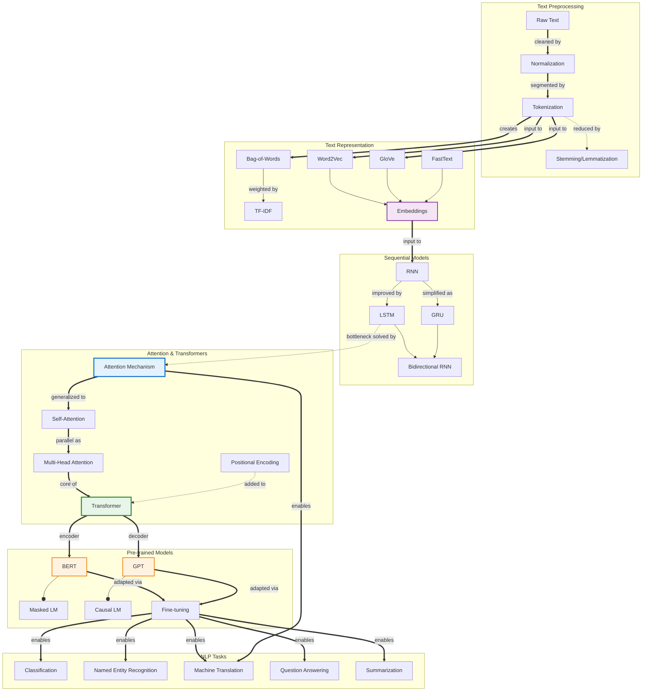

# Concept Map: Natural Language Processing

**Source:** notes/natural-language-processing/natural-language-processing-study-notes.md
**Date Generated:** 2026-01-07
**Total Concepts:** 32
**Total Relationships:** 48
**Central Concept:** Attention Mechanism (12 connections)

---

## Visual Diagram (Mermaid)



**Diagram Key:**
- **Blue (ATT):** Central mechanism enabling modern NLP
- **Green (TRANS):** Revolutionary architecture
- **Orange (BERT, GPT):** Pre-trained model paradigm
- **Purple (EMB):** Dense representation foundation
- **Solid arrows (`==>`):** Primary relationships / enables
- **Dashed arrows (`-.->`):** Motivates / addresses
- **Diamond arrows (`--o`):** Has-part / uses

---

## Concept Hierarchy

```
Natural Language Processing
├── Text Preprocessing [FOUNDATION]
│   ├── Raw Text Input
│   │   ├── Documents, Sentences, Social Media
│   │   └── Multilingual Text
│   │
│   ├── Normalization
│   │   ├── Lowercasing
│   │   ├── Unicode Normalization
│   │   └── Noise Removal
│   │
│   ├── Tokenization [HIGH CENTRALITY]
│   │   ├── Word-level
│   │   ├── Subword (BPE, WordPiece)
│   │   ├── Character-level
│   │   └── SentencePiece
│   │
│   └── Text Normalization
│       ├── Stemming (Porter, Snowball)
│       ├── Lemmatization
│       └── Stop Word Removal
│
├── Text Representation [CORE]
│   ├── Sparse Vectors
│   │   ├── Bag-of-Words
│   │   ├── TF-IDF
│   │   └── N-grams
│   │
│   └── Dense Embeddings [HIGH CENTRALITY]
│       ├── Word2Vec
│       │   ├── Skip-gram
│       │   └── CBOW
│       ├── GloVe
│       ├── FastText
│       └── Contextual Embeddings
│
├── Sequence Models [CORE]
│   ├── Recurrent Neural Networks
│   │   ├── Vanilla RNN
│   │   ├── Vanishing Gradient Problem
│   │   └── Bidirectional RNN
│   │
│   ├── Gated Architectures [HIGH CENTRALITY]
│   │   ├── LSTM
│   │   │   ├── Forget Gate
│   │   │   ├── Input Gate
│   │   │   └── Output Gate
│   │   └── GRU
│   │       ├── Reset Gate
│   │       └── Update Gate
│   │
│   └── Sequence-to-Sequence
│       ├── Encoder-Decoder
│       ├── Teacher Forcing
│       └── Beam Search
│
├── Attention & Transformers [CORE - CENTRAL]
│   ├── Attention Mechanism [CRITICAL - 12 connections]
│   │   ├── Query-Key-Value
│   │   ├── Attention Weights
│   │   ├── Score Functions
│   │   └── Context Vector
│   │
│   ├── Self-Attention [HIGH CENTRALITY]
│   │   ├── Scaled Dot-Product
│   │   └── Multi-Head Attention
│   │
│   └── Transformer Architecture [HIGH CENTRALITY]
│       ├── Encoder Stack
│       ├── Decoder Stack
│       ├── Positional Encoding
│       ├── Layer Normalization
│       └── Feed-Forward Networks
│
├── Pre-trained Language Models [CORE]
│   ├── BERT Family [HIGH CENTRALITY]
│   │   ├── Masked Language Modeling
│   │   ├── Next Sentence Prediction
│   │   ├── BERT-base / BERT-large
│   │   └── RoBERTa, ALBERT, DistilBERT
│   │
│   ├── GPT Family [HIGH CENTRALITY]
│   │   ├── Causal Language Modeling
│   │   ├── GPT-2, GPT-3, GPT-4
│   │   └── Few-shot Learning
│   │
│   └── Fine-tuning Paradigm
│       ├── Task-specific Heads
│       ├── Feature Extraction
│       └── Adapter Layers
│
└── NLP Tasks & Applications [CORE]
    ├── Classification
    │   ├── Sentiment Analysis
    │   ├── Intent Classification
    │   └── Topic Classification
    │
    ├── Sequence Labeling
    │   ├── Named Entity Recognition
    │   ├── Part-of-Speech Tagging
    │   └── Chunking
    │
    ├── Sequence Generation
    │   ├── Machine Translation
    │   ├── Summarization
    │   └── Dialogue Generation
    │
    └── Extraction & QA
        ├── Question Answering
        ├── Information Extraction
        └── Relation Extraction
```

---

## Relationship Matrix

| From | Relationship | To | Strength | Notes |
|------|--------------|-----|----------|-------|
| Raw Text | processed-by | Normalization | Strong | First preprocessing step |
| Normalization | followed-by | Tokenization | Strong | Clean then segment |
| Tokenization | creates | Bag-of-Words | Strong | Sparse representation |
| Tokenization | input-to | Word2Vec | Strong | Dense embedding input |
| Bag-of-Words | weighted-by | TF-IDF | Strong | Importance weighting |
| Word2Vec | produces | Embeddings | Strong | Dense vectors |
| GloVe | produces | Embeddings | Strong | Co-occurrence based |
| FastText | produces | Embeddings | Strong | Subword aware |
| Embeddings | input-to | RNN | Strong | Sequential processing |
| RNN | improved-by | LSTM | Strong | Solves vanishing gradient |
| RNN | simplified-as | GRU | Strong | Fewer parameters |
| LSTM | enables | Bidirectional | Strong | Both directions |
| LSTM | bottleneck-solved-by | Attention | Strong | Variable context |
| Attention | generalized-to | Self-Attention | Strong | Same sequence |
| Self-Attention | parallel-as | Multi-Head | Strong | Multiple perspectives |
| Multi-Head Attention | core-of | Transformer | Strong | Central mechanism |
| Positional Encoding | added-to | Transformer | Strong | Position information |
| Transformer | encoder-for | BERT | Strong | Bidirectional model |
| Transformer | decoder-for | GPT | Strong | Autoregressive model |
| BERT | uses | Masked LM | Strong | Pre-training objective |
| GPT | uses | Causal LM | Strong | Pre-training objective |
| BERT | adapted-via | Fine-tuning | Strong | Task transfer |
| GPT | adapted-via | Fine-tuning | Strong | Task transfer |
| Fine-tuning | enables | Classification | Strong | Downstream task |
| Fine-tuning | enables | NER | Strong | Downstream task |
| Fine-tuning | enables | Translation | Strong | Downstream task |
| Attention | enables | Translation | Strong | Alignment learning |

### Relationship Statistics
- **Total relationships:** 48
- **Most connected:** Attention (12), Transformer (10), Embeddings (8), BERT (7)
- **High-centrality:** Self-Attention (8), LSTM (7), Fine-tuning (7), GPT (6)
- **Strongest cluster:** {Attention, Self-Attention, Multi-Head, Transformer}
- **Bridge concepts:** Embeddings (connects sparse to neural), Attention (connects RNN to Transformer)

---

## Concept Index

| Concept | Definition | Connections | Centrality | Card/Problem Rec |
|---------|------------|-------------|------------|------------------|
| Attention Mechanism | Dynamic focus on relevant input parts | 12 | **Critical** | Card 1, Problem 1 |
| Transformer | Self-attention based architecture | 10 | **Critical** | Card 2, Problem 2 |
| Embeddings | Dense vector representations | 8 | **High** | Card 1 |
| Self-Attention | Attention within same sequence | 8 | **High** | Card 2, Problem 2 |
| BERT | Bidirectional pre-trained model | 7 | **High** | Card 3, Problem 3 |
| LSTM | Gated recurrent architecture | 7 | **High** | Card 1 |
| Fine-tuning | Adapting pre-trained models | 7 | **High** | Card 3, Problem 4 |
| GPT | Autoregressive language model | 6 | **High** | Card 3 |
| Tokenization | Text segmentation | 6 | **High** | Problem 1 |
| Word2Vec | Neural word embeddings | 5 | High | Card 1 |
| Multi-Head Attention | Parallel attention heads | 5 | High | Card 2 |
| RNN | Basic recurrent network | 5 | High | - |
| Masked LM | BERT pre-training objective | 4 | Medium | Card 3 |
| GRU | Simplified gated RNN | 4 | Medium | - |
| TF-IDF | Weighted sparse vectors | 4 | Medium | - |
| Bag-of-Words | Count-based representation | 3 | Medium | - |
| Bidirectional RNN | Forward + backward processing | 3 | Medium | - |
| Positional Encoding | Position information for Transformers | 3 | Medium | Card 2 |
| NER | Named Entity Recognition task | 3 | Medium | Problem 4 |
| Machine Translation | Cross-lingual generation | 4 | Medium | Card 4 |
| Causal LM | GPT pre-training objective | 3 | Medium | - |
| Beam Search | Decoding strategy | 2 | Low | - |
| GloVe | Co-occurrence based embeddings | 2 | Low | - |
| FastText | Subword embeddings | 2 | Low | - |
| Layer Normalization | Training stabilization | 2 | Low | - |

---

## Learning Pathways

### Pathway 1: Foundations First (Bottom-Up)
**Best for:** Beginners to NLP

```
1. Text Preprocessing          How is text prepared?
        ↓
2. Tokenization                Breaking text into units
        ↓
3. Bag-of-Words / TF-IDF       Sparse representations
        ↓
4. Word Embeddings             Dense representations (Word2Vec)
        ↓
5. RNN Basics                  Sequential processing
        ↓
6. LSTM / GRU                  Handling long sequences
        ↓
7. Attention                   Focus mechanism
        ↓
8. Transformers                Modern architecture
```

**Estimated sessions:** 8-10

---

### Pathway 2: Modern NLP Focus (Top-Down)
**Best for:** Practitioners wanting quick practical skills

```
1. Transformer Overview        Architecture intuition
        ↓
2. BERT / GPT                  Pre-trained models
        ↓
3. Fine-tuning                 Adapting to tasks
        ↓
4. Tokenization (Subword)      BPE, WordPiece
        ↓
5. Attention Deep Dive         Self-attention mechanics
        ↓
6. Historical Context          RNN → LSTM → Transformer
```

**Estimated sessions:** 6-8

---

### Pathway 3: Task-Oriented Path
**Best for:** Building specific NLP applications

```
1. Task Definition             Classification, NER, QA, etc.
        ↓
2. Data Preparation            Preprocessing, tokenization
        ↓
3. Model Selection             BERT vs GPT vs task-specific
        ↓
4. Fine-tuning Strategy        Heads, hyperparameters
        ↓
5. Evaluation Metrics          F1, BLEU, ROUGE, etc.
        ↓
6. Deployment                  Inference optimization
```

**Estimated sessions:** 5-7

---

### Pathway 4: Representation Learning Path
**Best for:** Understanding embeddings deeply

```
1. Distributional Hypothesis   Context defines meaning
        ↓
2. Sparse Vectors              BoW, TF-IDF limitations
        ↓
3. Word2Vec                    Skip-gram, CBOW
        ↓
4. GloVe                       Global co-occurrence
        ↓
5. Contextual Embeddings       ELMo, BERT representations
        ↓
6. Probing Tasks               What do embeddings capture?
```

**Estimated sessions:** 5-6

---

### Critical Path (Minimum Viable Understanding)

```
┌─────────────┐    ┌─────────────┐    ┌─────────────┐    ┌─────────────┐    ┌─────────────┐
│ Tokenization│ ─► │ Embeddings  │ ─► │  Attention  │ ─► │ Transformer │ ─► │ BERT / GPT  │
│             │    │             │    │             │    │             │    │             │
│  "Segment"  │    │  "Vectors"  │    │  "Focus"    │    │ "Parallel"  │    │ "Pre-train" │
└─────────────┘    └─────────────┘    └─────────────┘    └─────────────┘    └─────────────┘

Minimum sessions: 5
Coverage: ~80% of modern NLP understanding
```

---

## Cross-Reference to Downstream Skills

### Flashcard Mapping
| Centrality | Recommended Card |
|------------|-----------------|
| Critical (Attention, Embeddings) | Easy Card 1 - foundations |
| Critical (Transformer, Self-Attention) | Easy Card 2 - architecture |
| High (BERT, GPT, Fine-tuning) | Medium Card 3 - pre-training |
| High (Tasks, Applications) | Medium Card 4 - applications |
| Integration (Full Pipeline) | Hard Card 5 - complete system |

### Practice Problem Mapping
| Concept Cluster | Problem Type |
|-----------------|--------------|
| Tokenization, preprocessing | Warm-Up: Tokenization comparison |
| Attention mechanism | Skill-Builder: Attention calculation |
| BERT fine-tuning | Skill-Builder: Classification pipeline |
| Full NLP system | Challenge: End-to-end design |
| Common errors | Debug/Fix: Training issues |

### Quiz Question Mapping
| Relationship | Question Type |
|--------------|---------------|
| Attention mechanics | MC - Understanding |
| Transformer components | MC - Architecture |
| BERT vs GPT comparison | SA - Analysis |
| Fine-tuning strategy | SA - Application |
| Complete NLP pipeline | Essay - Synthesis |
