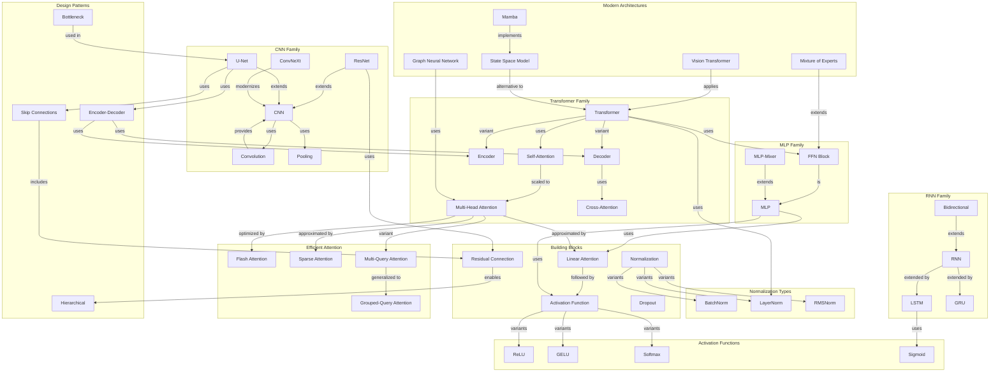

# Concept Map: Lesson 8 - Neural Network Architectures

**Source:** Lessons/Lesson_8.md
**Subject Area:** AI Learning - Neural Network Architectures: Design Patterns and Modern Innovations
**Date Generated:** 2026-01-08
**Total Concepts:** 42
**Total Relationships:** 58

---

## Visual Concept Map (Mermaid)



---

## Concept Hierarchy

```
NEURAL NETWORK ARCHITECTURES
├── BUILDING BLOCKS
│   ├── Linear Layer
│   │   └── y = Wx + b
│   ├── Activation Functions
│   │   ├── ReLU (max(0,x))
│   │   ├── GELU (x·Φ(x))
│   │   ├── SiLU/Swish (x·σ(x))
│   │   ├── Softmax (probability)
│   │   └── Sigmoid (gating)
│   ├── Normalization
│   │   ├── BatchNorm (batch dimension)
│   │   ├── LayerNorm (feature dimension)
│   │   ├── RMSNorm (efficient LN)
│   │   └── GroupNorm (channel groups)
│   ├── Dropout
│   │   └── Regularization via random zeroing
│   └── Residual Connection
│       └── y = F(x) + x
│
├── ARCHITECTURE FAMILIES
│   ├── MLP (Feedforward)
│   │   ├── Dense layers + activations
│   │   ├── FFN blocks (in Transformers)
│   │   └── MLP-Mixer (patch mixing)
│   │
│   ├── CNN (Convolutional)
│   │   ├── Convolution (local features)
│   │   ├── Pooling (downsampling)
│   │   ├── LeNet, AlexNet, VGG (classic)
│   │   ├── ResNet (residual learning)
│   │   ├── U-Net (encoder-decoder)
│   │   └── ConvNeXt (modernized CNN)
│   │
│   ├── RNN (Recurrent)
│   │   ├── Vanilla RNN (hidden state)
│   │   ├── LSTM (gated memory)
│   │   ├── GRU (simplified gating)
│   │   └── Bidirectional (both directions)
│   │
│   ├── Transformer (Attention)
│   │   ├── Self-Attention (Q, K, V)
│   │   ├── Multi-Head Attention
│   │   ├── Encoder (bidirectional)
│   │   ├── Decoder (causal)
│   │   └── Cross-Attention (enc-dec)
│   │
│   └── GNN (Graph)
│       ├── Message Passing
│       ├── GCN (mean aggregation)
│       ├── GAT (attention aggregation)
│       └── GraphSAGE (sampling)
│
├── EFFICIENT ATTENTION
│   ├── Flash Attention
│   │   └── Memory-efficient kernels
│   ├── Sparse Attention
│   │   └── Attend to subset
│   ├── Linear Attention
│   │   └── O(n) approximation
│   ├── Multi-Query Attention
│   │   └── Shared KV heads
│   └── Grouped-Query Attention
│       └── KV head groups
│
├── MODERN INNOVATIONS
│   ├── Mixture of Experts
│   │   ├── Router network
│   │   ├── Expert networks
│   │   └── Top-k routing
│   ├── Vision Transformer
│   │   ├── Patch tokenization
│   │   └── Position embeddings
│   ├── State Space Models
│   │   ├── Continuous dynamics
│   │   └── O(n) complexity
│   └── Mamba
│       └── Selective state spaces
│
└── DESIGN PATTERNS
    ├── Encoder-Decoder
    │   └── Compress → Transform → Expand
    ├── U-Net / Skip Connections
    │   └── Multi-scale feature fusion
    ├── Hierarchical Processing
    │   └── Local → Global
    └── Bottleneck
        └── Compress → Process → Expand
```

---

## Relationship Matrix

| From Concept | To Concept | Relationship Type | Strength |
|--------------|------------|-------------------|----------|
| Linear Layer | Activation | followed-by | Strong |
| Residual Connection | Deep Networks | enables | Strong |
| CNN | Convolution | uses | Strong |
| CNN | Pooling | uses | Strong |
| ResNet | Residual Connection | uses | Strong |
| Transformer | Self-Attention | uses | Strong |
| Self-Attention | Multi-Head Attention | scaled-to | Strong |
| Transformer | LayerNorm | uses | Strong |
| Transformer | FFN | uses | Strong |
| Multi-Head Attention | Flash Attention | optimized-by | Strong |
| MoE | FFN | extends | Strong |
| ViT | Transformer | applies | Strong |
| U-Net | Encoder-Decoder | uses | Strong |
| U-Net | Skip Connections | uses | Strong |
| LSTM | RNN | extends | Strong |
| GRU | RNN | extends | Strong |
| Decoder | Cross-Attention | uses | Strong |
| MQA | GQA | generalized-to | Medium |
| SSM | Transformer | alternative-to | Medium |
| Mamba | SSM | implements | Strong |
| ConvNeXt | CNN | modernizes | Medium |
| GNN | Message Passing | uses | Strong |
| Sparse Attention | MHA | approximates | Medium |
| Linear Attention | MHA | approximates | Medium |

---

## Centrality Index

**High Centrality (6+ connections):**

| Concept | Incoming | Outgoing | Total | Role |
|---------|----------|----------|-------|------|
| Transformer | 2 | 6 | 8 | **Central Architecture** |
| Multi-Head Attention | 2 | 5 | 7 | **Core Mechanism** |
| CNN | 2 | 5 | 7 | **Spatial Architecture** |
| Residual Connection | 2 | 4 | 6 | **Key Innovation** |
| Linear Layer | 1 | 4 | 5 | **Building Block** |

**Medium Centrality (3-5 connections):**

| Concept | Incoming | Outgoing | Total | Role |
|---------|----------|----------|-------|------|
| RNN | 2 | 3 | 5 | Sequential processing |
| Encoder-Decoder | 2 | 3 | 5 | Structural pattern |
| U-Net | 2 | 3 | 5 | Dense prediction |
| Self-Attention | 1 | 3 | 4 | Attention core |
| FFN | 2 | 2 | 4 | Transformer component |
| Skip Connections | 2 | 2 | 4 | Feature preservation |

**Low Centrality (1-2 connections):**
- BatchNorm, LayerNorm, RMSNorm, GELU, ReLU, Softmax, LSTM, GRU, Flash Attention, Sparse Attention, MoE, ViT, Mamba, GNN

---

## Learning Pathways

### Pathway 1: Foundation to Feedforward
**Goal:** Understand basic neural network building blocks
**Sequence:** Linear Layer → Activation Functions → Normalization → Dropout → MLP → FFN Block
**Prerequisites:** Linear algebra, calculus
**Assessment:** Can design and analyze simple feedforward networks

### Pathway 2: Spatial Processing
**Goal:** Master CNN architectures for spatial data
**Sequence:** Convolution → Pooling → CNN → Receptive Field → ResNet → U-Net → ConvNeXt
**Prerequisites:** Pathway 1
**Assessment:** Can design CNN architectures for image tasks

### Pathway 3: Sequential Processing
**Goal:** Understand sequence modeling architectures
**Sequence:** RNN → Vanishing Gradients → LSTM → GRU → Bidirectional → Attention origins
**Prerequisites:** Pathway 1
**Assessment:** Can explain RNN limitations and LSTM solutions

### Pathway 4: Attention Mastery
**Goal:** Deep understanding of Transformer architectures
**Sequence:** Self-Attention → Q/K/V → Multi-Head → Encoder → Decoder → Cross-Attention → Positional Encoding → Efficient Attention
**Prerequisites:** Pathways 1-3
**Assessment:** Can implement and modify attention mechanisms

### Pathway 5: Modern Innovations
**Goal:** Survey cutting-edge architectural developments
**Sequence:** Flash Attention → MQA/GQA → MoE → ViT → SSM/Mamba → GNN
**Prerequisites:** Pathways 1-4
**Assessment:** Can evaluate and select modern architectures for specific tasks

---

## Critical Path Analysis

**Minimum Viable Understanding (MVU):**
```
Linear → Activation → Normalization → Residual → Attention → Transformer
```

**Rationale:** These six concepts provide the essential architecture vocabulary:
1. **Linear:** Basic transformation
2. **Activation:** Non-linearity for complex functions
3. **Normalization:** Training stability
4. **Residual:** Enables depth
5. **Attention:** Modern sequence processing
6. **Transformer:** Dominant architecture

**Expanded Path for Practitioners:**
```
Linear → Activation → Normalization → MLP/FFN → CNN → Convolution →
Pooling → ResNet → RNN → LSTM → Self-Attention → Multi-Head →
Transformer → Encoder/Decoder → Positional Encoding → Flash Attention →
MoE → ViT → U-Net → GNN
```

---

## Cross-Lesson Connections

### To Lesson 4 (Transformers)
| Architecture Concept | Transformer Connection | Implication |
|---------------------|----------------------|-------------|
| Self-Attention | Core mechanism | O(n²) but powerful |
| Multi-Head Attention | Standard implementation | Different relationship types |
| Positional Encoding | Inject position info | RoPE, ALiBi modern choices |
| Pre-LN | Stable training | Modern default |

### To Lesson 5 (Deep Learning)
| Architecture Concept | Deep Learning Connection | Implication |
|---------------------|-------------------------|-------------|
| Residual Connection | Gradient flow | Enables deep networks |
| Normalization | Training stability | LayerNorm for Transformers |
| Activation Functions | Non-linearity | GELU modern default |
| Dropout | Regularization | Placement matters |

### To Lesson 7 (Generative AI)
| Architecture Concept | Generative Connection | Implication |
|---------------------|----------------------|-------------|
| U-Net | Diffusion backbone | Skip connections for details |
| Decoder Transformer | LLM generation | Causal attention |
| Cross-Attention | Text-to-image conditioning | Text guides image |
| MoE | Large model scaling | Efficient parameter use |

---

## Concept Definitions (Quick Reference)

| Concept | One-Line Definition |
|---------|---------------------|
| Linear Layer | Affine transformation: y = Wx + b |
| Activation | Non-linear function enabling complex learning |
| ReLU | max(0, x); simple, effective |
| GELU | Smooth activation for Transformers |
| BatchNorm | Normalize across batch dimension |
| LayerNorm | Normalize across feature dimension |
| Dropout | Random zeroing for regularization |
| Residual | y = F(x) + x; gradient highway |
| MLP | Stacked linear layers with activations |
| Convolution | Local feature extraction with shared weights |
| Pooling | Spatial downsampling |
| ResNet | CNN with residual connections |
| U-Net | Encoder-decoder with skip connections |
| RNN | Recurrent hidden state for sequences |
| LSTM | Gated RNN for long-term memory |
| Self-Attention | Every position attends to all positions |
| Multi-Head | Multiple parallel attention operations |
| Transformer | Attention-based architecture |
| Flash Attention | Memory-efficient attention implementation |
| MoE | Conditional expert activation |
| ViT | Transformer applied to image patches |
| GNN | Message passing on graph structure |

---

## Study Recommendations

### Foundation First
1. Implement a basic MLP from scratch
2. Understand why each component (linear, activation, norm) exists
3. Trace gradient flow through residual connections

### Architecture Deep Dives
1. Implement convolution operation manually
2. Build a simple Transformer encoder
3. Trace attention weights on sample inputs

### Modern Understanding
1. Compare attention complexities (standard vs efficient)
2. Understand MoE routing and load balancing
3. Compare ViT and CNN for image classification

### Practical Skills
1. Select architectures based on data structure
2. Estimate memory and compute requirements
3. Apply modern techniques (Flash Attention, GQA)

---

*Generated from Lesson 8: Neural Network Architectures | Concept Map Skill*
