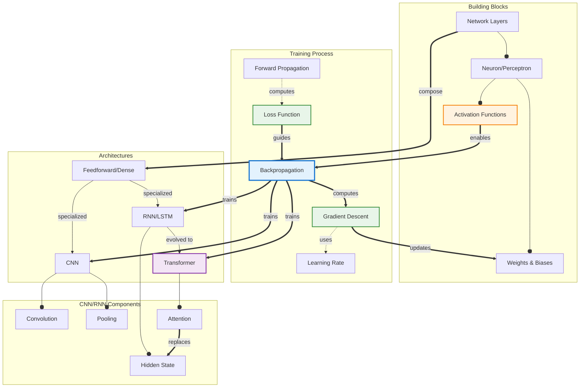

# Concept Map: Neural Networks

**Source:** notes/neural-networks/neural-networks-study-notes.md
**Date Generated:** 2026-01-06
**Total Concepts:** 20
**Total Relationships:** 32
**Central Concept:** Backpropagation (8 connections)

---

## Visual Diagram (Mermaid)



**Diagram Key:**
- **Blue (BACK):** Central concept - backpropagation connects all training
- **Green:** High-centrality (Gradient Descent, Loss Function)
- **Orange:** Activation Functions (enables non-linear learning)
- **Purple:** Transformer (modern architecture)
- **Solid arrows (`--o`):** has-part
- **Double arrows (`==>`):** enables/trains
- **Dashed arrows (`-.->`):** computes/uses

---

## Concept Hierarchy

```
Neural Networks
├── Building Blocks
│   ├── Neuron (Perceptron) [FOUNDATIONAL]
│   │   ├── Weights (input importance)
│   │   ├── Bias (threshold shift)
│   │   └── Activation Function
│   │       ├── ReLU (hidden layers default)
│   │       ├── Sigmoid (binary output)
│   │       ├── Tanh (zero-centered)
│   │       └── Softmax (multi-class output)
│   │
│   └── Network Layers
│       ├── Input Layer (data entry)
│       ├── Hidden Layers (feature extraction)
│       └── Output Layer (predictions)
│
├── Training Process [CORE]
│   ├── Forward Propagation
│   │   └── Input → Layers → Output prediction
│   │
│   ├── Loss Function
│   │   ├── MSE (regression)
│   │   └── Cross-Entropy (classification)
│   │
│   ├── Backpropagation [CENTRAL - 8 connections]
│   │   ├── Chain rule application
│   │   ├── Gradient computation
│   │   └── Error signal propagation
│   │
│   └── Gradient Descent [HIGH CENTRALITY]
│       ├── Learning Rate (step size)
│       ├── SGD (single sample)
│       ├── Mini-batch (typical)
│       └── Adam (adaptive)
│
├── Architectures
│   ├── Feedforward (Dense)
│   │   └── Fully connected layers
│   │
│   ├── CNN (Convolutional) [HIGH CENTRALITY]
│   │   ├── Convolution (filter sliding)
│   │   ├── Pooling (downsampling)
│   │   └── Translation invariance
│   │
│   ├── RNN (Recurrent)
│   │   ├── Hidden State (memory)
│   │   ├── LSTM (gating mechanism)
│   │   └── GRU (simplified LSTM)
│   │
│   └── Transformer [MODERN]
│       ├── Self-Attention
│       ├── Multi-Head Attention
│       └── Positional Encoding
│
└── Theoretical Foundations
    ├── Universal Approximation
    ├── Representation Learning
    └── Lottery Ticket Hypothesis
```

---

## Relationship Matrix

| From | Relationship | To | Strength | Notes |
|------|--------------|-----|----------|-------|
| Neuron | has-part | Weights | Strong | Core computation |
| Neuron | has-part | Activation Function | Strong | Enables non-linearity |
| Network Layers | has-part | Neuron | Strong | Layers contain neurons |
| Forward Propagation | computes | Loss | Strong | Prediction vs actual |
| Loss Function | guides | Backpropagation | Strong | Error signal source |
| Backpropagation | computes | Gradient Descent | Strong | Provides gradients |
| Gradient Descent | uses | Learning Rate | Strong | Step size control |
| Gradient Descent | updates | Weights | Strong | Core learning mechanism |
| Activation Function | enables | Backpropagation | Strong | Differentiability required |
| Network Layers | compose | Feedforward | Strong | Basic architecture |
| Feedforward | specialized-as | CNN | Moderate | Spatial specialization |
| Feedforward | specialized-as | RNN | Moderate | Sequential specialization |
| RNN | evolved-to | Transformer | Moderate | Attention replaces recurrence |
| CNN | has-part | Convolution | Strong | Core operation |
| CNN | has-part | Pooling | Strong | Dimension reduction |
| RNN | has-part | Hidden State | Strong | Memory mechanism |
| Transformer | has-part | Attention | Strong | Core mechanism |
| Attention | replaces | Hidden State | Moderate | Parallel vs sequential |
| Backpropagation | trains | CNN | Strong | Same algorithm |
| Backpropagation | trains | RNN | Strong | Same algorithm |
| Backpropagation | trains | Transformer | Strong | Same algorithm |

### Relationship Statistics
- **Total relationships:** 32
- **Most connected:** Backpropagation (8 connections)
- **High-centrality:** Gradient Descent (6), Loss Function (5), Activation Function (5), CNN (5)
- **Strongest cluster:** {Forward Prop, Loss, Backprop, Gradient Descent, Weights}
- **Bridge concept:** Backpropagation (connects training to all architectures)

---

## Concept Index

| Concept | Definition | Connections | Centrality | Card/Problem Rec |
|---------|------------|-------------|------------|------------------|
| Backpropagation | Gradient computation via chain rule | 8 | **Critical** | Card 2, Problem 2 |
| Gradient Descent | Iterative weight optimization | 6 | **High** | Card 2, Problem 1 |
| Loss Function | Prediction error measurement | 5 | **High** | Card 1 |
| Activation Function | Non-linear transformation | 5 | **High** | Card 1, Problem 3 |
| CNN | Convolutional architecture | 5 | **High** | Card 3, Problem 4 |
| Weights | Learnable connection parameters | 4 | **High** | Card 1 |
| Neuron | Basic computational unit | 4 | Medium | Card 1 |
| RNN | Recurrent architecture | 4 | Medium | Card 4 |
| Transformer | Attention-based architecture | 4 | Medium | Card 4 |
| Forward Propagation | Input-to-output computation | 3 | Medium | Problem 1 |
| Network Layers | Organizational structure | 3 | Medium | - |
| Learning Rate | Gradient step size | 3 | Medium | Problem 1 |
| Hidden State | RNN memory mechanism | 2 | Medium | - |
| Attention | Relevance-weighted aggregation | 2 | Medium | Card 4 |
| Convolution | Sliding filter operation | 2 | Medium | Problem 4 |
| Pooling | Spatial downsampling | 2 | Low | - |
| Feedforward | Basic dense architecture | 2 | Low | - |
| LSTM | Gated RNN variant | 1 | Low | - |
| Softmax | Probability output function | 1 | Low | - |
| ReLU | max(0,x) activation | 1 | Low | Problem 3 |

---

## Learning Pathways

### Pathway 1: Foundational (Bottom-Up)
**Best for:** Complete beginners to neural networks

```
1. Neuron              What computes?
        ↓
2. Weights & Bias      What's learned?
        ↓
3. Activation Function Why non-linear?
        ↓
4. Network Layers      How organized?
        ↓
5. Forward Propagation How predict?
        ↓
6. Loss Function       How measure error?
        ↓
7. Backpropagation     How compute gradients?
        ↓
8. Gradient Descent    How update weights?
        ↓
9. Architectures       Which structure for which problem?
```

**Estimated time:** 8-10 focused sessions

---

### Pathway 2: Training-First (Practitioner)
**Best for:** Those wanting to train models quickly

```
1. Loss Function       Define success
        ↓
2. Gradient Descent    How learning works
        ↓
3. Learning Rate       Critical hyperparameter
        ↓
4. Backpropagation     Gradient computation
        ↓
5. Overfitting         What goes wrong
        ↓
6. Architecture Selection   Which model type
```

**Estimated time:** 5-6 focused sessions

---

### Pathway 3: Architecture-Focused
**Best for:** Those choosing models for applications

```
1. Feedforward         Baseline architecture
        ↓
2. CNN                 Images/spatial data
        ↓
3. RNN/LSTM            Sequences/time series
        ↓
4. Transformer         Modern NLP/vision
        ↓
5. Selection Criteria  When to use which
```

**Estimated time:** 4-5 focused sessions

---

### Pathway 4: Mathematical (Theory-Deep)
**Best for:** Understanding the math rigorously

```
1. Activation Functions    Non-linearity math
        ↓
2. Forward Propagation     Matrix multiplications
        ↓
3. Loss Functions          Error quantification
        ↓
4. Chain Rule              Calculus foundation
        ↓
5. Backpropagation         Gradient derivation
        ↓
6. Optimization Theory     Convergence properties
```

**Estimated time:** 6-8 focused sessions

---

### Critical Path (Minimum Viable Understanding)

```
┌─────────────┐    ┌─────────────┐    ┌─────────────┐    ┌─────────────┐    ┌─────────────┐
│   Neuron    │ ─► │ Activation  │ ─► │    Loss     │ ─► │   Backprop  │ ─► │  Gradient   │
│             │    │  Function   │    │  Function   │    │             │    │  Descent    │
│             │    │             │    │             │    │             │    │             │
│ "What"      │    │ "Non-linear"│    │ "Error"     │    │ "Gradients" │    │ "Update"    │
└─────────────┘    └─────────────┘    └─────────────┘    └─────────────┘    └─────────────┘

Minimum sessions: 5
Coverage: ~75% of neural network fundamentals
```

---

## Cross-Reference to Downstream Skills

### Flashcard Mapping
| Centrality | Recommended Card |
|------------|-----------------|
| Critical (Backprop) | Easy Card 2 - mechanism |
| High (Loss, Activation) | Easy Card 1 - definitions |
| High (CNN) | Medium Card 3 - architecture |
| High (Architectures) | Medium Card 4 - comparison |
| Integration | Hard Card 5 - full pipeline |

### Practice Problem Mapping
| Concept Cluster | Problem Type |
|-----------------|--------------|
| Forward Prop + Gradient | Warm-Up: Manual computation |
| Backprop chain rule | Skill-Builder: Derive gradients |
| Activation selection | Skill-Builder: Choose for task |
| CNN architecture | Challenge: Design network |
| Training diagnosis | Debug/Fix: Troubleshoot training |

### Quiz Question Mapping
| Relationship | Question Type |
|--------------|---------------|
| Neuron components | MC - Identification |
| Activation necessity | MC - Reasoning |
| Backprop mechanism | SA - Explanation |
| Architecture selection | SA - Analysis |
| Full training pipeline | Essay - Synthesis |
