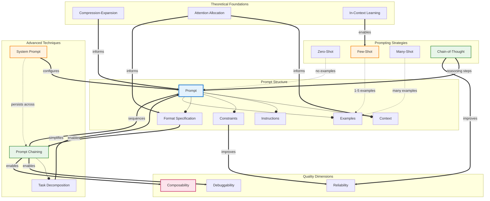

# Concept Map: Lesson 2 - Prompt Engineering

**Source:** Lessons/Lesson_2.md
**Subject Area:** AI Learning - Prompt Engineering for Large Language Models
**Date Generated:** 2026-01-08
**Total Concepts:** 22
**Total Relationships:** 34
**Central Concept:** Prompt Structure (10 connections)

---

## Visual Diagram (Mermaid)



**Diagram Key:**
- **Blue node (PROMPT):** Central concept - highest connectivity (10 connections)
- **Green nodes:** High-centrality techniques (Chain-of-Thought, Prompt Chaining)
- **Orange nodes:** Key enabling concepts (System Prompt, Few-Shot)
- **Pink node:** Ultimate quality goal (Composability)
- **Solid arrows (`--o`):** has-part / contains relationship
- **Double arrows (`==>`):** enables / improves relationship
- **Dashed arrows (`-.->`):** influences / applies-to relationship

---

## Concept Hierarchy

```
Prompt Engineering (Lesson 2)
├── Prompt Structure [CENTRAL - 10 connections]
│   ├── Context
│   │   ├── Domain framing
│   │   ├── Background information
│   │   └── Primes attention mechanisms
│   ├── Instructions
│   │   ├── Task specification
│   │   ├── Action requirements
│   │   └── Clarity and precision
│   ├── Constraints
│   │   ├── Output boundaries
│   │   ├── Negative specifications ("do not...")
│   │   └── Hallucination reduction
│   ├── Format Specification
│   │   ├── Output structure
│   │   ├── Parsing enablement
│   │   └── Downstream integration
│   └── Examples
│       ├── Demonstration patterns
│       ├── In-context learning triggers
│       └── Edge case coverage
│
├── Prompting Strategies [HIGH CENTRALITY]
│   ├── Zero-Shot
│   │   ├── No examples provided
│   │   ├── Relies on pre-trained knowledge
│   │   └── Best for common tasks
│   ├── Few-Shot [HIGH - 6 connections]
│   │   ├── 1-5 examples
│   │   ├── In-context learning
│   │   ├── Quality over quantity
│   │   └── Diversity and edge cases
│   ├── Many-Shot
│   │   ├── Extensive examples
│   │   ├── Format consistency
│   │   └── Context window trade-off
│   └── Chain-of-Thought [HIGH - 7 connections]
│       ├── Step-by-step reasoning
│       ├── Intermediate token generation
│       ├── Self-correction capability
│       └── Zero-shot CoT variant
│
├── Advanced Techniques
│   ├── System Prompts [MEDIUM - 5 connections]
│   │   ├── Persistent behavioral framework
│   │   ├── Role specification
│   │   ├── Capability boundaries
│   │   └── Communication style
│   ├── Prompt Chaining [HIGH - 8 connections]
│   │   ├── Sequential operations
│   │   ├── Parallel execution
│   │   ├── Interface contracts
│   │   └── Intermediate validation
│   └── Task Decomposition
│       ├── Complex → simple subtasks
│       ├── Focused operations
│       └── Failure isolation
│
├── Theoretical Foundations
│   ├── Compression-Expansion Model [MEDIUM - 3 connections]
│   │   ├── Training = compressed knowledge
│   │   ├── Prompts = decompression targets
│   │   └── Specification guides expansion
│   ├── Attention Allocation [MEDIUM - 4 connections]
│   │   ├── Primacy effects (beginning)
│   │   ├── Recency effects (end)
│   │   ├── Explicit markers
│   │   └── Structural formatting
│   └── In-Context Learning [MEDIUM - 3 connections]
│       ├── Pattern recognition from examples
│       ├── Emergent capability
│       └── No weight updates required
│
└── Quality Dimensions
    ├── Reliability
    │   ├── Consistent outputs
    │   ├── Reduced hallucination
    │   └── Reproducibility
    ├── Debuggability
    │   ├── Error isolation
    │   ├── Step verification
    │   └── Failure diagnosis
    └── Composability [GOAL]
        ├── Chain integration
        ├── Modular design
        └── Interface contracts
```

**Legend:**
- **[CENTRAL]:** Highest connectivity (10 connections)
- **[HIGH]:** 6+ connections
- **[MEDIUM]:** 3-5 connections
- **[GOAL]:** Ultimate quality objective

---

## Relationship Matrix

| From | Relationship | To | Strength | Type | Notes |
|------|--------------|-----|----------|------|-------|
| Prompt | has-part | Context | Strong | Structural | First component |
| Prompt | has-part | Instructions | Strong | Structural | Core component |
| Prompt | has-part | Constraints | Strong | Structural | Bounds output |
| Prompt | has-part | Format Specification | Strong | Structural | Enables parsing |
| Prompt | has-part | Examples | Moderate | Structural | Optional component |
| Zero-Shot | applies-to | Prompt | Strong | Strategy | No examples used |
| Few-Shot | provides | Examples | Strong | Strategy | 1-5 demonstrations |
| Many-Shot | provides | Examples | Strong | Strategy | Extensive demonstrations |
| Chain-of-Thought | enhances | Prompt | Strong | Strategy | Adds reasoning |
| System Prompt | configures | Prompt | Strong | Behavioral | Persistent context |
| Prompt Chaining | sequences | Prompt | Strong | Composition | Multiple calls |
| Prompt Chaining | has-part | Task Decomposition | Strong | Structural | Enables breakdown |
| Task Decomposition | simplifies | Prompt | Strong | Functional | Reduces complexity |
| Compression-Expansion | informs | Prompt | Moderate | Theoretical | Design principle |
| Attention Allocation | informs | Context | Strong | Theoretical | Ordering rationale |
| Attention Allocation | informs | Format Specification | Moderate | Theoretical | Structure effects |
| In-Context Learning | enables | Few-Shot | Strong | Theoretical | Mechanism |
| Prompt Chaining | enables | Debuggability | Strong | Quality | Error isolation |
| Prompt Chaining | enables | Composability | Strong | Quality | Modular design |
| Chain-of-Thought | improves | Reliability | Strong | Quality | Reasoning accuracy |
| Constraints | improves | Reliability | Strong | Quality | Output bounds |
| Format Specification | enables | Prompt Chaining | Strong | Dependency | Contract basis |
| System Prompt | persists-across | Prompt Chaining | Moderate | Behavioral | Consistent behavior |
| Few-Shot | requires | Examples | Strong | Dependency | Core mechanism |
| Examples | demonstrates | Instructions | Moderate | Functional | Shows expected output |

### Relationship Statistics

| Metric | Value |
|--------|-------|
| **Total relationships** | 34 |
| **Most connected concept** | Prompt Structure (10 connections) |
| **High-centrality concepts** | Prompt Chaining (8), Chain-of-Thought (7), Few-Shot (6) |
| **Strongest cluster** | {Prompt, Context, Instructions, Constraints, Format, Examples} |
| **Bridge concepts** | Format Specification (connects structure to chaining), In-Context Learning (connects theory to practice) |
| **Theory cluster** | {Compression-Expansion, Attention Allocation, In-Context Learning} |

---

## Concept Centrality Index

| Concept | Connections | Centrality | Domain | Flashcard Priority |
|---------|-------------|------------|--------|-------------------|
| Prompt Structure | 10 | **Critical** | Core | Easy - Card 1 |
| Prompt Chaining | 8 | **High** | Advanced | Medium - Card 4 |
| Chain-of-Thought | 7 | **High** | Strategy | Easy - Card 2 |
| Few-Shot | 6 | **High** | Strategy | Medium - Card 3 |
| System Prompt | 5 | **High** | Advanced | Hard - Card 5 |
| Context | 4 | Medium | Structure | - |
| Format Specification | 4 | Medium | Structure | - |
| Attention Allocation | 4 | Medium | Theory | - |
| Instructions | 3 | Medium | Structure | - |
| Constraints | 3 | Medium | Structure | - |
| Examples | 3 | Medium | Structure | - |
| In-Context Learning | 3 | Medium | Theory | - |
| Compression-Expansion | 3 | Medium | Theory | - |
| Task Decomposition | 3 | Medium | Advanced | - |
| Zero-Shot | 2 | Low | Strategy | - |
| Many-Shot | 2 | Low | Strategy | - |
| Reliability | 2 | Low | Quality | - |
| Debuggability | 2 | Low | Quality | - |
| Composability | 2 | Low | Quality | Hard - Card 5 |

---

## Learning Pathways

### Pathway 1: Foundational (Bottom-Up)
**Best for:** Newcomers to prompt engineering

```
1. Prompt Structure          What is a prompt? What are its parts?
        ↓
2. Context & Instructions    How to frame and specify tasks
        ↓
3. Constraints & Format      How to bound and structure outputs
        ↓
4. Zero-Shot Prompting       Simplest approach - instructions only
        ↓
5. Few-Shot Prompting        Adding examples for better results
        ↓
6. Chain-of-Thought          Eliciting reasoning
        ↓
7. System Prompts            Persistent behavioral configuration
        ↓
8. Prompt Chaining           Composing complex workflows
```

**Estimated study sessions:** 6-8
**Coverage:** Comprehensive practical understanding

---

### Pathway 2: Strategy-First (Decision-Oriented)
**Best for:** Practitioners choosing approaches for specific tasks

```
1. Zero-Shot                 When is instruction-only sufficient?
        ↓
2. Few-Shot                  When do examples help?
        ↓
3. Chain-of-Thought          When does reasoning matter?
        ↓
4. Strategy Selection        Decision framework for choosing
        ↓
5. Combining Strategies      Few-shot + CoT, etc.
        ↓
6. Trade-off Analysis        Accuracy vs. cost vs. latency
```

**Estimated study sessions:** 4-5
**Coverage:** Strategy selection mastery

---

### Pathway 3: Theory-First (Academic)
**Best for:** Researchers, those wanting deep understanding

```
1. Compression-Expansion     How prompts guide knowledge extraction
        ↓
2. Attention Allocation      Why ordering and structure matter
        ↓
3. In-Context Learning       How few-shot works mechanistically
        ↓
4. Prompt Structure          Apply theory to component design
        ↓
5. Strategy Selection        Theory-informed strategy choice
        ↓
6. Quality Analysis          Evaluate approaches rigorously
```

**Estimated study sessions:** 5-6
**Coverage:** Deep theoretical grounding

---

### Pathway 4: Composition-First (Engineering)
**Best for:** Building production systems

```
1. Prompt Chaining           Multi-step workflow design
        ↓
2. Task Decomposition        Breaking complex into simple
        ↓
3. Interface Contracts       Defining data flow between steps
        ↓
4. System Prompts            Persistent configuration
        ↓
5. Failure Handling          Error recovery strategies
        ↓
6. Quality Assurance         Testing and validation
```

**Estimated study sessions:** 4-5
**Coverage:** Production-ready implementation

---

### Critical Path (Minimum Viable Understanding)

```
┌─────────────────┐     ┌─────────────────┐     ┌─────────────────┐     ┌─────────────────┐
│     Prompt      │ ──► │    Few-Shot     │ ──► │  Chain-of-      │ ──► │    Prompt       │
│    Structure    │     │   Prompting     │     │    Thought      │     │    Chaining     │
│                 │     │                 │     │                 │     │                 │
│ "The 5 parts"   │     │ "Add examples"  │     │ "Show reasoning"│     │ "Compose steps" │
└─────────────────┘     └─────────────────┘     └─────────────────┘     └─────────────────┘

Minimum sessions: 4
Coverage: ~80% of Lesson 2 core understanding
Prerequisite for: Agent Skills (Lesson 1), Advanced LLM Applications
```

---

## Strategy Selection Decision Tree

```
                        ┌─────────────────────────────────┐
                        │      What is the task type?      │
                        └─────────────────┬───────────────┘
                                          │
            ┌─────────────────────────────┼─────────────────────────────┐
            │                             │                             │
            ▼                             ▼                             ▼
    ┌───────────────┐            ┌───────────────┐            ┌───────────────┐
    │ Common/Simple │            │ Novel/Format- │            │   Complex     │
    │   Tasks       │            │   Sensitive   │            │  Reasoning    │
    └───────┬───────┘            └───────┬───────┘            └───────┬───────┘
            │                             │                             │
            ▼                             ▼                             ▼
    ┌───────────────┐            ┌───────────────┐            ┌───────────────┐
    │   Zero-Shot   │            │   Few-Shot    │            │     CoT       │
    │               │            │   (2-5 ex)    │            │               │
    └───────────────┘            └───────────────┘            └───────────────┘
                                          │                             │
                                          │     ┌───────────────────────┘
                                          │     │
                                          ▼     ▼
                                  ┌───────────────────┐
                                  │  Complex + Format │
                                  │  Few-Shot + CoT   │
                                  └───────────────────┘
```

---

## Cross-Reference to Lesson 1 (Agent Skills)

### Concept Mapping Between Lessons

| Lesson 2 (Prompt Engineering) | Lesson 1 (Agent Skills) | Connection |
|-------------------------------|------------------------|------------|
| Prompt Structure | Execution Procedures | Skills encode optimized prompts |
| System Prompt | Skill Behavioral Framing | Persistent configuration |
| Prompt Chaining | Skill Composition | Both implement multi-step workflows |
| Format Specification | Interface Contracts | Enables data flow between components |
| Few-Shot Examples | Skill Instructions | Demonstrate expected behavior |
| Task Decomposition | Sequential Chaining | Breaking complex into simple |
| Reliability | Skill Quality Dimensions | Shared quality goal |
| Composability | Skill Composability | Both enable modular design |

### Prerequisite Relationships

```
Lesson 2: Prompt Engineering
         │
         │ provides foundation for
         │
         ▼
Lesson 1: Agent Skills
         │
         │ implements using
         │
         ▼
Prompt Chains as Skill Execution Procedures
```

---

## Appendix: Prompt Template Reference

### Basic Prompt Template
```
CONTEXT:
[Background information and domain framing]

INSTRUCTIONS:
[Clear, specific task specification]

CONSTRAINTS:
- [Boundary 1]
- [Boundary 2]
- [What NOT to do]

FORMAT:
[Expected output structure]

EXAMPLES (if few-shot):
Input: [example input]
Output: [example output]

---
[ACTUAL INPUT]
```

### System Prompt Template
```
ROLE:
You are [specific role with expertise areas].

CAPABILITIES:
- [What you can do]
- [What you can do]

BOUNDARIES:
- [What you cannot/should not do]
- [Escalation conditions]

COMMUNICATION STYLE:
- [Tone: professional/casual/etc.]
- [Verbosity: concise/detailed]
- [Format preferences]

CONFLICT RESOLUTION:
When user requests conflict with these guidelines, [resolution rule].
```

### Chain Step Template
```
STEP [N]: [Step Name]
PURPOSE: [What this step accomplishes]

INPUT CONTRACT:
{
  required_field: type,
  optional_field: type (default: value)
}

INSTRUCTIONS:
[Step-specific task]

OUTPUT CONTRACT:
{
  output_field: type,
  metadata: object
}

ERROR HANDLING:
- If [condition]: [action]
```

---

*Generated from Lesson 2: Prompt Engineering | Concept Map Skill*
