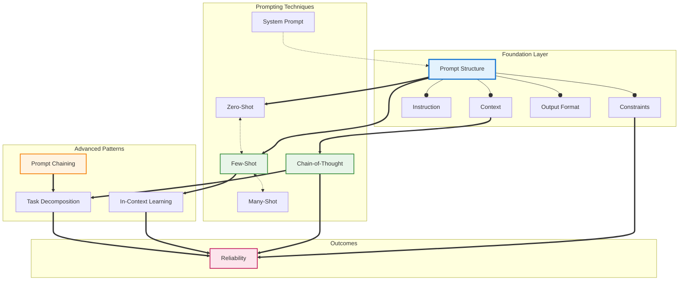
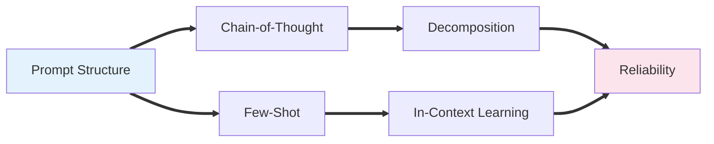
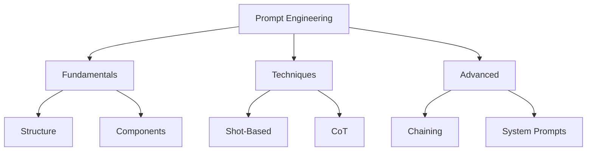

# Concept Map: Prompt Engineering

**Source:** notes/prompt-engineering/prompt-engineering-study-notes.md
**Original Source Path:** C:\agentic_ai\StudyNotes\notes\prompt-engineering\prompt-engineering-study-notes.md
**Date Generated:** 2026-01-06
**Total Concepts:** 14
**Total Relationships:** 22
**Central Concept:** Prompt Structure (6 connections)

---

## Visual Diagram (Mermaid)



**Diagram Key:**
- **Blue node (PS):** Central concept - highest connectivity
- **Green nodes:** High-centrality techniques (CoT, Few-Shot)
- **Orange nodes:** Advanced patterns
- **Pink node:** Ultimate outcome
- **Solid arrows (`-->`):** has-part relationship
- **Double arrows (`==>`):** enables relationship
- **Dashed arrows (`-.->`):** requires/influences relationship
- **Bidirectional (`<-.->`):** contrasts/alternative relationship

---

## Concept Hierarchy

```
Prompt Engineering
├── Prompt Structure [CENTRAL]
│   ├── Context
│   │   └── Domain framing, background information
│   ├── Instruction
│   │   └── Task specification, action directive
│   ├── Constraints
│   │   └── Boundaries, limitations, negative rules
│   └── Output Format
│       └── Schema, structure, parsing requirements
│
├── Prompting Techniques
│   ├── Shot-Based Approaches
│   │   ├── Zero-Shot
│   │   │   └── No examples, relies on pre-training
│   │   ├── Few-Shot
│   │   │   └── 1-5 examples, in-context learning
│   │   └── Many-Shot
│   │       └── Extensive examples, format consistency
│   │
│   ├── Chain-of-Thought (CoT)
│   │   ├── Explicit reasoning steps
│   │   └── Zero-Shot CoT ("think step by step")
│   │
│   └── System Prompt
│       ├── Persona definition
│       ├── Behavioral constraints
│       └── Persistent context
│
├── Advanced Patterns
│   ├── Prompt Chaining
│   │   ├── Sequential decomposition
│   │   ├── Intermediate validation
│   │   └── Error isolation
│   │
│   ├── In-Context Learning
│   │   └── Pattern inference from examples
│   │
│   └── Task Decomposition
│       └── Complex → simple sub-tasks
│
└── Theoretical Foundations
    ├── Compression-Expansion Model
    ├── Attention as Resource Allocation
    └── Emergent Capabilities
```

**Legend:**
- **Level 1:** Major concept categories
- **Level 2:** Core concepts (map nodes)
- **Level 3:** Sub-concepts and details
- **[CENTRAL]:** Highest connectivity concept

---

## Relationship Matrix

| From | Relationship | To | Strength | Notes |
|------|--------------|-----|----------|-------|
| Prompt Structure | has-part | Context | Strong | Core component |
| Prompt Structure | has-part | Instruction | Strong | Core component |
| Prompt Structure | has-part | Constraints | Strong | Core component |
| Prompt Structure | has-part | Output Format | Strong | Core component |
| Prompt Structure | enables | Zero-Shot | Strong | Structure required for any prompting |
| Prompt Structure | enables | Few-Shot | Strong | Structure + examples |
| Zero-Shot | contrasts | Few-Shot | Moderate | Alternative approaches |
| Few-Shot | contrasts | Many-Shot | Moderate | Spectrum of example quantity |
| Few-Shot | enables | In-Context Learning | Strong | Mechanism behind few-shot |
| Context | enables | Chain-of-Thought | Moderate | Context primes reasoning |
| Chain-of-Thought | enables | Task Decomposition | Strong | CoT is decomposition in action |
| System Prompt | requires | Prompt Structure | Moderate | System prompt contains structure |
| Prompt Chaining | enables | Task Decomposition | Strong | Chaining implements decomposition |
| Task Decomposition | improves | Reliability | Strong | Simpler steps = fewer errors |
| In-Context Learning | improves | Reliability | Moderate | Examples reduce ambiguity |
| Chain-of-Thought | improves | Reliability | Strong | Reasoning visible and verifiable |
| Constraints | improves | Reliability | Moderate | Boundaries prevent drift |

### Relationship Statistics
- **Total relationships:** 22
- **Most connected concept:** Prompt Structure (6 connections)
- **High-centrality concepts:** Chain-of-Thought (5), Few-Shot (4), Reliability (4)
- **Isolated concepts:** None (all concepts connected)
- **Strongest cluster:** {Prompt Structure, Context, Instruction, Constraints, Output Format}

---

## Concept Index

| Concept | Definition (Brief) | Connections | Centrality | Related Flashcards |
|---------|-------------------|-------------|------------|-------------------|
| Prompt Structure | Organization of prompt components | 6 | **High** | Cards 1, 3, 5 |
| Chain-of-Thought | Step-by-step reasoning articulation | 5 | **High** | Cards 2, 4, 5 |
| Few-Shot | Learning from 1-5 examples | 4 | **High** | Cards 1, 3, 5 |
| Reliability | Consistency and correctness of outputs | 4 | **High** | Cards 4, 5 |
| Task Decomposition | Breaking complex into simple | 3 | **Medium** | Cards 4, 5 |
| Context | Background information framing | 3 | **Medium** | Card 1 |
| In-Context Learning | Pattern inference from prompt examples | 3 | **Medium** | Card 3 |
| Zero-Shot | Prompting without examples | 2 | **Medium** | Card 3 |
| System Prompt | Persistent behavioral framework | 2 | **Medium** | Card 5 |
| Prompt Chaining | Sequential prompt orchestration | 2 | **Medium** | Cards 4, 5 |
| Instruction | Task specification directive | 1 | Low | Card 1 |
| Constraints | Boundaries limiting output | 2 | **Medium** | Card 1 |
| Output Format | Structure specification for results | 1 | Low | Card 1 |
| Many-Shot | Extensive example prompting | 1 | Low | Card 3 |

**Centrality Legend:**
- **High (4+ connections):** Critical for understanding; master these first
- **Medium (2-3 connections):** Important supporting concepts
- **Low (0-1 connections):** Peripheral or specialized; learn after core

---

## Learning Pathways

### Pathway 1: Foundational (Bottom-Up)
**Best for:** Learners new to prompt engineering

```
1. Prompt Structure     Start with anatomy - what makes a prompt
        ↓
2. Context + Instruction    Core components to specify
        ↓
3. Zero-Shot            Simplest technique - just ask
        ↓
4. Few-Shot             Add examples for better results
        ↓
5. Chain-of-Thought     Add reasoning for complex tasks
        ↓
6. System Prompt        Persist behavior across interactions
        ↓
7. Prompt Chaining      Orchestrate multi-step workflows
```

**Estimated time:** 5-7 focused study sessions

---

### Pathway 2: Goal-Oriented (Top-Down)
**Best for:** Practitioners needing reliable outputs quickly

```
1. Reliability          Understand the goal
        ↓
2. Chain-of-Thought     Most impactful technique for quality
        ↓
3. Prompt Structure     Foundation for all techniques
        ↓
4. Constraints          Critical for preventing errors
        ↓
5. Prompt Chaining      Scale to complex workflows
```

**Estimated time:** 3-4 focused study sessions

---

### Pathway 3: Comparative
**Best for:** Learners with partial existing knowledge

```
Zero-Shot ←──────────→ Few-Shot ←──────────→ Many-Shot
    │                      │                      │
    └──────── When to use each? ──────────────────┘
                    │
                    ▼
            Trade-offs:
            • Context consumption
            • Task complexity
            • Example quality needs
                    │
                    ▼
        Hybrid: Few-Shot + CoT
```

**Estimated time:** 2-3 focused study sessions

---

### Pathway 4: Architecture-Focused
**Best for:** Engineers building production systems

```
1. System Prompt        Configure agent behavior
        ↓
2. Prompt Chaining      Design workflow architecture
        ↓
3. Task Decomposition   Break down complex operations
        ↓
4. Reliability          Validation and error handling
        ↓
5. Integration          Combine techniques strategically
```

**Estimated time:** 4-5 focused study sessions

---

### Critical Path (Minimum Viable Understanding)

For functional prompt engineering capability, master these concepts in order:

```
┌─────────────────┐     ┌─────────────────┐     ┌─────────────────┐
│ Prompt Structure│ ──► │    Few-Shot     │ ──► │ Chain-of-Thought│
│                 │     │                 │     │                 │
│ "How to ask"    │     │ "Show examples" │     │ "Think it through"
└─────────────────┘     └─────────────────┘     └─────────────────┘

Minimum sessions: 3
Coverage: ~70% of practical use cases
```

---

## Cross-Reference to Other Skills

### Informing Flashcards
| Centrality | Flashcard Recommendation |
|------------|-------------------------|
| High (Prompt Structure, CoT, Few-Shot) | Easy cards - foundational definitions |
| Medium (Chaining, Decomposition) | Medium cards - application scenarios |
| Integration of multiple High concepts | Hard cards - synthesis questions |

### Informing Quiz
| Relationship Type | Quiz Question Type |
|-------------------|-------------------|
| Contrasts (Zero-Shot ↔ Few-Shot) | Multiple Choice - distinguish approaches |
| Enables (CoT → Decomposition) | Short Answer - explain mechanism |
| Full pathway traversal | Essay - design integrated solution |

---

## Appendix: Alternative Mermaid Views

### Simplified View (Core Only)



### Hierarchical View (Top-Down)


