# Concept Map: Lesson 6 - Reinforcement Learning

**Source:** Lessons/Lesson_6.md
**Subject Area:** AI Learning - Reinforcement Learning: Foundations, Algorithms, and Decision-Making
**Date Generated:** 2026-01-08
**Total Concepts:** 35
**Total Relationships:** 52

---

## Visual Concept Map (Mermaid)

```mermaid
graph TD
    subgraph Framework["RL Framework"]
        AGENT[Agent]
        ENV[Environment]
        STATE[State]
        ACTION[Action]
        REWARD[Reward]
        POLICY[Policy π]
        TRAJ[Trajectory]
    end

    subgraph MDP["Markov Decision Process"]
        MARKOV[Markov Property]
        TRANS[Transition P]
        DISCOUNT[Discount γ]
        EPISODIC[Episodic]
        CONTINUING[Continuing]
    end

    subgraph Value["Value Functions"]
        VFUNC[V Function]
        QFUNC[Q Function]
        VSTAR[V*]
        QSTAR[Q*]
        ADVANTAGE[Advantage A]
    end

    subgraph Bellman["Bellman Equations"]
        BELLEXP[Bellman Expectation]
        BELLOPT[Bellman Optimality]
        RECURSIVE[Recursive Structure]
    end

    subgraph TD["Temporal Difference"]
        TDLEARN[TD Learning]
        TDERROR[TD Error δ]
        BOOTSTRAP[Bootstrapping]
        SARSA[SARSA]
    end

    subgraph QLearning["Q-Learning Family"]
        QLEARN[Q-Learning]
        DQN[DQN]
        REPLAY[Experience Replay]
        TARGET[Target Network]
        OFFPOLICY[Off-Policy]
    end

    subgraph PolicyGrad["Policy Gradients"]
        PG[Policy Gradient]
        PGTHEOREM[PG Theorem]
        REINFORCE[REINFORCE]
        BASELINE[Baseline]
        CONTINUOUS[Continuous Actions]
    end

    subgraph ActorCritic["Actor-Critic"]
        AC[Actor-Critic]
        ACTOR[Actor]
        CRITIC[Critic]
        A2C[A2C]
        PPO[PPO]
    end

    subgraph Exploration["Exploration"]
        EXPLORE[Exploration]
        EXPLOIT[Exploitation]
        EPSILON[ε-greedy]
        UCB[UCB]
        INTRINSIC[Intrinsic Motivation]
    end

    %% Framework relationships
    AGENT -->|"observes"| STATE
    AGENT -->|"selects"| ACTION
    AGENT -->|"follows"| POLICY
    ENV -->|"provides"| STATE
    ENV -->|"provides"| REWARD
    ACTION -->|"affects"| ENV
    STATE -->|"sequence forms"| TRAJ

    %% MDP relationships
    STATE -->|"satisfies"| MARKOV
    TRANS -->|"defines"| ENV
    DISCOUNT -->|"weights"| REWARD

    %% Value relationships
    VFUNC -->|"evaluates"| STATE
    QFUNC -->|"evaluates"| ACTION
    POLICY -->|"induces"| VFUNC
    POLICY -->|"induces"| QFUNC
    VSTAR -->|"optimal"| VFUNC
    QSTAR -->|"optimal"| QFUNC
    ADVANTAGE -->|"derived from"| QFUNC
    ADVANTAGE -->|"derived from"| VFUNC

    %% Bellman relationships
    BELLEXP -->|"defines"| VFUNC
    BELLOPT -->|"defines"| VSTAR
    BELLOPT -->|"defines"| QSTAR
    RECURSIVE -->|"enables"| BELLEXP

    %% TD relationships
    TDLEARN -->|"computes"| TDERROR
    TDERROR -->|"updates"| VFUNC
    TDERROR -->|"updates"| QFUNC
    BOOTSTRAP -->|"characterizes"| TDLEARN
    SARSA -->|"variant of"| TDLEARN

    %% Q-Learning relationships
    QLEARN -->|"learns"| QSTAR
    QLEARN -->|"uses"| TDERROR
    QLEARN -->|"is"| OFFPOLICY
    DQN -->|"extends"| QLEARN
    DQN -->|"uses"| REPLAY
    DQN -->|"uses"| TARGET
    REPLAY -->|"stabilizes"| DQN
    TARGET -->|"stabilizes"| DQN

    %% Policy Gradient relationships
    PG -->|"optimizes"| POLICY
    PGTHEOREM -->|"enables"| PG
    REINFORCE -->|"implements"| PG
    BASELINE -->|"reduces variance"| PG
    PG -->|"handles"| CONTINUOUS

    %% Actor-Critic relationships
    AC -->|"combines"| PG
    AC -->|"combines"| TDLEARN
    ACTOR -->|"is"| POLICY
    CRITIC -->|"estimates"| VFUNC
    ADVANTAGE -->|"used by"| AC
    A2C -->|"variant of"| AC
    PPO -->|"variant of"| AC
    PPO -->|"clips"| PG

    %% Exploration relationships
    EXPLORE -->|"tradeoff with"| EXPLOIT
    EPSILON -->|"strategy for"| EXPLORE
    UCB -->|"strategy for"| EXPLORE
    INTRINSIC -->|"motivates"| EXPLORE
    QLEARN -->|"requires"| EXPLORE
```



---

## Concept Hierarchy

```
REINFORCEMENT LEARNING
├── FRAMEWORK
│   ├── Agent
│   │   └── Learner and decision-maker
│   ├── Environment
│   │   └── Provides states and rewards
│   ├── State (s)
│   │   └── Current situation representation
│   ├── Action (a)
│   │   └── Agent's choice
│   ├── Reward (r)
│   │   └── Scalar feedback signal
│   ├── Policy (π)
│   │   └── State → Action mapping
│   └── Trajectory (τ)
│       └── Sequence of (s, a, r)
│
├── MARKOV DECISION PROCESS
│   ├── Markov Property
│   │   └── Future depends only on present
│   ├── Transition Function P(s'|s,a)
│   │   └── Dynamics model
│   ├── Discount Factor (γ)
│   │   └── Future reward weighting
│   ├── Episodic Tasks
│   │   └── Finite horizon
│   └── Continuing Tasks
│       └── Infinite horizon
│
├── VALUE FUNCTIONS
│   ├── State-Value V(s)
│   │   └── Expected return from state
│   ├── Action-Value Q(s,a)
│   │   └── Expected return from state-action
│   ├── Optimal Values (V*, Q*)
│   │   └── Best policy values
│   └── Advantage A(s,a)
│       └── Q(s,a) - V(s)
│
├── BELLMAN EQUATIONS
│   ├── Bellman Expectation
│   │   └── V = E[r + γV']
│   ├── Bellman Optimality
│   │   └── V* = max[r + γV*']
│   └── Recursive Structure
│       └── Dynamic programming foundation
│
├── TEMPORAL DIFFERENCE LEARNING
│   ├── TD Learning
│   │   └── Bootstrap from estimates
│   ├── TD Error (δ)
│   │   └── r + γV(s') - V(s)
│   ├── Bootstrapping
│   │   └── Update from estimates
│   └── SARSA
│       └── On-policy TD control
│
├── Q-LEARNING FAMILY
│   ├── Q-Learning
│   │   └── Off-policy TD control
│   ├── Off-Policy
│   │   └── Learn target ≠ behavior
│   ├── DQN
│   │   └── Deep Q-Network
│   ├── Experience Replay
│   │   └── Buffer past transitions
│   └── Target Network
│       └── Stable TD targets
│
├── POLICY GRADIENT METHODS
│   ├── Policy Gradient
│   │   └── Direct policy optimization
│   ├── Policy Gradient Theorem
│   │   └── ∇J = E[∇log π · Q]
│   ├── REINFORCE
│   │   └── Monte Carlo policy gradient
│   ├── Baseline
│   │   └── Variance reduction
│   └── Continuous Actions
│       └── Natural fit for PG
│
├── ACTOR-CRITIC
│   ├── Actor
│   │   └── Policy network
│   ├── Critic
│   │   └── Value network
│   ├── Advantage Actor-Critic (A2C)
│   │   └── Uses advantage function
│   └── PPO
│       └── Clipped policy updates
│
└── EXPLORATION
    ├── Exploration vs Exploitation
    │   └── Fundamental tradeoff
    ├── ε-greedy
    │   └── Random with probability ε
    ├── UCB
    │   └── Optimism under uncertainty
    └── Intrinsic Motivation
        └── Curiosity-driven exploration
```

---

## Relationship Matrix

| From Concept | To Concept | Relationship Type | Strength |
|--------------|------------|-------------------|----------|
| Agent | State | observes | Strong |
| Agent | Action | selects | Strong |
| Agent | Policy | follows | Strong |
| Environment | State | provides | Strong |
| Environment | Reward | provides | Strong |
| Policy | V Function | induces | Strong |
| Policy | Q Function | induces | Strong |
| Bellman Expectation | V Function | defines | Strong |
| Bellman Optimality | V* | defines | Strong |
| Bellman Optimality | Q* | defines | Strong |
| TD Learning | TD Error | computes | Strong |
| TD Error | V Function | updates | Strong |
| TD Error | Q Function | updates | Strong |
| Q-Learning | Q* | learns | Strong |
| Q-Learning | Off-Policy | is-a | Strong |
| DQN | Q-Learning | extends | Strong |
| DQN | Experience Replay | uses | Strong |
| DQN | Target Network | uses | Strong |
| Experience Replay | DQN | stabilizes | Strong |
| Target Network | DQN | stabilizes | Strong |
| Policy Gradient | Policy | optimizes | Strong |
| PG Theorem | Policy Gradient | enables | Strong |
| REINFORCE | Policy Gradient | implements | Strong |
| Baseline | Policy Gradient | reduces-variance | Strong |
| Actor-Critic | Policy Gradient | combines | Strong |
| Actor-Critic | TD Learning | combines | Strong |
| Advantage | Actor-Critic | used-by | Strong |
| PPO | Actor-Critic | variant-of | Strong |
| PPO | Policy Gradient | clips | Strong |
| Exploration | Exploitation | tradeoff-with | Strong |
| ε-greedy | Exploration | strategy-for | Strong |
| UCB | Exploration | strategy-for | Strong |
| Intrinsic Motivation | Exploration | motivates | Strong |
| Q-Learning | Exploration | requires | Strong |
| Discount γ | Reward | weights | Medium |
| SARSA | TD Learning | variant-of | Medium |
| Advantage | Q Function | derived-from | Medium |
| Advantage | V Function | derived-from | Medium |
| Bootstrapping | TD Learning | characterizes | Medium |

---

## Centrality Index

**High Centrality (6+ connections):**

| Concept | Incoming | Outgoing | Total | Role |
|---------|----------|----------|-------|------|
| Policy | 3 | 4 | 7 | **Central Concept** - What agent learns |
| Q Function | 4 | 2 | 6 | **Key Representation** - Action values |
| TD Error | 2 | 4 | 6 | **Learning Signal** - Drives updates |
| DQN | 3 | 3 | 6 | **Key Algorithm** - Deep value-based |
| Policy Gradient | 3 | 4 | 7 | **Method Family** - Direct optimization |

**Medium Centrality (3-5 connections):**

| Concept | Incoming | Outgoing | Total | Role |
|---------|----------|----------|-------|------|
| V Function | 3 | 2 | 5 | State evaluation |
| Q-Learning | 2 | 3 | 5 | Off-policy control |
| Actor-Critic | 2 | 3 | 5 | Hybrid method |
| Exploration | 3 | 2 | 5 | Learning enabler |
| Advantage | 2 | 2 | 4 | Variance reduction |
| State | 2 | 2 | 4 | Observation |
| Reward | 2 | 1 | 3 | Objective signal |

**Low Centrality (1-2 connections):**
- Agent, Action, Environment, Trajectory, Markov Property, Discount, SARSA, REINFORCE, Baseline, A2C, PPO, ε-greedy, UCB, Intrinsic Motivation

---

## Learning Pathways

### Pathway 1: Value-Based Foundation
**Goal:** Understand value functions and Q-learning
**Sequence:** State → Action → Reward → Policy → V Function → Q Function → Bellman Equations → TD Learning → TD Error → Q-Learning → Off-Policy
**Prerequisites:** Basic probability, expected value
**Assessment:** Can derive and apply Q-learning update rule

### Pathway 2: Policy Optimization
**Goal:** Master direct policy learning
**Sequence:** Policy → Policy Gradient → PG Theorem → REINFORCE → Baseline → Advantage → Continuous Actions
**Prerequisites:** Pathway 1, calculus (gradients)
**Assessment:** Can explain policy gradient theorem and variance reduction

### Pathway 3: Deep RL Systems
**Goal:** Design complete deep RL solutions
**Sequence:** Q-Learning → DQN → Experience Replay → Target Network → Actor-Critic → PPO → Exploration Strategies
**Prerequisites:** Pathways 1-2, deep learning fundamentals
**Assessment:** Can design and justify deep RL architecture choices

### Pathway 4: Practical Deployment
**Goal:** Apply RL to real problems
**Sequence:** Exploration vs Exploitation → ε-greedy → UCB → Intrinsic Motivation → Sample Efficiency → Reward Design → Training Stability
**Prerequisites:** Pathways 1-3
**Assessment:** Can diagnose RL training failures and propose solutions

---

## Critical Path Analysis

**Minimum Viable Understanding (MVU):**
```
State → Action → Reward → Policy → Value Function → Bellman → TD Error → Q-Learning
```

**Rationale:** These eight concepts provide the essential RL loop:
1. **State/Action/Reward:** The interaction protocol
2. **Policy:** What the agent learns
3. **Value Function:** How to evaluate decisions
4. **Bellman:** The recursive structure enabling computation
5. **TD Error:** The learning signal
6. **Q-Learning:** The foundational algorithm

**Expanded Path for Practitioners:**
```
State → Action → Reward → Policy → V(s) → Q(s,a) → Bellman Optimality →
TD Learning → Q-Learning → DQN (Replay + Target) → Policy Gradient →
Actor-Critic → PPO → Exploration Strategies → Training Stability
```

---

## Cross-Lesson Connections

### To Lesson 5 (Deep Learning)
| RL Concept | Deep Learning Connection | Implication |
|------------|-------------------------|-------------|
| DQN | CNN feature extraction | Visual RL |
| Policy networks | Neural network policies | Continuous control |
| Experience replay | Mini-batch training | Stable gradients |
| Target network | Delayed parameter updates | Training stability |

### To Lesson 3 (LLMs)
| RL Concept | LLM Connection | Implication |
|------------|----------------|-------------|
| Policy gradient | RLHF fine-tuning | Alignment |
| Reward model | Preference learning | Human feedback |
| PPO | Standard RLHF algorithm | Stable training |
| KL constraint | Preventing distribution shift | Language quality |

### To Lesson 4 (Transformers)
| RL Concept | Transformer Connection | Implication |
|------------|----------------------|-------------|
| Sequential decisions | Autoregressive generation | Token-by-token policy |
| Return prediction | Decision Transformer | RL as sequence modeling |
| Trajectory | Context window | History encoding |

---

## Concept Definitions (Quick Reference)

| Concept | One-Line Definition |
|---------|---------------------|
| Agent | The learner and decision-maker |
| Environment | External system providing states and rewards |
| State | Representation of current situation |
| Action | Choice made by the agent |
| Reward | Scalar feedback defining the objective |
| Policy | Mapping from states to actions |
| Markov Property | Future depends only on current state |
| Discount Factor | Weight on future vs immediate rewards |
| V Function | Expected return from a state |
| Q Function | Expected return from state-action pair |
| Bellman Equation | Recursive value relationship |
| TD Learning | Learning from temporal differences |
| TD Error | r + γV(s') - V(s) |
| Q-Learning | Off-policy TD control learning Q* |
| Off-Policy | Learning target differs from behavior |
| DQN | Q-learning with neural networks |
| Experience Replay | Buffer and sample past transitions |
| Target Network | Separate network for stable targets |
| Policy Gradient | Direct policy optimization via gradients |
| REINFORCE | Monte Carlo policy gradient |
| Baseline | Variance reduction technique |
| Advantage | A(s,a) = Q(s,a) - V(s) |
| Actor-Critic | Combined policy and value learning |
| PPO | Clipped policy optimization |
| Exploration | Trying unknown actions |
| Exploitation | Using current best knowledge |
| ε-greedy | Random action with probability ε |
| UCB | Optimism in face of uncertainty |
| Intrinsic Motivation | Curiosity-driven exploration |

---

## Study Recommendations

### Foundation First
1. Master the agent-environment interaction loop
2. Understand why value functions are useful (credit assignment)
3. Trace Bellman equation derivation step-by-step

### Algorithm Focus
1. Implement tabular Q-learning from scratch
2. Compare SARSA vs Q-learning on cliff-walking
3. Understand DQN innovations and why each is necessary

### Deep RL Mastery
1. Study PPO's clipping mechanism mathematically
2. Understand experience replay's role in breaking correlation
3. Practice debugging RL training failures

### Practical Skills
1. Design reward functions for specified objectives
2. Select algorithms based on problem characteristics
3. Diagnose exploration failures vs value estimation errors

---

*Generated from Lesson 6: Reinforcement Learning | Concept Map Skill*
