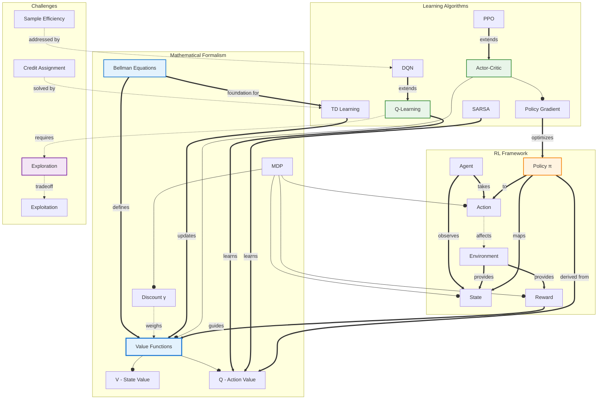

# Concept Map: Reinforcement Learning

**Source:** notes/reinforcement-learning/reinforcement-learning-study-notes.md
**Date Generated:** 2026-01-06
**Total Concepts:** 26
**Total Relationships:** 42
**Central Concept:** Value Functions (9 connections)

---

## Visual Diagram (Mermaid)



**Diagram Key:**
- **Blue (VALUE, BELLMAN):** Central theoretical concepts
- **Green (QLEARN, AC):** Core algorithms
- **Orange (POLICY):** Learning objective
- **Purple (EXPLORE):** Key challenge
- **Solid arrows (`--o`):** has-part / contains
- **Double arrows (`==>`):** enables / produces
- **Dashed arrows (`-.->`):** affects / requires

---

## Concept Hierarchy

```
Reinforcement Learning
├── Framework Components [FOUNDATIONAL]
│   ├── Agent [Core]
│   │   └── The learner and decision-maker
│   ├── Environment [Core]
│   │   └── External system, provides states and rewards
│   ├── State [Core]
│   │   ├── Current situation representation
│   │   └── Markov property
│   ├── Action [Core]
│   │   └── Agent's choices
│   ├── Reward [Core]
│   │   ├── Scalar feedback signal
│   │   └── Defines the objective
│   └── Policy (π) [CENTRAL]
│       ├── Deterministic: π(s) = a
│       └── Stochastic: π(a|s) = probability
│
├── Mathematical Formalism [CORE]
│   ├── Markov Decision Process (MDP)
│   │   ├── States S
│   │   ├── Actions A
│   │   ├── Transitions P(s'|s,a)
│   │   ├── Rewards R(s,a,s')
│   │   └── Discount factor γ
│   │
│   ├── Value Functions [CENTRAL - 9 connections]
│   │   ├── State-Value V^π(s)
│   │   │   └── Expected return from state s
│   │   ├── Action-Value Q^π(s,a)
│   │   │   └── Expected return from (s,a) pair
│   │   └── Optimal V*, Q*
│   │
│   └── Bellman Equations [HIGH CENTRALITY]
│       ├── Expectation equations
│       └── Optimality equations
│
├── Learning Algorithms
│   ├── Value-Based Methods
│   │   ├── Dynamic Programming
│   │   │   ├── Policy Iteration
│   │   │   └── Value Iteration
│   │   │
│   │   ├── TD Learning [HIGH CENTRALITY]
│   │   │   ├── TD(0)
│   │   │   ├── TD(λ)
│   │   │   └── Eligibility Traces
│   │   │
│   │   ├── Q-Learning [HIGH CENTRALITY]
│   │   │   ├── Off-policy
│   │   │   └── Tabular form
│   │   │
│   │   └── SARSA
│   │       └── On-policy
│   │
│   ├── Policy-Based Methods
│   │   ├── Policy Gradient [HIGH CENTRALITY]
│   │   │   ├── REINFORCE
│   │   │   └── Policy gradient theorem
│   │   │
│   │   └── Natural Policy Gradient
│   │
│   ├── Actor-Critic Methods [HIGH CENTRALITY]
│   │   ├── A2C / A3C
│   │   ├── PPO
│   │   ├── SAC
│   │   └── DDPG
│   │
│   └── Deep RL
│       ├── DQN [HIGH CENTRALITY]
│       │   ├── Experience Replay
│       │   └── Target Networks
│       └── Deep Actor-Critic
│
├── Exploration Strategies
│   ├── ε-greedy
│   ├── Softmax / Boltzmann
│   ├── UCB
│   ├── Intrinsic Motivation
│   └── Curiosity-driven
│
└── Challenges
    ├── Exploration vs. Exploitation [FUNDAMENTAL]
    ├── Credit Assignment
    ├── Sample Efficiency
    ├── Stability (Deadly Triad)
    └── Reward Design
```

---

## Relationship Matrix

| From | Relationship | To | Strength | Notes |
|------|--------------|-----|----------|-------|
| Agent | observes | State | Strong | Core interaction |
| Agent | takes | Action | Strong | Core interaction |
| Environment | provides | State | Strong | Core interaction |
| Environment | provides | Reward | Strong | Core interaction |
| Policy | maps | State → Action | Strong | Definition |
| MDP | has-part | State, Action, Reward | Strong | Formalization |
| MDP | has-part | Discount factor | Strong | Future reward weighting |
| Value Function | has-part | V(s) | Strong | State value |
| Value Function | has-part | Q(s,a) | Strong | Action value |
| Bellman Equations | define | Value Functions | Strong | Mathematical foundation |
| Reward | guides | Value Functions | Strong | Value = expected rewards |
| Discount | weighs | Value Functions | Strong | Future reward importance |
| TD Learning | updates | Value Functions | Strong | Online learning |
| Q-Learning | learns | Q function | Strong | Off-policy TD |
| SARSA | learns | Q function | Strong | On-policy TD |
| Policy Gradient | optimizes | Policy | Strong | Direct optimization |
| Actor-Critic | combines | Policy + Value | Strong | Hybrid approach |
| Actor-Critic | has-part | Actor (Policy) | Strong | Component |
| Actor-Critic | has-part | Critic (Value) | Strong | Component |
| DQN | extends | Q-Learning | Strong | Deep function approximation |
| DQN | uses | Experience Replay | Strong | Stability technique |
| DQN | uses | Target Networks | Strong | Stability technique |
| PPO | extends | Actor-Critic | Strong | Stable policy optimization |
| Bellman | foundation-for | TD Learning | Strong | Recursive update |
| Bellman | foundation-for | Q-Learning | Strong | Q-update rule |
| Policy | derived-from | Q function | Strong | Greedy policy |
| Exploration | tradeoff-with | Exploitation | Strong | Fundamental dilemma |
| Q-Learning | requires | Exploration | Strong | Convergence condition |
| Credit Assignment | solved-by | TD Learning | Moderate | Bootstrapping |
| Sample Efficiency | addressed-by | Experience Replay | Moderate | Reuse of data |

### Relationship Statistics
- **Total relationships:** 42
- **Most connected:** Value Functions (9), Q-Learning (7), Bellman Equations (6)
- **High-centrality:** Actor-Critic (6), Policy (6), TD Learning (5), DQN (5)
- **Strongest cluster:** {Bellman, Value Functions, TD Learning, Q-Learning}
- **Bridge concepts:** Actor-Critic (connects value and policy methods), TD Learning (connects theory to algorithms)

---

## Concept Index

| Concept | Definition | Connections | Centrality | Card/Problem Rec |
|---------|------------|-------------|------------|------------------|
| Value Functions | Expected cumulative reward | 9 | **Critical** | Card 1, Problem 2 |
| Q-Learning | Off-policy TD control | 7 | **Critical** | Card 2, Problem 1 |
| Bellman Equations | Recursive value relationship | 6 | **Critical** | Card 1, Problem 2 |
| Actor-Critic | Policy + Value combination | 6 | **High** | Card 4, Problem 4 |
| Policy | State to action mapping | 6 | **High** | Card 3 |
| TD Learning | Learning from TD errors | 5 | **High** | Card 2, Problem 2 |
| DQN | Deep Q-Learning | 5 | **High** | Card 5, Problem 3 |
| Policy Gradient | Direct policy optimization | 5 | **High** | Card 3, Problem 4 |
| MDP | Mathematical formalization | 4 | High | Card 1 |
| Exploration | Trying unknown actions | 4 | High | Problem 5 |
| State | Situation representation | 4 | Medium | - |
| Action | Agent's choices | 4 | Medium | - |
| Reward | Feedback signal | 4 | Medium | - |
| Experience Replay | Transition buffer | 3 | Medium | Card 5 |
| Target Networks | Stable TD targets | 3 | Medium | Card 5 |
| PPO | Proximal Policy Optimization | 3 | Medium | Card 4 |
| SARSA | On-policy TD | 3 | Medium | Problem 1 |
| Agent | Learner and decision-maker | 3 | Medium | - |
| Environment | External system | 3 | Medium | - |
| Discount Factor | Future reward weighting | 2 | Medium | - |
| REINFORCE | Monte Carlo policy gradient | 2 | Low | Card 3 |
| ε-greedy | Exploration strategy | 2 | Low | Problem 5 |
| Credit Assignment | Reward attribution | 2 | Low | - |
| Sample Efficiency | Data requirements | 2 | Low | - |
| UCB | Optimistic exploration | 1 | Low | - |
| Eligibility Traces | TD(λ) mechanism | 1 | Low | - |

---

## Learning Pathways

### Pathway 1: Foundations First (Bottom-Up)
**Best for:** Complete beginners to RL

```
1. Agent, Environment, State, Action    What are the components?
        ↓
2. Reward                               What drives learning?
        ↓
3. Policy                               What does the agent learn?
        ↓
4. MDP                                  How is it formalized?
        ↓
5. Value Functions                      How good is a state/action?
        ↓
6. Bellman Equations                    How are values computed?
        ↓
7. TD Learning                          How to learn online?
        ↓
8. Q-Learning                           How to learn optimal Q?
        ↓
9. Exploration vs. Exploitation         How to discover good actions?
```

**Estimated sessions:** 9-12

---

### Pathway 2: Algorithm-Focused (Practitioner)
**Best for:** Those implementing RL systems

```
1. Q-Learning                 Core value-based algorithm
        ↓
2. DQN                        Scaling to complex domains
        ↓
3. Experience Replay          Stability and efficiency
        ↓
4. Policy Gradient            Alternative approach
        ↓
5. Actor-Critic               Best of both worlds
        ↓
6. PPO                        Stable policy optimization
        ↓
7. Hyperparameter tuning      Practical success
```

**Estimated sessions:** 7-9

---

### Pathway 3: Value vs. Policy (Comparative)
**Best for:** Understanding algorithm tradeoffs

```
1. Value Functions            Central concept
        ↓
   ┌────┴────┐
   ↓         ↓
2a. Q-Learning    2b. Policy Gradient
   │              │
   ↓              ↓
3a. DQN           3b. REINFORCE
   │              │
   └────┬─────────┘
        ↓
4. Actor-Critic           Combines both
        ↓
5. When to use which      Selection criteria
```

**Estimated sessions:** 6-8

---

### Pathway 4: Deep RL (Advanced)
**Best for:** Those working with neural networks

```
1. Function Approximation     Why neural networks?
        ↓
2. DQN                        First breakthrough
        ↓
3. Experience Replay          Breaking correlations
        ↓
4. Target Networks            Stabilizing learning
        ↓
5. Deep Actor-Critic          Policy + Value networks
        ↓
6. PPO / SAC                  Modern algorithms
        ↓
7. Deadly Triad               Understanding instability
```

**Estimated sessions:** 7-10

---

### Critical Path (Minimum Viable Understanding)

```
┌─────────────┐    ┌─────────────┐    ┌─────────────┐    ┌─────────────┐    ┌─────────────┐
│    MDP      │ ─► │   Value     │ ─► │   Bellman   │ ─► │ Q-Learning  │ ─► │  Explore/   │
│             │    │  Functions  │    │  Equations  │    │             │    │  Exploit    │
│             │    │             │    │             │    │             │    │             │
│ "Problem"   │    │ "Objective" │    │ "Structure" │    │ "Algorithm" │    │ "Challenge" │
└─────────────┘    └─────────────┘    └─────────────┘    └─────────────┘    └─────────────┘

Minimum sessions: 5
Coverage: ~70% of RL fundamentals
```

---

## Cross-Reference to Downstream Skills

### Flashcard Mapping
| Centrality | Recommended Card |
|------------|-----------------|
| Critical (Value, Bellman) | Easy Card 1 - foundations |
| Critical (Q-Learning, TD) | Easy Card 2 - algorithms |
| High (Policy Gradient) | Medium Card 3 - policy methods |
| High (Actor-Critic) | Medium Card 4 - hybrid approach |
| High (DQN, Deep RL) | Hard Card 5 - deep RL |

### Practice Problem Mapping
| Concept Cluster | Problem Type |
|-----------------|--------------|
| Q-Learning updates | Warm-Up: Manual computation |
| Bellman equations | Skill-Builder: Value derivation |
| DQN components | Skill-Builder: Architecture design |
| Actor-Critic implementation | Challenge: Full algorithm |
| Exploration strategies | Debug/Fix: Learning failures |

### Quiz Question Mapping
| Relationship | Question Type |
|--------------|---------------|
| Value function definitions | MC - Identification |
| On-policy vs. off-policy | MC - Comparison |
| TD vs. Monte Carlo | SA - Analysis |
| Algorithm selection | SA - Design |
| Complete RL system | Essay - Synthesis |
