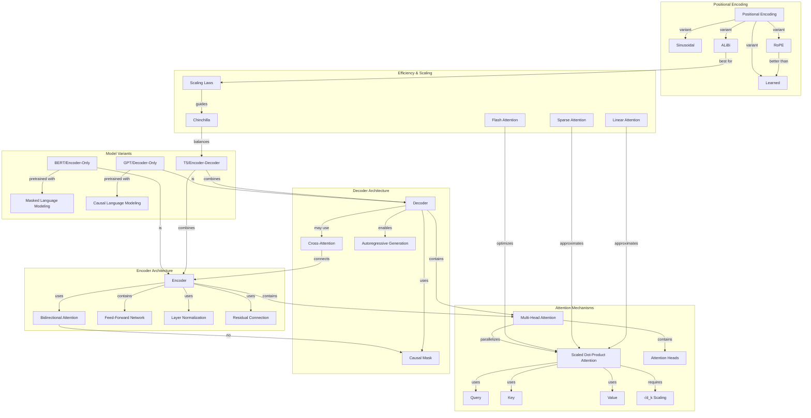

# Concept Map: Lesson 4 - Transformers

**Source:** Lessons/Lesson_4.md
**Subject Area:** AI Learning - Transformer Architecture: Attention Mechanisms, Model Variants, and Implementation
**Date Generated:** 2026-01-08
**Total Concepts:** 28
**Total Relationships:** 42

---

## Visual Concept Map (Mermaid)



---

## Concept Hierarchy

```
TRANSFORMERS
├── ATTENTION MECHANISMS
│   ├── Scaled Dot-Product Attention
│   │   ├── Query (Q) Projection
│   │   ├── Key (K) Projection
│   │   ├── Value (V) Projection
│   │   ├── √d_k Scaling Factor
│   │   └── Softmax Normalization
│   ├── Multi-Head Attention
│   │   ├── Parallel Heads
│   │   ├── Subspace Projections
│   │   └── Output Projection (W_O)
│   └── Attention Complexity
│       └── O(n²d) Time and Space
│
├── POSITIONAL ENCODING
│   ├── Why Needed (Permutation Equivariance)
│   ├── Sinusoidal (Original)
│   │   └── Fixed, Some Generalization
│   ├── Learned Embeddings
│   │   └── Flexible, No Extrapolation
│   ├── RoPE (Rotary)
│   │   └── Relative Position, Good Generalization
│   └── ALiBi (Linear Bias)
│       └── Attention Bias, Best Generalization
│
├── ENCODER ARCHITECTURE
│   ├── Bidirectional Self-Attention
│   │   └── All Positions See All Positions
│   ├── Feed-Forward Network
│   │   ├── Two Linear Layers
│   │   ├── 4x Expansion
│   │   └── GELU Activation
│   ├── Layer Normalization
│   │   ├── Pre-LN (Modern)
│   │   └── Post-LN (Original)
│   └── Residual Connections
│       └── Gradient Flow
│
├── DECODER ARCHITECTURE
│   ├── Causal Self-Attention
│   │   └── Masked to Prevent Future Attention
│   ├── Autoregressive Generation
│   │   └── Token-by-Token Output
│   ├── Cross-Attention (Encoder-Decoder)
│   │   └── Q from Decoder, K/V from Encoder
│   └── KV Caching
│       └── Efficient Generation
│
├── MODEL VARIANTS
│   ├── Encoder-Only (BERT Family)
│   │   ├── Masked Language Modeling
│   │   ├── Bidirectional Context
│   │   ├── Understanding Tasks
│   │   └── Variants: RoBERTa, ALBERT, DeBERTa
│   ├── Decoder-Only (GPT Family)
│   │   ├── Causal Language Modeling
│   │   ├── Autoregressive Generation
│   │   ├── Few-Shot Learning
│   │   └── Variants: GPT-3/4, Llama, Mistral
│   └── Encoder-Decoder (T5 Family)
│       ├── Span Corruption Pre-training
│       ├── Cross-Attention Bridge
│       ├── Sequence-to-Sequence Tasks
│       └── Variants: BART, mT5, FLAN-T5
│
└── EFFICIENCY & SCALING
    ├── Efficient Attention
    │   ├── Flash Attention (Exact, Optimized)
    │   ├── Sparse Attention (Longformer, BigBird)
    │   └── Linear Attention (Performer)
    ├── Scaling Laws
    │   ├── Loss vs Compute/Data/Params
    │   └── Chinchilla Optimal
    └── Context Length
        └── Extending Beyond Training
```

---

## Relationship Matrix

| From Concept | To Concept | Relationship Type | Strength |
|--------------|------------|-------------------|----------|
| Scaled Dot-Product Attention | Query | uses | Strong |
| Scaled Dot-Product Attention | Key | uses | Strong |
| Scaled Dot-Product Attention | Value | uses | Strong |
| Scaled Dot-Product Attention | √d_k Scaling | requires | Strong |
| Multi-Head Attention | Scaled Dot-Product | parallelizes | Strong |
| Multi-Head Attention | Attention Heads | contains | Strong |
| Positional Encoding | Sinusoidal | variant-of | Strong |
| Positional Encoding | Learned | variant-of | Strong |
| Positional Encoding | RoPE | variant-of | Strong |
| Positional Encoding | ALiBi | variant-of | Strong |
| RoPE | Learned | better-than | Medium |
| ALiBi | Length Generalization | best-for | Strong |
| Encoder | Bidirectional Attention | uses | Strong |
| Encoder | Multi-Head Attention | contains | Strong |
| Encoder | Feed-Forward Network | contains | Strong |
| Encoder | Layer Normalization | uses | Strong |
| Encoder | Residual Connection | uses | Strong |
| Decoder | Causal Mask | uses | Strong |
| Decoder | Autoregressive Generation | enables | Strong |
| Decoder | Cross-Attention | may-use | Medium |
| Decoder | Multi-Head Attention | contains | Strong |
| Cross-Attention | Encoder | connects | Strong |
| BERT | Encoder | is-a | Strong |
| BERT | Masked Language Modeling | pretrained-with | Strong |
| GPT | Decoder | is-a | Strong |
| GPT | Causal Language Modeling | pretrained-with | Strong |
| T5 | Encoder | combines | Strong |
| T5 | Decoder | combines | Strong |
| Flash Attention | Scaled Dot-Product | optimizes | Strong |
| Sparse Attention | Scaled Dot-Product | approximates | Medium |
| Linear Attention | Scaled Dot-Product | approximates | Medium |
| Scaling Laws | Chinchilla | guides | Strong |
| Causal Mask | Future Tokens | prevents-attention-to | Strong |
| KV Cache | Generation | accelerates | Strong |
| FFN | Knowledge Storage | hypothesized | Medium |
| Residual Connection | Gradient Flow | enables | Strong |
| Pre-LN | Training Stability | improves | Strong |
| Softmax | Attention Weights | normalizes | Strong |
| O(n²) Complexity | Context Length | limits | Strong |
| Encoder-Only | Classification | suited-for | Strong |
| Decoder-Only | Generation | suited-for | Strong |
| Encoder-Decoder | Seq2Seq | suited-for | Strong |

---

## Centrality Index

**High Centrality (6+ connections):**
| Concept | Incoming | Outgoing | Total | Role |
|---------|----------|----------|-------|------|
| Scaled Dot-Product Attention | 4 | 5 | 9 | **Central Hub** - Core operation |
| Multi-Head Attention | 2 | 4 | 6 | **Key Mechanism** - Enables diversity |
| Encoder | 2 | 5 | 7 | **Architecture Base** - Understanding |
| Decoder | 2 | 5 | 7 | **Architecture Base** - Generation |
| Positional Encoding | 0 | 5 | 5 | **Entry Point** - Position information |

**Medium Centrality (3-5 connections):**
| Concept | Incoming | Outgoing | Total | Role |
|---------|----------|----------|-------|------|
| Query/Key/Value | 3 | 1 | 4 | Attention components |
| Causal Mask | 2 | 2 | 4 | Enables autoregressive |
| BERT | 1 | 2 | 3 | Encoder variant |
| GPT | 1 | 2 | 3 | Decoder variant |
| T5 | 0 | 3 | 3 | Combined variant |
| Flash Attention | 1 | 1 | 2 | Efficiency solution |

**Low Centrality (1-2 connections):**
- Sinusoidal, Learned, RoPE, ALiBi, FFN, Layer Norm, Residual, Cross-Attention, Sparse Attention, Linear Attention, Scaling Laws, Chinchilla

---

## Learning Pathways

### Pathway 1: Attention Foundation
**Goal:** Understand how attention computes representations
**Sequence:** Q/K/V Projections → Scaled Dot-Product → √d_k Scaling → Softmax → Multi-Head Attention → Attention Heads
**Duration Estimate:** Core attention mastery
**Prerequisites:** Linear algebra basics, neural network fundamentals
**Assessment:** Can derive attention computation from scratch; explain why multi-head > single-head

### Pathway 2: Architecture Variants
**Goal:** Select appropriate architecture for tasks
**Sequence:** Encoder (Bidirectional) → Decoder (Causal) → Cross-Attention → BERT → GPT → T5 → Task Mapping
**Duration Estimate:** Architecture selection skill
**Prerequisites:** Pathway 1 (attention understanding)
**Assessment:** Given task description, can justify architecture choice with technical reasoning

### Pathway 3: Position and Sequence
**Goal:** Handle sequences of varying length
**Sequence:** Permutation Equivariance → Sinusoidal → Learned → RoPE → ALiBi → Length Generalization
**Duration Estimate:** Position encoding expertise
**Prerequisites:** Pathway 1 (understand what position affects)
**Assessment:** Can select positional encoding for specific context length requirements

### Pathway 4: Efficiency and Scale
**Goal:** Deploy transformers at production scale
**Sequence:** O(n²) Complexity → Flash Attention → Sparse Attention → Linear Attention → Scaling Laws → Chinchilla → Context Length Extension
**Duration Estimate:** Production deployment readiness
**Prerequisites:** Pathways 1-3 (full architecture understanding)
**Assessment:** Can design efficient attention for given memory/latency constraints

---

## Critical Path Analysis

**Minimum Viable Understanding (MVU):**
```
Q/K/V → Scaled Dot-Product → Multi-Head → Encoder vs Decoder
```

**Rationale:** These four concept groups provide the essential mental model:
1. **Q/K/V:** How attention queries and retrieves
2. **Scaled Dot-Product:** The core computation
3. **Multi-Head:** Why transformers are expressive
4. **Encoder vs Decoder:** When to use which architecture

**Expanded Path for Practitioners:**
```
Q/K/V → Scaled Dot-Product → √d_k → Softmax → Multi-Head →
Positional Encoding → RoPE/ALiBi →
Encoder → Decoder → Causal Mask → Cross-Attention →
BERT → GPT → T5 → Task Selection →
Flash Attention → Scaling Laws
```

---

## Cross-Lesson Connections

### To Lesson 3 (Large Language Models)
| Transformer Concept | LLM Connection | Implication |
|---------------------|----------------|-------------|
| Decoder Architecture | GPT-style LLMs | LLMs are decoder transformers |
| Causal Mask | Autoregressive generation | Why LLMs generate token-by-token |
| Multi-Head Attention | Diverse capabilities | Different heads capture different patterns |
| Context Window | LLM context limits | Attention O(n²) bounds context |
| Positional Encoding | "Lost in the middle" | Position affects information retrieval |

### To Lesson 2 (Prompt Engineering)
| Transformer Concept | Prompt Engineering Connection | Implication |
|---------------------|------------------------------|-------------|
| Attention Weights | Prompt structure matters | Position affects what model attends to |
| Causal Masking | Left-to-right processing | Earlier tokens influence later |
| Multi-Head | Different aspects captured | Prompts activate different heads |
| Context Window | Prompt length limits | Must fit within attention capacity |

### To Lesson 1 (Agent Skills)
| Transformer Concept | Agent Skills Connection | Implication |
|---------------------|------------------------|-------------|
| Architecture Selection | Skill task matching | Choose encoder/decoder based on skill type |
| Attention Patterns | Skill context handling | Skills must respect attention behavior |
| Efficiency | Skill latency | Optimize attention for interactive skills |
| KV Cache | Skill composition | Efficient multi-turn skill chains |

---

## Concept Definitions (Quick Reference)

| Concept | One-Line Definition |
|---------|---------------------|
| Scaled Dot-Product Attention | Core operation: softmax(QK^T/√d_k)V |
| Query (Q) | Projection representing "what am I looking for" |
| Key (K) | Projection representing "what do I contain" |
| Value (V) | Projection representing "what I provide when attended" |
| Multi-Head Attention | Parallel attention operations in different subspaces |
| √d_k Scaling | Prevents vanishing gradients in softmax |
| Positional Encoding | Injects sequence order into position-agnostic attention |
| RoPE | Rotary position embedding; encodes relative position |
| ALiBi | Attention with linear biases; best length generalization |
| Encoder | Bidirectional transformer stack for understanding |
| Decoder | Autoregressive transformer stack for generation |
| Causal Mask | Prevents attention to future positions |
| Cross-Attention | Decoder attending to encoder outputs |
| BERT | Encoder-only model; masked language modeling |
| GPT | Decoder-only model; causal language modeling |
| T5 | Encoder-decoder model; text-to-text format |
| Feed-Forward Network | Position-wise transformation; 4x expansion |
| Layer Normalization | Normalizes across features; stabilizes training |
| Residual Connection | Adds input to sublayer output; gradient flow |
| Pre-LN | Layer norm before sublayer; modern default |
| Flash Attention | Memory-efficient exact attention implementation |
| Sparse Attention | O(n) attention via limited attention patterns |
| Linear Attention | O(n) attention via kernel approximation |
| Scaling Laws | Empirical relationships predicting performance |
| Chinchilla | Optimal balance of model size and training data |
| KV Cache | Stored key-values for efficient generation |
| O(n²) Complexity | Quadratic attention cost limiting context length |
| Autoregressive | Sequential generation, each token from previous |

---

## Study Recommendations

### Foundation First
1. Master the attention formula until you can derive it from first principles
2. Understand why each component exists (not just what it does)
3. Trace through a small example (3 tokens) by hand

### Architecture Understanding
1. Draw encoder and decoder layer diagrams from memory
2. Explain the causal mask's purpose for autoregressive generation
3. Articulate when each architecture variant is appropriate

### Positional Encoding
1. Understand the permutation equivariance problem
2. Compare generalization properties of each approach
3. Know when to choose ALiBi vs RoPE vs learned

### Efficiency Perspective
1. Calculate attention memory for various context lengths
2. Understand Flash Attention's memory optimization
3. Apply scaling laws to resource allocation decisions

---

*Generated from Lesson 4: Transformers | Concept Map Skill*
