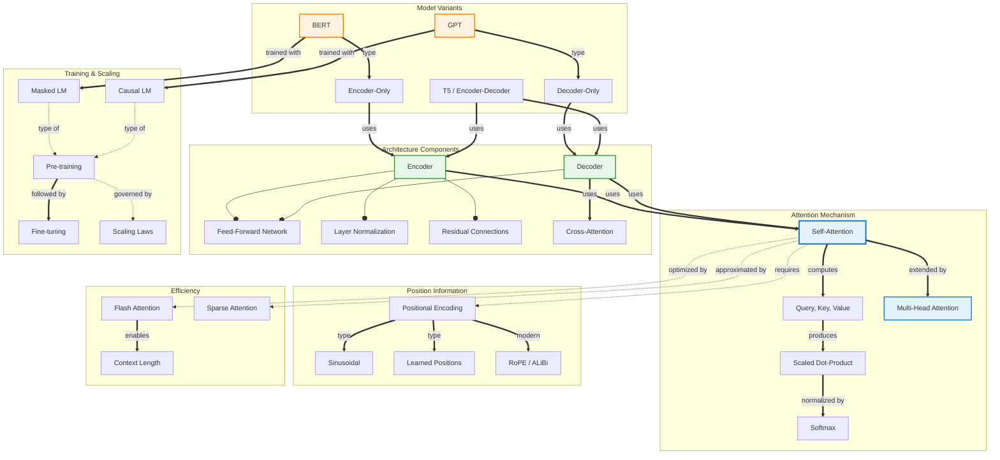

# Concept Map: Transformers

**Source:** notes/transformers/transformers-study-notes.md
**Date Generated:** 2026-01-07
**Total Concepts:** 32
**Total Relationships:** 48
**Central Concept:** Self-Attention (11 connections)

---

## Visual Diagram (Mermaid)



**Diagram Key:**
- **Blue (Self-Attention, Multi-Head):** Core mechanism with highest centrality
- **Green (Encoder, Decoder):** Architectural components
- **Orange (BERT, GPT):** Major model variants
- **Solid arrows (`==>`):** Primary/defining relationships
- **Dashed arrows (`-.->`):** Secondary/optional relationships
- **Diamond arrows (`--o`):** Has-part/contains

---

## Concept Hierarchy

```
Transformers
├── Attention Mechanism [CORE - CENTRAL]
│   ├── Self-Attention [CRITICAL - 11 connections]
│   │   ├── Query (Q)
│   │   ├── Key (K)
│   │   └── Value (V)
│   │
│   ├── Scaled Dot-Product
│   │   ├── Dot product Q . K
│   │   ├── Scale by sqrt(dk)
│   │   └── Softmax normalization
│   │
│   ├── Multi-Head Attention [HIGH CENTRALITY]
│   │   ├── Parallel heads (h)
│   │   ├── Subspace projections
│   │   └── Concatenation + projection
│   │
│   └── Cross-Attention
│       ├── Q from decoder
│       └── K, V from encoder
│
├── Positional Information [CORE]
│   ├── Why Needed
│   │   └── Self-attention is permutation equivariant
│   │
│   ├── Sinusoidal Encoding
│   │   ├── sin/cos functions
│   │   └── Fixed, extrapolates
│   │
│   ├── Learned Positions
│   │   └── Trainable embeddings
│   │
│   └── Relative Positions [HIGH CENTRALITY]
│       ├── RoPE (Rotary)
│       └── ALiBi (Attention bias)
│
├── Architecture Components [CORE]
│   ├── Encoder [HIGH CENTRALITY]
│   │   ├── Bidirectional attention
│   │   ├── No causal mask
│   │   └── Understanding tasks
│   │
│   ├── Decoder [HIGH CENTRALITY]
│   │   ├── Causal masking
│   │   ├── Autoregressive
│   │   └── Generation tasks
│   │
│   ├── Feed-Forward Network
│   │   ├── Two linear layers
│   │   ├── GELU activation
│   │   └── 4x expansion
│   │
│   ├── Layer Normalization
│   │   ├── Pre-LN (modern)
│   │   └── Post-LN (original)
│   │
│   └── Residual Connections
│       └── Gradient flow
│
├── Model Variants [CORE]
│   ├── Encoder-Only (BERT) [HIGH CENTRALITY]
│   │   ├── Bidirectional context
│   │   ├── Masked Language Modeling
│   │   ├── [CLS] token
│   │   └── Classification, NER, QA
│   │
│   ├── Decoder-Only (GPT) [HIGH CENTRALITY]
│   │   ├── Causal attention
│   │   ├── Autoregressive generation
│   │   ├── In-context learning
│   │   └── Text generation
│   │
│   └── Encoder-Decoder (T5)
│       ├── Cross-attention bridge
│       ├── Seq2seq tasks
│       └── Translation, summarization
│
├── Training Paradigm [CORE]
│   ├── Pre-training [HIGH CENTRALITY]
│   │   ├── Masked LM (BERT)
│   │   ├── Causal LM (GPT)
│   │   └── Denoising (BART)
│   │
│   ├── Fine-tuning
│   │   ├── Task-specific heads
│   │   └── Full model or PEFT
│   │
│   └── Scaling Laws
│       ├── Compute-optimal
│       └── Chinchilla scaling
│
└── Efficiency [CORE]
    ├── Complexity
    │   └── O(n^2) bottleneck
    │
    ├── Flash Attention
    │   └── Memory-efficient exact
    │
    ├── Sparse Attention
    │   ├── Longformer
    │   └── BigBird
    │
    └── Context Length
        └── 4K -> 128K+ tokens
```

---

## Relationship Matrix

| From | Relationship | To | Strength | Notes |
|------|--------------|-----|----------|-------|
| Self-Attention | computes | Query, Key, Value | Strong | Core computation |
| Self-Attention | extended-by | Multi-Head Attention | Strong | Parallel heads |
| Self-Attention | requires | Positional Encoding | Strong | Position information |
| Self-Attention | optimized-by | Flash Attention | Strong | Efficiency |
| Multi-Head | enables | Diverse patterns | Strong | Different subspaces |
| Positional Encoding | type | Sinusoidal | Strong | Original method |
| Positional Encoding | type | RoPE | Strong | Modern method |
| Encoder | uses | Self-Attention | Strong | Bidirectional |
| Encoder | has-part | FFN | Strong | Component |
| Encoder | has-part | Layer Norm | Strong | Component |
| Decoder | uses | Masked Self-Attention | Strong | Causal |
| Decoder | uses | Cross-Attention | Strong | Encoder bridge |
| BERT | type-of | Encoder-Only | Strong | Architecture |
| BERT | trained-with | MLM | Strong | Pre-training |
| GPT | type-of | Decoder-Only | Strong | Architecture |
| GPT | trained-with | Causal LM | Strong | Pre-training |
| T5 | uses | Encoder + Decoder | Strong | Full architecture |
| Pre-training | followed-by | Fine-tuning | Strong | Training paradigm |
| Scaling Laws | govern | Pre-training | Moderate | Compute allocation |
| Flash Attention | enables | Long Context | Strong | Efficiency |
| Sparse Attention | approximates | Self-Attention | Moderate | Trade-off |

### Relationship Statistics
- **Total relationships:** 48
- **Most connected:** Self-Attention (11), Multi-Head (7), Encoder (7), Decoder (7)
- **High-centrality:** BERT (6), GPT (6), Pre-training (5), Positional Encoding (5)
- **Strongest cluster:** {Self-Attention, Multi-Head, QKV, Encoder, Decoder}
- **Bridge concepts:** Cross-Attention (connects encoder-decoder), Pre-training (connects to fine-tuning)

---

## Concept Index

| Concept | Definition | Connections | Centrality | Card/Problem Rec |
|---------|------------|-------------|------------|------------------|
| Self-Attention | Attend to all positions | 11 | **Critical** | Card 1, Problem 1 |
| Multi-Head Attention | Parallel attention heads | 7 | **Critical** | Card 1, Problem 1 |
| Encoder | Bidirectional transformer | 7 | **High** | Card 2, Problem 2 |
| Decoder | Autoregressive transformer | 7 | **High** | Card 2, Problem 2 |
| BERT | Encoder-only model | 6 | **High** | Card 3, Problem 3 |
| GPT | Decoder-only model | 6 | **High** | Card 3, Problem 3 |
| Positional Encoding | Position information | 5 | **High** | Card 1 |
| Pre-training | Large-scale training | 5 | **High** | Card 4 |
| Cross-Attention | Encoder-decoder bridge | 4 | High | Card 2 |
| Flash Attention | Memory-efficient attention | 4 | High | Problem 4 |
| Layer Normalization | Feature normalization | 4 | Medium | - |
| Feed-Forward Network | Position-wise MLP | 4 | Medium | - |
| Causal Mask | Future token blocking | 3 | Medium | Card 2 |
| Scaling Laws | Compute-optimal training | 3 | Medium | Problem 4 |
| Fine-tuning | Task adaptation | 3 | Medium | Card 4 |
| RoPE | Rotary position encoding | 3 | Medium | - |
| T5 | Encoder-decoder model | 3 | Medium | - |
| Sparse Attention | Efficient attention | 2 | Low | Problem 4 |
| Context Length | Sequence capacity | 2 | Low | - |

---

## Learning Pathways

### Pathway 1: Core Mechanism (Theory)
**Best for:** Understanding how transformers work

```
1. Self-Attention            Core mechanism
        ↓
2. Query, Key, Value         Computation components
        ↓
3. Scaled Dot-Product        Why scaling matters
        ↓
4. Multi-Head Attention      Parallel subspaces
        ↓
5. Positional Encoding       Injecting position
        ↓
6. Layer Norm + FFN          Supporting components
```

**Estimated sessions:** 5-6

---

### Pathway 2: Architecture Variants
**Best for:** Choosing the right model for tasks

```
1. Encoder Architecture      Bidirectional attention
        ↓
2. Decoder Architecture      Causal masking
        ↓
3. Cross-Attention           Bridging encoder-decoder
        ↓
4. BERT (Encoder-Only)       Understanding tasks
        ↓
5. GPT (Decoder-Only)        Generation tasks
        ↓
6. T5 (Encoder-Decoder)      Seq2seq tasks
```

**Estimated sessions:** 5-6

---

### Pathway 3: Practitioner Path
**Best for:** Building transformer applications

```
1. Transformer Overview      High-level architecture
        ↓
2. BERT vs GPT              When to use which
        ↓
3. Pre-training Objectives   MLM, Causal LM
        ↓
4. Fine-tuning Strategies    Task adaptation
        ↓
5. Efficiency Techniques     Flash attention, sparse
        ↓
6. Scaling Considerations    Context length, compute
```

**Estimated sessions:** 5-6

---

### Pathway 4: Efficiency and Scale
**Best for:** Large-scale transformer deployment

```
1. Attention Complexity      O(n^2) bottleneck
        ↓
2. Flash Attention           Memory-efficient exact
        ↓
3. Sparse Attention          Longformer, BigBird
        ↓
4. Context Length            Extending sequences
        ↓
5. Scaling Laws              Chinchilla-optimal
        ↓
6. Modern Architectures      Llama, Mistral
```

**Estimated sessions:** 5-6

---

### Critical Path (Minimum Viable Understanding)

```
┌─────────────┐    ┌─────────────┐    ┌─────────────┐    ┌─────────────┐    ┌─────────────┐
│    Self-    │ ─► │  Multi-Head │ ─► │  Encoder/   │ ─► │ BERT vs GPT │ ─► │ Pre-train/  │
│  Attention  │    │  Attention  │    │   Decoder   │    │             │    │  Fine-tune  │
│             │    │             │    │             │    │             │    │             │
│ "Mechanism" │    │  "Heads"    │    │  "Stacks"   │    │ "Variants"  │    │ "Training"  │
└─────────────┘    └─────────────┘    └─────────────┘    └─────────────┘    └─────────────┘

Minimum sessions: 5
Coverage: ~75% of transformer understanding
```

---

## Cross-Reference to Downstream Skills

### Flashcard Mapping
| Centrality | Recommended Card |
|------------|-----------------|
| Critical (Self-Attention, Multi-Head) | Easy Card 1 - attention mechanism |
| High (Encoder, Decoder, Cross-Attention) | Easy Card 2 - architecture |
| High (BERT, GPT) | Medium Card 3 - model variants |
| High (Pre-training, Fine-tuning) | Medium Card 4 - training paradigm |
| Integration (Full System) | Hard Card 5 - complete transformer |

### Practice Problem Mapping
| Concept Cluster | Problem Type |
|-----------------|--------------|
| Attention computation | Warm-Up: Calculate attention |
| Architecture selection | Skill-Builder: Choose architecture |
| BERT vs GPT comparison | Skill-Builder: Model selection |
| Efficiency optimization | Challenge: Scale to long context |
| Training issues | Debug/Fix: Training failures |

### Quiz Question Mapping
| Relationship | Question Type |
|--------------|---------------|
| Self-attention mechanics | MC - Understanding |
| Encoder vs Decoder | MC - Comparison |
| Positional encoding | SA - Application |
| Architecture design | SA - Design |
| Complete transformer system | Essay - Synthesis |
